# Curated star schema

The curated layer (`dbt/models/curated/`) contains sixteen fact tables across
six subject areas, sharing a conformed `dim_date` (the census fact, a
once-per-census snapshot, joins its own mesh dimension instead):

- `fct_jepx_spot_market` — market-wide JEPX day-ahead auction results, one row
  per delivery period (trade date × 30-minute time code).
- `fct_jepx_spot_area_price` — area clearing prices, one row per delivery
  period per bidding zone.
- `fct_jma_weather_hourly` — JMA hourly weather observations, one row per
  station and observation hour (native hourly grain; not interpolated to the
  30-minute JEPX periods — align by joining each delivery period to the
  weather hour that contains it).
- `fct_spot_price_forecast` — day-ahead price forecasts written back from
  backtest runs (`scripts/spot_price_backtest.py` →
  `pma_ml.spot_price_forecast`), one row per MLflow run per delivery period
  per area; `run_id` is a degenerate dimension linking to the MLflow run.
  Forecasts only — no actuals stored.
- `fct_spot_price_forecast_accuracy` — the forecast fact drilled across to
  `fct_jepx_spot_area_price` actuals, adding signed/absolute/percentage error
  columns. This is the intended BI surface for forecast analysis.
- `fct_demand_forecast` — day-ahead area demand forecasts written back from
  `scripts/demand_backtest.py` (MLflow experiment `demand`); grain run ×
  delivery period × area; forecast values only.
- `fct_demand_forecast_accuracy` — the demand forecast fact drilled across to
  `fct_area_demand_generation_actual` on (date_key, time_code, area_key):
  `actual_demand_kwh`, signed `error_kwh`, `abs_error_kwh`, `pct_error`,
  `abs_pct_error`; the BI surface for demand runs.
- `fct_occto_demand_supply_forecast_daily` — OCCTO day-after-next (翌々日) demand and
  peak supply-capacity forecasts, one row per target date per JEPX area
  (periodic snapshot; formulated on target date − 2, so it is known before
  the day-ahead auction and usable as a spot-price feature). Covers
  2024-04-01 onward: the published エリア計 roll-ups, Okinawa, and OCCTO's
  pre-FY2024 trial rows (試験データ, 2024-03-13..31) stay in
  `std_occto__demand_forecast_dad` only.
- `fct_occto_demand_supply_forecast_30m` — the half-hourly counterpart: OCCTO
  day-after-next area demand and supply-capacity forecasts (MW) from the
  広域予備率 エリア・広域ブロック情報 publication, one row per delivery period
  per JEPX area (same grain as `fct_jepx_spot_area_price`, joins 1:1). Covers
  2025-04-01 onward — the 48-point 翌々日 series began with FY2025; before
  that only the daily peak/min points above exist. Okinawa and the wide-area
  block / reserve columns stay in `std_occto__area_reserve_rate_dad`.
- `fct_area_demand_generation_actual` — TSO-published area actuals, the
  インバランス料金 「系統の需給に関する情報」 items A-1/B-1/B-4. Total demand,
  total generation and wind+solar generation per 30-minute delivery period,
  energy in kWh and additive, one row per delivery period per area. Tokyo
  (TEPCO Power Grid) and Kansai (関西電力送配電) today, one `std_<tso>__…`
  model per TSO unioned underneath, same grain as `fct_jepx_spot_area_price`.
  Covers 2022-04-01 onward through the last finalized day. Measures are null
  where the TSO published no observation (Tokyo 2025-06-14 time codes 11-48,
  Kansai 2025-10-12 × 22 periods).
- `fct_area_power_usage_hourly` — the TSO でんき予報 hourly 電力使用状況
  display series for Tokyo (TEPCO Power Grid) and Kansai (関西電力送配電). Area
  demand per delivery hour, energy in kWh = the published 1時間平均 万kW ×
  10,000 and additive, one row per date × `hour_of_day` × area. Covers
  2016-04-01, the only public area demand before A-1 begins, through
  yesterday, with no gaps except Kansai 2024-03-31. It is this series alone,
  not stitched with A-1: it is a display product at 万kW resolution, revised
  without notice at best, and the two differ by 0.05 % MAE over their overlap.
  `hour_of_day` references `dim_delivery_hour`, the 24-row shrunken rollup of
  `dim_delivery_period`, so the two facts drill across by summing the
  30-minute fact per `dim_delivery_period.hour_of_day`. The daily files'
  予測値 / 使用率 / 供給力 stay in the `std_<tso>__power_usage_hourly` models.
- `fct_census_population_mesh` — Population Census total population per 500 m
  mesh (e-Stat 統計GIS 4次メッシュ). One row per census vintage (2015 and 2020,
  both JGD2000 products) per nine-digit `mesh_code`. It is a periodic snapshot
  at the census date. It is additive across meshes, since the population is as
  published at every mesh with the privacy processing untouched, but not across
  census years. Joins
  `dim_population_mesh_500m` (one row per mesh: primary mesh, datum, bounding
  box and centroid decoded from the code). Intended for population-weighted
  weather aggregation later; no weights or weather-grid crosswalk are stored.

```mermaid
erDiagram
    dim_date ||--o{ fct_jepx_spot_market : "date_key"
    dim_delivery_period ||--o{ fct_jepx_spot_market : "time_code"
    dim_date ||--o{ fct_jepx_spot_area_price : "date_key"
    dim_delivery_period ||--o{ fct_jepx_spot_area_price : "time_code"
    dim_area ||--o{ fct_jepx_spot_area_price : "area_key"
    dim_date ||--o{ fct_jma_weather_hourly : "date_key"
    dim_jma_station ||--o{ fct_jma_weather_hourly : "station_id"
    dim_date ||--o{ fct_spot_price_forecast : "date_key"
    dim_delivery_period ||--o{ fct_spot_price_forecast : "time_code"
    dim_area ||--o{ fct_spot_price_forecast : "area_key"
    dim_date ||--o{ fct_spot_price_forecast_accuracy : "date_key"
    dim_delivery_period ||--o{ fct_spot_price_forecast_accuracy : "time_code"
    dim_area ||--o{ fct_spot_price_forecast_accuracy : "area_key"
    dim_date ||--o{ fct_demand_forecast : "date_key"
    dim_delivery_period ||--o{ fct_demand_forecast : "time_code"
    dim_area ||--o{ fct_demand_forecast : "area_key"
    dim_date ||--o{ fct_demand_forecast_accuracy : "date_key"
    dim_delivery_period ||--o{ fct_demand_forecast_accuracy : "time_code"
    dim_area ||--o{ fct_demand_forecast_accuracy : "area_key"
    dim_date ||--o{ fct_occto_demand_supply_forecast_daily : "date_key"
    dim_area ||--o{ fct_occto_demand_supply_forecast_daily : "area_key"
    dim_date ||--o{ fct_occto_demand_supply_forecast_30m : "date_key"
    dim_delivery_period ||--o{ fct_occto_demand_supply_forecast_30m : "time_code"
    dim_area ||--o{ fct_occto_demand_supply_forecast_30m : "area_key"
    dim_date ||--o{ fct_area_demand_generation_actual : "date_key"
    dim_delivery_period ||--o{ fct_area_demand_generation_actual : "time_code"
    dim_area ||--o{ fct_area_demand_generation_actual : "area_key"
    dim_delivery_hour ||--o{ dim_delivery_period : "hour_of_day"
    dim_date ||--o{ fct_area_power_usage_hourly : "date_key"
    dim_delivery_hour ||--o{ fct_area_power_usage_hourly : "hour_of_day"
    dim_area ||--o{ fct_area_power_usage_hourly : "area_key"
    dim_population_mesh_500m ||--o{ fct_census_population_mesh : "mesh_code"

    dim_date {
        date date_key PK
        int year
        int half
        int quarter
        int month
        int day_of_month
        int day_of_quarter
        int day_of_year
        int day_of_week_iso
        string day_name
        string month_name
        int fiscal_year
        int fiscal_quarter
        boolean is_weekend
        boolean is_holiday
        string holiday_name_ja
        boolean is_business_day
        double holiday_degree
    }

    dim_delivery_period {
        int time_code PK
        int start_minute_of_day
        int hour_of_day FK
        string period_start_time
        string period_end_time
        boolean is_daytime
        string day_part
    }

    dim_delivery_hour {
        int hour_of_day PK
        int hour_ending
        string period_start_time
        string period_end_time
        int first_time_code FK
        int last_time_code FK
        boolean is_daytime
        string day_part
    }

    dim_area {
        int area_key PK
        string area_code
        string area_name_en
        string area_name_ja
        string tso_name_en
        string grid_frequency
        string grid_region
        string representative_jma_station_id
    }

    fct_jepx_spot_market {
        date date_key PK, FK
        int time_code PK, FK
        timestamp trade_datetime
        bigint sell_bid_volume_kwh
        bigint buy_bid_volume_kwh
        bigint contract_volume_kwh
        bigint sell_block_bid_volume_kwh
        bigint sell_block_contract_volume_kwh
        bigint buy_block_bid_volume_kwh
        bigint buy_block_contract_volume_kwh
        double system_price_jpy_kwh
    }

    fct_jepx_spot_area_price {
        date date_key PK, FK
        int time_code PK, FK
        int area_key PK, FK
        timestamp trade_datetime
        double area_price_jpy_kwh
    }

    dim_jma_station {
        string station_id PK
        string station_type
        int prefecture_code
        string station_name
        string station_kana
        double latitude
        double longitude
        double elevation_m
        string kansoku
        int obs_precipitation
        int obs_wind
        int obs_temperature
        int obs_sunshine
        int obs_snow
        int obs_other
        date observation_ended_on
        boolean is_active
    }

    fct_jma_weather_hourly {
        string station_id PK, FK
        timestamp observed_at PK
        timestamp observed_hour_start_at
        date date_key FK
        double precipitation_mm
        int precipitation_phenomenon_absent
        int precipitation_quality_flag
        int precipitation_homogeneity_no
        double temperature_c
        int temperature_quality_flag
        int temperature_homogeneity_no
        double wind_speed_ms
        int wind_speed_quality_flag
        string wind_direction
        int wind_direction_quality_flag
        int wind_homogeneity_no
        double sunshine_duration_h
        int sunshine_phenomenon_absent
        int sunshine_quality_flag
        int sunshine_homogeneity_no
        int snow_depth_cm
        int snow_depth_phenomenon_absent
        int snow_depth_quality_flag
        int snow_depth_homogeneity_no
        int humidity_pct
        int humidity_quality_flag
        int humidity_homogeneity_no
        double solar_radiation_mjm2
        int solar_radiation_quality_flag
        int solar_radiation_homogeneity_no
    }

    fct_spot_price_forecast {
        date date_key PK, FK
        int time_code PK, FK
        int area_key PK, FK
        string run_id PK
        string strategy
        timestamp trade_datetime
        timestamp forecast_issued_ts
        double horizon_hours
        double forecast_price_jpy_kwh
    }

    fct_spot_price_forecast_accuracy {
        date date_key PK, FK
        int time_code PK, FK
        int area_key PK, FK
        string run_id PK
        string strategy
        timestamp trade_datetime
        timestamp forecast_issued_ts
        double horizon_hours
        double forecast_price_jpy_kwh
        double actual_price_jpy_kwh
        double error_jpy_kwh
        double abs_error_jpy_kwh
        double pct_error
        double abs_pct_error
    }

    fct_demand_forecast {
        date date_key PK, FK
        int time_code PK, FK
        int area_key PK, FK
        string run_id PK
        string strategy
        timestamp trade_datetime
        timestamp forecast_issued_ts
        double horizon_hours
        double forecast_demand_kwh
        timestamp published_at
    }

    fct_demand_forecast_accuracy {
        date date_key PK, FK
        int time_code PK, FK
        int area_key PK, FK
        string run_id PK
        string strategy
        timestamp trade_datetime
        timestamp forecast_issued_ts
        double horizon_hours
        double forecast_demand_kwh
        bigint actual_demand_kwh
        double error_kwh
        double abs_error_kwh
        double pct_error
        double abs_pct_error
    }

    fct_occto_demand_supply_forecast_daily {
        date date_key PK, FK
        int area_key PK, FK
        date formulated_date
        int forecast_horizon_days
        int min_demand_hour_ending
        int min_demand_mw
        int max_demand_hour_ending
        int max_demand_mw
        int max_supply_capacity_mw
        double usage_rate
        double reserve_rate
    }

    fct_occto_demand_supply_forecast_30m {
        date date_key PK, FK
        int time_code PK, FK
        int area_key PK, FK
        timestamp delivery_datetime
        double demand_mw
        double supply_capacity_mw
    }

    fct_area_demand_generation_actual {
        date date_key PK, FK
        int time_code PK, FK
        int area_key PK, FK
        timestamp delivery_datetime
        bigint demand_kwh
        bigint generation_kwh
        bigint wind_solar_generation_kwh
    }

    fct_area_power_usage_hourly {
        date date_key PK, FK
        int hour_of_day PK, FK
        int area_key PK, FK
        timestamp delivery_datetime
        bigint demand_kwh
    }

    dim_population_mesh_500m {
        string mesh_code PK
        string primary_mesh_code
        string geodetic_datum
        double south_latitude
        double north_latitude
        double west_longitude
        double east_longitude
        double centroid_latitude
        double centroid_longitude
    }

    fct_census_population_mesh {
        int census_year PK
        date census_date
        string mesh_code PK, FK
        bigint population_total
    }

    classDef dim fill:#DBEAFE,stroke:#2563EB,color:#1E3A8A
    classDef fact fill:#FEF3C7,stroke:#B45309,color:#78350F
    class dim_date,dim_delivery_period,dim_area,dim_jma_station,dim_population_mesh_500m dim
    class fct_jepx_spot_market,fct_jepx_spot_area_price,fct_jma_weather_hourly,fct_spot_price_forecast,fct_spot_price_forecast_accuracy,fct_demand_forecast,fct_demand_forecast_accuracy,fct_occto_demand_supply_forecast_daily,fct_occto_demand_supply_forecast_30m,fct_area_demand_generation_actual,fct_census_population_mesh fact
```

Notes:

- Prices (`system_price_jpy_kwh`, `area_price_jpy_kwh`) are non-additive —
  average them (volume-weighted if needed), never sum. Volumes are fully
  additive.
- `trade_datetime` is a standalone timestamp for time-series work, not a
  dimension key.
- `dim_area` row 0 is the default "System (Nationwide)" row, so fact tables
  never carry a null area foreign key.
- In `fct_spot_price_forecast_accuracy`, error columns are null where the
  actual is missing (Hokkaido suspension) and percentage errors are also null
  where the actual is 0.00 JPY/kWh, so `AVG(abs_error_jpy_kwh)` /
  `AVG(abs_pct_error)` reproduce the MLflow run's MAE /
  `mape_excl_zero_actuals`. Beware that actuals at the post-FY2016 0.01 floor
  still make percentage errors explode — prefer MAE when a window contains
  near-zero prices.
- `dim_date` is conformed across all subject areas: its spine starts 2016-01-01
  to cover JMA weather (JEPX spot begins at fiscal year 2016 = 2016-04-01).
- `fct_jma_weather_hourly.observed_at` marks the end of the observation hour;
  precipitation and sunshine accumulate over `[observed_hour_start_at,
  observed_at]`, temperature and wind are instantaneous at `observed_at`.
  `phenomenon_absent` columns are null only when the quality flag is 2/1/0, and
  for snow depth also when snow is untracked off-season. Value 0 with
  `phenomenon_absent = 0` is a JMA "trace" reading, below measurement
  resolution, which is distinct from a true zero (`phenomenon_absent = 1`).
- `fct_occto_demand_supply_forecast_daily` MW columns are additive across areas; the
  `usage_rate` / `reserve_rate` columns are fractions (0.924 = 92.4%, converted
  from OCCTO's percentages in the standardized layer) and non-additive
  (average, or recompute from the MW columns). `min_demand_mw` for `date_key` ≤ 2025-03-31 is the demand at the
  minimum-reserve-rate hour, not the minimum demand (an OCCTO definition
  change). Hour-ending values run 1–24 (24 = the hour ending at midnight).
- `fct_occto_demand_supply_forecast_30m` measures are power in MW for the
  30-minute period: additive across areas (they sum to OCCTO's wide-area
  block demand), not across periods — × 0.5 h for MWh, × 500 for the kWh
  unit of `fct_area_demand_generation_actual`. `supply_capacity_mw` is available supply
  capacity (供給力), not a generation forecast; minus `demand_mw` it is the
  published area reserve and can be negative.
- `fct_area_demand_generation_actual` measures are energy per 30-minute
  period in kWh (30分kWh, as published) and additive across periods, days
  and areas; divide by 500 for average MW. `wind_solar_generation_kwh` is
  the wind + solar share of `generation_kwh` (always ≤ it). Each TSO
  measures its own area with its own system (TEPCO values are multiples of
  1,000 kWh, Kansai's exact kWh). The fact joins `fct_jepx_spot_area_price`
  1:1 on (`date_key`, `time_code`, `area_key`).
- `fct_census_population_mesh.population_total` is additive across meshes
  (sum for any geography) but not across `census_year` — each vintage is a
  separate snapshot. It is the published headcount at every mesh, privacy
  processing included (the 秘匿処理 folds only the suppressed detail columns
  into neighbouring meshes, never the total), so nothing is reallocated. The
  census date (October 1) predates `dim_date`'s spine and is carried as a
  plain `census_date`; mesh geography lives on `dim_population_mesh_500m`
  (bounding box / centroid decoded from the JIS X 0410 code, JGD2000).
