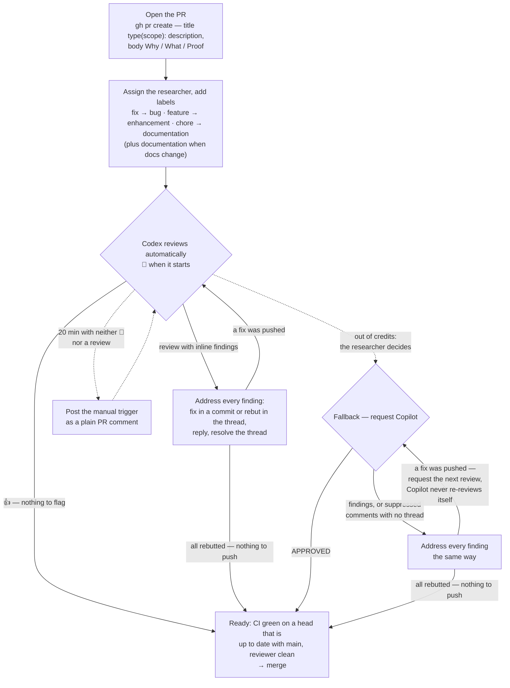

# Development and code review

## Development environment

The project runs inside a Docker Compose stack (see `docker-compose.yaml`):

| Service | Port | What it is |
|---|---|---|
| **devcontainer** | — | Python 3.13 + uv + Spark client tooling. Open the repo in VS Code and reopen in container |
| **postgres-metastore** | 5432 | Backing store for the Hive Metastore |
| **postgres-mlflow** | 5433 | Backing store for MLflow |
| **hive-metastore** | — | Standalone Hive Metastore backed by Postgres |
| **thriftserver** | 10000 | Spark Thrift Server (JDBC/ODBC); Spark UI on 4040 |
| **mlflow** | 5005 | Experiment tracking UI |
| **postgres-superset** | 5434 | Backing store for Superset metadata |
| **superset** | 8088 | Apache Superset BI UI. Admin login in `.env`; the Spark Thriftserver connection is registered in the UI |
| **superset-mcp** | 5008 | Superset MCP server, lets Claude Code manage datasets and charts. No-auth dev mode, wired up in `.mcp.json` |
| **docsify** | 3000 | Serves `docs/` |

### Setup

1. Copy `.env.template` to `.env` and fill in the values (see the comments for per-host memory settings).
2. `docker compose up -d`
3. Open the repo in VS Code and use "Reopen in Container", or `docker compose exec devcontainer bash`.

### Running commands (`just`)

The `justfile` wraps `docker compose exec` so python and dbt commands run
inside the devcontainer from a host terminal (requires
[just](https://github.com/casey/just), e.g. `brew install just`, and the
compose stack to be up):

```bash
just refresh-all                         # every source: each download/load script with its defaults, one dbt build at the end
just python scripts/download_jma_hourly_all.py --prefecture 44   # one source = its download + load scripts (pairs in CLAUDE.md) ...
just python scripts/load_jma_hourly.py && just dbt build          # ... then rebuild + test dbt
just python scripts/load_jepx_spot.py    # python in the devcontainer
just python -c "import power_market_analytics"
just python scripts/spot_price_backtest.py --strategy lightgbm --area tokyo  # forecast backtest
just python scripts/compare_spot_price_runs.py --baseline <run_id> --candidate <run_id>  # matched run comparison
just dbt run                             # dbt, run from /workspace/dbt
just dbt test --select stg_jepx__spot
just exec spark-submit --version         # any command in the devcontainer
just sql                                 # beeline SQL shell on the thriftserver
just shell                               # interactive bash in the devcontainer
just open superset                       # open a web UI: docsify | mlflow | spark | spark-dev | superset
```

Run `just --list` to see all recipes. Anything creating a `SparkSession`
must run in the devcontainer (the Hive metastore and `/spark-warehouse`
volume only resolve on the compose network); dbt also works from the host
directly with `cd dbt && DBT_THRIFT_HOST=localhost uv run dbt <command>`.

## Code review process

Every pull request is reviewed by a bot before it is merged, documentation-only ones
included. **Codex** is the reviewer, and it reviews every push on its own. **Copilot**
is the fallback, for when Codex cannot review — in practice when it has run out of
credits. Claude drives the loop and reports the PR as ready; the researcher merges
unless they have explicitly asked Claude to.

The two are worth keeping both of, because they miss different things. Codex reads the
change for what it is trying to do. Copilot is better at the gap between what a file
promises and what the tool it configures actually enforces.

The mechanics are in `CLAUDE.md` under *Code review (pull requests)*: the exact
`gh api` polls and their timestamps, why the Codex trigger is never spelled out in a
PR body or reply, how a Copilot request differs, resolving review threads, and stacked
PRs. This is the shape of the loop:



One rule the diagram compresses. The repository's required checks must pass on the
PR's *current* head. So a branch that has fallen behind `main` is brought up to date
by merging `main` into it, never by rebasing a reviewed branch. That makes a new head,
which goes through the loop once more before it is merged.
