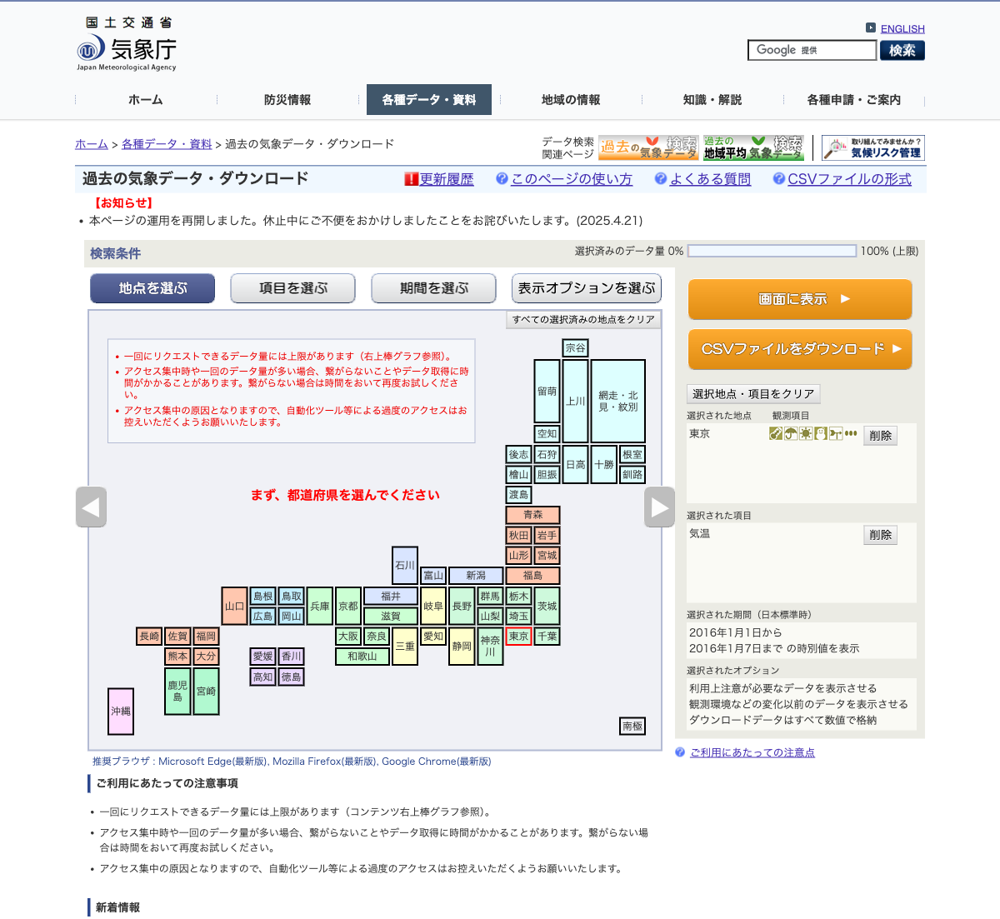
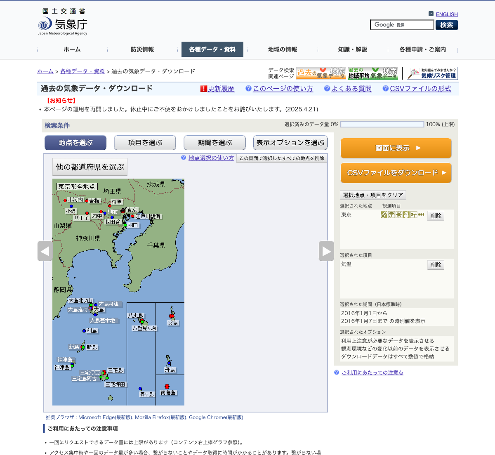
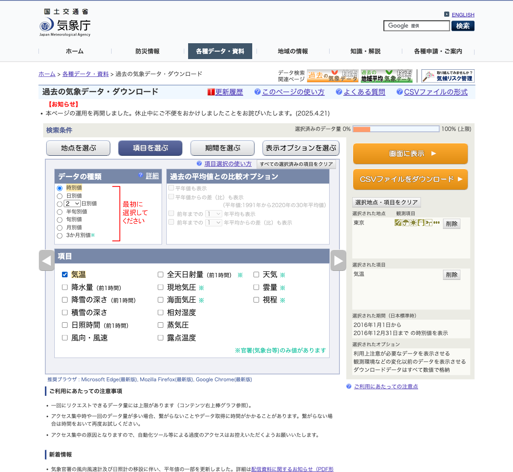
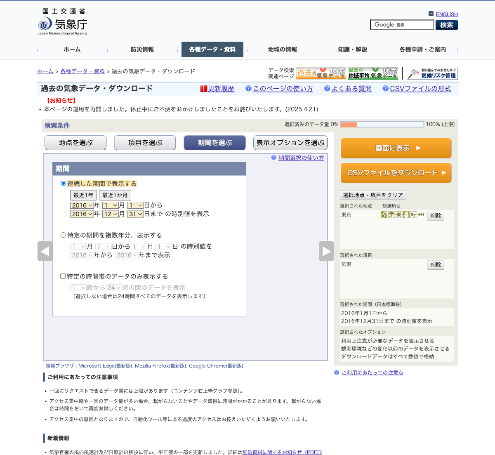

# JMA Hourly Weather Data Retrieval

This document describes how we obtain historical hourly weather observations from the
Japan Meteorological Agency (JMA) for JEPX spot price forecasting: the reverse-engineered
HTTP protocol, the station and element model, the per-request limits, the format of the
downloaded CSV files, and how to use the downloader in
`src/power_market_analytics/jma.py`.

All protocol details below were established empirically on 2026-07-20 by driving the JMA
site in a browser, capturing its network traffic, and replaying the requests with plain
HTTP clients. JMA may change the site at any time; if downloads start failing, re-verify
against the live page.

## 1. Overview

- **Source**: [過去の気象データ・ダウンロード](https://www.data.jma.go.jp/risk/obsdl/index.php)
  (`https://www.data.jma.go.jp/risk/obsdl/`), JMA's official bulk-download UI for
  historical observations. There is no documented API; the page drives a small set of
  form-POST endpoints that we call directly.
- **Key property**: the download endpoint is **stateless** — a single `POST` with form
  fields returns the CSV. No session cookie, login, or token is required.
- **Data**: hourly (時別値) observations from two station networks (staffed offices and
  AMeDAS), available for decades back; we scrape from 2016 to match our JEPX history.
- **Terms of use**: the page explicitly asks users to avoid excessive automated access
  (アクセス集中の原因となりますので、自動化ツール等による過度のアクセスはお控えください),
  and the server enforces this with rate limiting (see [§6](#6-request-limits)). Our
  downloader throttles and backs off accordingly. JMA content is free to reuse with
  attribution per the [JMA website terms](https://www.jma.go.jp/jma/kishou/info/coment.html).

## 2. The browser workflow

The UI is a four-tab wizard; the HTTP protocol in [§3](#3-the-http-protocol) mirrors it
exactly, so understanding the UI explains every payload field.

**Step 1 — 地点を選ぶ (choose stations).** The landing page shows a clickable prefecture
map (61 areas — Hokkaidō is subdivided; see [Appendix A](#appendix-a-prefecture-pd-codes)).



Clicking a prefecture loads its station map. Hovering a station shows its name, kana,
coordinates, and elevation; discontinued stations are included and labeled with their
end-of-observation date.



**Step 2 — 項目を選ぶ (choose items).** Pick the aggregation first (時別値 = hourly),
which reloads the item list. The ※ mark means 官署のみ — the element is only observed at
staffed stations (see [§4](#4-stations)).



**Step 3 — 期間を選ぶ (choose period).** One continuous date range (or a same-months-
across-years mode we don't use). **Step 4 — 表示オプション** we leave at the defaults,
which append quality-information columns and store everything as numbers.

The right panel accumulates the selections, and the gauge at the top right
(選択済みのデータ量) fills toward the per-request data-volume cap. The orange
`CSVファイルをダウンロード` button performs the POST described next.



## 3. The HTTP protocol

### 3.1 Endpoints

| Endpoint | Method | Parameters | Returns |
|---|---|---|---|
| `/risk/obsdl/index.php` | GET | — | The UI page (not needed for scraping) |
| `/risk/obsdl/top/station` | POST | `pd=<code>` | HTML fragment: prefecture map (`pd=00`) or one prefecture's stations (`pd=44` etc.) |
| `/risk/obsdl/top/element` | POST | `aggrgPeriod=<n>` | HTML fragment: item list for that aggregation (9 = hourly) |
| `/risk/obsdl/show/table` | POST | see §3.2 | **The CSV file** (Shift_JIS), or an HTML error page |

All under `https://www.data.jma.go.jp`. The `top/station` response contains, per station,
a block of hidden inputs we parse for enumeration:

```html
<input type="hidden" name="stid"    value="s47662">
<input type="hidden" name="stname"  value="東京">
<input type="hidden" name="prid"    value="44">
<input type="hidden" name="kansoku" value="111111">
```

### 3.2 The download request

`POST /risk/obsdl/show/table` with `Content-Type: application/x-www-form-urlencoded`.
Fields as captured from the browser (JSON-ish values are sent as literal strings):

| Field | Example | Meaning |
|---|---|---|
| `stationNumList` | `["s47662"]` | Station ids; multiple allowed |
| `aggrgPeriod` | `9` | Aggregation: 9=時別値(hourly), 1=日別値, 2=半旬別値, 4=旬別値, 5=月別値, 6=3か月別値, 8=N日別値 |
| `elementNumList` | `[["201",""],["301",""]]` | `[code, option]` pairs; multiple allowed; option is `""` for plain values |
| `interAnnualType` | `1` | 1 = one continuous period |
| `ymdList` | `["2016","2016","1","12","1","31"]` | **`[yearFrom, yearTo, monthFrom, monthTo, dayFrom, dayTo]`** (note the interleaved order) |
| `optionNumList` | `[]` | Extra display options (none) |
| `downloadFlag` | `true` | Download as file (vs. render table) |
| `rmkFlag` | `1` | Append 品質情報 (quality) columns |
| `disconnectFlag` | `1` | Append 均質番号 (homogeneity) columns |
| `youbiFlag` | `0` | No day-of-week column |
| `fukenFlag` | `0` | No prefecture-name row |
| `kijiFlag` | `0` | No remarks (記事) column |
| `csvFlag` | `1` | CSV output |
| `jikantaiFlag` | `0` | All 24 hours (no time-band filter) |
| `jikantaiList` | `[1,24]` | Time band (unused when `jikantaiFlag=0`) |
| `ymdLiteral` | `1` | Date-literal timestamps: hour 24:00 is stored as 00:00 of the next day |

Working `curl` reproduction (downloads hourly temperature for 東京, calendar year 2016):

```bash
curl -s "https://www.data.jma.go.jp/risk/obsdl/show/table" \
  --data-urlencode 'stationNumList=["s47662"]' \
  --data-urlencode 'aggrgPeriod=9' \
  --data-urlencode 'elementNumList=[["201",""]]' \
  --data-urlencode 'interAnnualType=1' \
  --data-urlencode 'ymdList=["2016","2016","1","12","1","31"]' \
  --data-urlencode 'optionNumList=[]' \
  --data-urlencode 'downloadFlag=true' \
  --data-urlencode 'rmkFlag=1' \
  --data-urlencode 'disconnectFlag=1' \
  --data-urlencode 'youbiFlag=0' \
  --data-urlencode 'fukenFlag=0' \
  --data-urlencode 'kijiFlag=0' \
  --data-urlencode 'csvFlag=1' \
  --data-urlencode 'jikantaiFlag=0' \
  --data-urlencode 'jikantaiList=[1,24]' \
  --data-urlencode 'ymdLiteral=1' \
  -H "Referer: https://www.data.jma.go.jp/risk/obsdl/index.php" \
  -o tokyo_2016.csv
iconv -f SHIFT_JIS -t UTF-8 tokyo_2016.csv | head
```

### 3.3 Failure modes

- **HTML error page with HTTP 200.** Returned when the request is invalid — most notably
  when the period's **end date is later than yesterday** (JST) or the request exceeds the
  data-volume cap. Detect it by checking that the decoded response starts with
  `ダウンロードした時刻`; anything else is not a CSV. Beware of encodings when debugging:
  the CSV is Shift_JIS but the error page is UTF-8.
- **HTTP 429 (Too Many Requests).** The server rate-limits; in testing, a burst of ~9
  requests at 2-second spacing triggered it. Space requests ≥ 5 s apart and retry with
  exponential backoff (the downloader does both).

## 4. Stations

### 4.1 Station types

Station ids come in two flavors, and the type determines which elements exist:

| Prefix | Type | Count (approx.) | Observes |
|---|---|---|---|
| `s` | 気象官署 — staffed offices / weather stations (e.g. `s47662` = 東京) | ~150 nationwide | All 15 hourly elements, including the ※ 官署のみ ones (pressure, solar radiation, weather, cloud, visibility) |
| `a` | AMeDAS — automated stations (e.g. `a0368` = 世田谷) | ~1,300 nationwide | A subset: at most precipitation, temperature, wind, sunshine, snow, and (at modernized stations) humidity; many are precipitation-only |

Requesting an element a station does not observe is not an error — you get columns whose
quality flag is 0 (not an observed item) — but it wastes request budget.

### 4.2 Enumerating stations and reading `kansoku`

`POST top/station` with `pd=00` returns the prefecture map (its `id="pr<nn>"` divs give
the codes in [Appendix A](#appendix-a-prefecture-pd-codes)); with `pd=<nn>` it returns
that prefecture's stations, including discontinued ones. Coordinates and elevation are in
each station div's `title` attribute.

The `kansoku` value is a 6-digit mask of what the station observes. The digit order is
defined in the site's own JS (`web/js/top.2.1.js`):

```js
var obs = ['ob_rain', 'ob_wind', 'ob_tmeter', 'ob_sun', 'ob_snow', 'ob_etc'];
var tag = ['降水量', '風', '気温', '日照時間', '積雪・降雪', 'その他'];
```

i.e. `kansoku[i]` for `i = 0..5` covers **[precipitation, wind, temperature, sunshine,
snow, other]**. Values: `0` = not observed, `1` = observed; `2` also renders as observed
and appears only in the sunshine position — at active AMeDAS stations whose sunshine
sensor was replaced by satellite-derived *estimated* sunshine (推計値, from ~2021).
"Other" (その他) covers the staffed-station extras and, at modern four-element AMeDAS
stations, humidity. Observed examples from `pd=44` (Tokyo):

| Station | `kansoku` | Reading |
|---|---|---|
| `s47662` 東京 (staffed) | `111111` | Everything |
| `a1133` 府中 (AMeDAS) | `111201` | Rain, wind, temp, *estimated* sunshine, no snow, humidity |
| `a0371` 羽田 (AMeDAS) | `111000` | Rain, wind, temp only |
| `a0368` 世田谷 (AMeDAS) | `100000` | Precipitation only |

A full-scrape orchestrator should read `kansoku` per station and request only the
elements the station observes.

`JmaStationMasterDownloader` automates this enumeration: it discovers the area codes from
`pd=00`, walks all ~61 area pages, and writes one row per station — id, prefecture, name,
kana, decimal-degree coordinates, elevation, the raw `kansoku` mask plus its decoded
digits, and the end-of-observation date for discontinued stations — to
the `jma_stations` dbt seed (see [§8](#8-downloading-with-power_market_analyticsjma)).
Coordinates are given by JMA in degrees + decimal minutes (0.1′ ≈ 185 m precision);
southern latitudes (南緯, the Antarctic station) parse as negative.

### 4.3 Station metadata changes over time

Station metadata is not static: stations relocate, instruments change height, elements are
added (humidity, estimated sunshine) or discontinued. How this history surfaces:

- **The obsdl `top/station` pages are a current-only snapshot** (SCD type 1): coordinates
  and elevation are silently overwritten on change, with no change dates. The only history
  that survives there is the 観測終了 end date of discontinued stations — and the
  convention that a *major* relocation retires the old station id and mints a new one
  (e.g. the two 新島 entries), while minor moves keep the id. Within downloaded
  observation CSVs, the 均質番号 column marks *when* an environment change happened, but
  not what changed.
- **JMA does publish true SCD-type-2 station history**, just not on the obsdl site.
  Under `https://www.data.jma.go.jp/stats/data/mdrr/chiten/meta/`:
  - `amdmaster.index4` — AMeDAS station history (CSV, Shift_JIS): one row per station
    *era* with `Start Date`/`End Date` (current era ends `9999-99-99`), per-era
    coordinates, altitude, anemometer height, per-element observation flags, an
    `Old Station Number` link across renumbering, and per-element statistical-break
    codes. Example: 府中 (44116) has 7 eras back to 1976, including the sunshine flag
    switching to 2 (estimated) on 2021-03-02 and humidity arriving 2024-11-06.
  - `smaster.index.zip` — the equivalent history for staffed surface stations.
  - `discnt_sfc.csv` — statistics-discontinuation records for staffed stations.
- **Caveat**: these files use JMA's official 5-digit station numbers (府中 = `44116`),
  not the obsdl ids (府中 = `a1133`). Joining the two requires station name + prefecture
  (or coordinates), not ids.

**Empirical change profile** (computed 2026-07-20 from `amdmaster.index4`: 1,868 AMeDAS
stations, 7,935 era rows, 6,067 era transitions; coordinates quantized to 0.001° ≈ 100 m):

| Change type | Count | Typical magnitude |
|---|---|---|
| Relocation (lat/lon) | 626 (10% of transitions) | median ≈ 1.0 km, p90 ≈ 3.5 km, max 10.3 km (名護 1987) |
| Altitude change | 565 | median 10 m, p90 40 m, max 770 m (mountain relocations) |
| Anemometer height change | 1,604 | median 0.3 m, p90 3.5 m, max 18.6 m |
| Element set change | 3,877 | humidity added ×842, sunshine→estimated ×687, temp/wind added ×675 each; removals are single-digit rare |
| Station renumbering | 86 | linked via `Old Station Number` |
| Pure statistical break (no metadata delta) | 2,141 (35%) | data gaps / instrument faults |

Within our 2016+ analysis window, 69 stations (~5% of the active network) relocated —
72 moves, median ≈ 1.0 km, largest 4.7 km (加賀中津原 2022). The median station has 3
eras; the busiest have 12.

For our purposes the obsdl snapshot in the `jma_stations` seed (SCD1, regenerated by
`scripts/update_jma_stations_seed.py`) is sufficient for feature joins; pull the mdrr
history files only if era-accurate coordinates or break dates become necessary.

## 5. Hourly observation elements

Element codes for `aggrgPeriod=9`, extracted from the `top/element` response. "Value
columns" is each element's width in the CSV **and** its weight against the per-request
cap ([§6](#6-request-limits)); wind is the only multi-column element.

| Code | JMA name | `HOURLY_ELEMENTS` key | Value columns | Staffed only (官署のみ) |
|---|---|---|---|---|
| 101 | 降水量（前1時間） | `precipitation` | 1 | |
| 201 | 気温 | `temperature` | 1 | |
| 301 | 風向・風速 | `wind` | 2 (speed + direction) | |
| 401 | 日照時間（前1時間） | `sunshine` | 1 | |
| 501 | 積雪の深さ | `snow_depth` | 1 | |
| 503 | 降雪の深さ（前1時間） | `snowfall` | 1 | |
| 601 | 現地気圧 | `station_pressure` | 1 | ✓ |
| 602 | 海面気圧 | `sea_level_pressure` | 1 | ✓ |
| 604 | 蒸気圧 | `vapor_pressure` | 1 | |
| 605 | 相対湿度 | `humidity` | 1 | |
| 607 | 雲量 | `cloud_cover` | 1 | ✓ |
| 610 | 全天日射量（前1時間） | `solar_radiation` | 1 | ✓ |
| 612 | 露点温度 | `dew_point` | 1 | |
| 703 | 天気 | `weather` | 1 | ✓ |
| 704 | 視程 | `visibility` | 1 | ✓ |

For price forecasting, 天気/雲量/視程 are the least useful (categorical, observer-
dependent, partly discontinued at automated offices); 蒸気圧/露点温度 are derivable from
temperature + humidity.

## 6. Request limits

### 6.1 Data-volume cap

One request may not exceed an internal data-volume cap (the UI gauge). Empirical results,
all for one station over one full year of hourly data:

| Request shape | Value columns | Result |
|---|---|---|
| 1 element (temperature) | 1 | ✓ (~249 KB) |
| 3 elements (temp, precip, humidity) | 3 | ✓ (~385 KB) |
| 5 single-value elements | 5 | ✓ (~524 KB) |
| 4 elements incl. wind | 5 | ✓ (~540 KB) |
| 6 elements incl. wind | 7 | ✗ HTML error page |
| 8, 10, 15 elements | 8–16 | ✗ |
| 15 elements, 6 months | 16 | ✗ |
| 15 elements, 2 stations | 32 | ✗ |

Rule of thumb: **≤ 5 value columns × 1 station × 1 full year per request** (~44k values
succeeded; ~61k was rejected, so the cap lies between). The downloader enforces this via
`MAX_VALUE_COLUMNS = 5`, counting wind as 2.

### 6.2 Rate limiting

A burst of ~9 requests at 2-second spacing drew HTTP 429. The downloader spaces requests
5 s apart (`request_interval`) and retries 429/5xx with exponential backoff
(30 s → 60 s → 120 s → 240 s). At this pacing, downloading all four core elements for one
station's 2016–2026 history (11 requests) takes about a minute.

### 6.3 Packing math for a full scrape

Requests per station-year = ceil(desired value columns ÷ 5):

- Four-element AMeDAS (rain+wind+temp+sunshine = 5 columns): **1 request/station-year**.
- Precipitation-only AMeDAS: 1 request/station-year (smaller).
- Staffed stations, all 15 elements (16 columns): 4 requests/station-year, or **3** if
  天気/雲量/視程 are dropped (13 columns).

Measured for the core-set scrape (2026-07-20): 1,321 stations in scope (1,287 active +
34 discontinued within the 2016+ window) → **14,330 station-year requests ≈ 7 GB**.
Server response time (~10 s per file) dominates the 5-second spacing, so the realistic
pace is ~15 s/request ≈ **60 hours** for the full network (20 h is the spacing-only
floor). Scoping to stations near JEPX demand centers cuts this dramatically.

## 7. CSV file format

Reference: JMA's own format page —
[CSVファイルの形式](https://www.data.jma.go.jp/risk/obsdl/top/help3).

### 7.1 Encoding and overall structure

- **Encoding**: Shift_JIS (`cp932`). **Line endings**: CRLF.
- Layout: download-timestamp line, blank line, header rows, then one data row per hour.
- **The header depth varies.** With a single element there are 3 header rows (station,
  element, flag-labels) — data starts at **line 6**. With multiple elements a fourth
  header row appears (sub-labels such as 風向 under wind) — data starts at **line 7**.
  A loader must parse the header rows, not hard-code positions.

Single-element example (`temperature` only):

```text
ダウンロードした時刻：2026/07/20 12:31:33
                                          ← blank line
,東京,東京,東京
年月日時,気温(℃),気温(℃),気温(℃)
,,品質情報,均質番号
2016/1/1 1:00:00,5.2,8,1
```

Multi-element example (precipitation, temperature, wind, sunshine — 17 columns):

```text
ダウンロードした時刻：2026/07/20 12:49:53
                                          ← blank line
,東京,東京,東京,東京,東京,東京,東京,東京,東京,東京,東京,東京,東京,東京,東京,東京
年月日時,降水量(mm),降水量(mm),降水量(mm),降水量(mm),気温(℃),気温(℃),気温(℃),風速(m/s),風速(m/s),風速(m/s),風速(m/s),風速(m/s),日照時間(時間),日照時間(時間),日照時間(時間),日照時間(時間)
,,,,,,,,,,風向,風向,,,,,
,,現象なし情報,品質情報,均質番号,,品質情報,均質番号,,品質情報,,品質情報,均質番号,,現象なし情報,品質情報,均質番号
2016/1/1 1:00:00,0,1,8,1,5.2,8,1,2.4,8,北西,8,1,0,1,8,1
```

### 7.2 Column groups

Each element occupies a contiguous group: value column(s), then appended info columns.
**The group width varies by element and station type**:

- Every group ends with 品質情報 (per value) and one 均質番号.
- Elements that record "did the phenomenon occur" — precipitation, sunshine, snowfall —
  additionally carry a 現象なし情報 column **at staffed stations** (AMeDAS elements and
  non-phenomenon elements like temperature never have it). Verified side by side: the
  identical temp+precip+sunshine+wind request returns **17 columns for 東京 (staffed)
  but 15 for 府中 (AMeDAS)** — no request parameter changes this, so a loader cannot
  assume one fixed layout across station types.
- Wind expands to 風速 (value, 品質情報) + 風向 (value, 品質情報) + one shared 均質番号.
  Wind direction is a 16-point compass string (北西 etc.) or 静穏 (calm), not a number.
- Value semantics differ too: a rainless/sunless hour at a staffed station is stored as
  `0` with 現象なし情報 = 1, while AMeDAS sunshine stores an **empty cell with quality 8**
  for nighttime hours — empty does not always mean missing; interpret value cells
  together with their quality flag and element.

### 7.3 Appended information values

品質情報 (quality flag), one per value column:

| Value | Meaning |
|---|---|
| 8 | Normal value (no missing source data) |
| 5 | Quasi-normal (some source data missing, within tolerance ~80%) |
| 4 | Insufficient data (資料不足値) |
| 2 | Questionable value (疑問値; hourly only) — value cell is empty |
| 1 | Missing (欠測) — value cell is empty |
| 0 | Not an observed/statistical item for this station |

現象なし情報: `1` = no phenomenon occurred (e.g. no rain that hour — the value 0 is then
a true zero), `0` = phenomenon occurred. Empty when quality is 2/1/0.

均質番号 (homogeneity number): increments when the observation conditions for *that
element* changed — station relocation, instrument replacement, or a method change —
making values across the boundary not directly comparable. It is per-element (a wind
sensor change breaks wind, not temperature) and the number itself is meaningless: it
tells you *when* something changed, never *what*. The *what* lives in the mdrr station
history files ([§4.3](#43-station-metadata-changes-over-time)); the boundaries line up —
e.g. 府中's hourly sunshine 均質番号 flips 1→2 at 2021-03-02 01:00, exactly the era
boundary `amdmaster.index4` records for its switch to estimated sunshine (verified).
**Numbering restarts from 1 in every downloaded file**, so it must not be compared
across files — when stitching year files, only within-file changes are meaningful, and a
break falling exactly on a chunk boundary is invisible in the CSVs alone.

### 7.4 Time semantics

- Timestamps are JST. Hours run 01:00–24:00, and with `ymdLiteral=1` hour 24:00 is
  stored as **00:00 of the next day**. A year file therefore covers
  `Jan 1 01:00` through `Jan 1 00:00` of the following year — 8,760 rows (8,784 in leap
  years) with **no overlap** between consecutive year files.
- The current year's file ends at yesterday 24:00 (= today 00:00 JST).

### 7.5 Minimum distinct formats for ingestion

A file's column layout is a pure function of **(element set) × (station class)** — nothing
else. Within one class and one fixed element set, every station produces the identical
layout: unobserved elements still emit standard-width groups (empty value, quality 0;
verified at a precipitation-only station), all 159 staffed stations observe all elements
(`kansoku=111111`), and discontinued stations keep the layout too. A set containing a
phenomenon element (降水量 101, 日照時間 401, 降雪 503) has two layout variants (staffed
adds 現象なし情報); a set without any has one shared layout everywhere.

Consequences, given the 5-value-column cap:

- **Core coverage** (temp + precip + wind + sunshine, every station): **2 formats** —
  the 15-column AMeDAS layout and the 17-column staffed layout. This is the floor for
  any coverage that includes precipitation or sunshine at both station classes; only a
  phenomenon-free set (e.g. temp + wind + humidity) could reach a single format.
- **Full coverage** (all forecast-relevant elements): **5 formats** —
  | # | Element set | Stations | Layout |
  |---|---|---|---|
  | F1 | precip, temp, wind, sunshine | all AMeDAS | 15 cols |
  | F2 | precip, temp, wind, sunshine | all staffed | 17 cols |
  | F3 | snowfall, snow_depth, humidity | AMeDAS observing any of them | 10 cols |
  | F4 | snowfall, snow_depth, humidity, vapor_pressure, dew_point | all staffed | 17 cols |
  | F5 | solar_radiation, station_pressure, sea_level_pressure | all staffed | 10 cols |

  F3 cannot fold into F1 and F4+F5 cannot merge (both exceed the value-column cap), so
  five is the floor at this coverage. The downloader's file naming
  (`{station}_{codes}_{year}.csv`) makes format membership derivable from the file name
  alone (station prefix + element-code list).

### 7.6 Data caveats

- JMA occasionally revises past observations (データ修正のお知らせ on the landing page),
  so cached files can drift from the source; re-download (`force=True`) if exactness
  matters.
- Even 東京 has holes: in 2016–2026 hourly temperature, 2019 has 3 missing hours
  (flag 1), 2020 and 2024 one each, 2022 one quasi-normal hour (flag 5). Loaders must
  tolerate empty value cells wherever the quality flag is not 8/5/4.
- Discontinued stations appear in the station list with an end date; their files simply
  stop at that date.

## 8. Downloading with `power_market_analytics.jma`

`JmaHourlyDownloader` handles chunking (one file per station × element set × year),
caching, throttling, backoff, and response validation. `HOURLY_ELEMENTS` maps friendly
names to element codes.

```python
from power_market_analytics.jma import HOURLY_ELEMENTS, JmaHourlyDownloader

downloader = JmaHourlyDownloader()  # data_dir="data/jma/hourly", 5 s between requests

# One station-year, all four core elements in a single request.
path = downloader.download("s47662", ["temperature", "precipitation", "sunshine", "wind"], 2016)
# -> data/jma/hourly/s47662_101-201-301-401_2016.csv
#    (file name embeds the sorted element codes, so the same set = the same cache file)

# Cached: a second call returns instantly without touching JMA.
path = downloader.download("s47662", ["temperature", "precipitation", "sunshine", "wind"], 2016)

# The current year must be refreshed explicitly (JMA appends new hours daily).
downloader.download("s47662", ["temperature", "precipitation", "sunshine", "wind"], 2026, force=True)

# The value-column budget is validated up front (wind counts as 2):
downloader.download("s47662", ["temperature", "humidity", "solar_radiation", "wind"], 2016)  # 5 cols: OK
# downloader.download("s47662", ["temperature", "humidity", "sunshine", "precipitation", "wind"], 2016)
#   -> ValueError: needs 6 value columns; JMA rejects full-year requests above 5
```

The CLI wrapper downloads a station's full history (past years cached, current year
refreshed):

```bash
# Host (no SparkSession involved):
PYTHONPATH=src uv run python scripts/download_jma_hourly.py --station s47662
# Or in the devcontainer:
just python scripts/download_jma_hourly.py --station s47662 --elements temperature wind
```

`JmaStationMasterDownloader` scrapes the station master ([§4.2](#42-enumerating-stations-and-reading-kansoku))
into a single UTF-8 CSV — roughly 60 requests, so ~5 minutes on a fresh run. The
canonical copy is the version-controlled dbt seed `dbt/seeds/jma_stations.csv`,
regenerated by:

```bash
PYTHONPATH=src uv run python scripts/update_jma_stations_seed.py
```

Columns: `station_id, prefecture_code, station_name, station_kana, latitude, longitude,
elevation_m, kansoku, obs_precipitation, obs_wind, obs_temperature, obs_sunshine,
obs_snow, obs_other, observation_ended_on`. `dbt build` loads the seed and derives the
`dim_jma_station` dimension from it (adds `station_type` and `is_active`; one row per
station, `station_id` as the natural key).

### The full-network scrape

`scripts/download_jma_hourly_all.py` orchestrates the core-set scrape: it loads the
station master (downloading it first if absent), plans one request per station-year —
skipping stations that ended before the window and truncating discontinued stations at
their end year — and downloads every missing file. It is resumable (existing files are
cached; re-running continues where it stopped and retries earlier failures), refreshes a
current-year file only when it predates today, logs and skips per-download failures, and
aborts after 10 consecutive failures as a rate-limit circuit breaker. See
[§6.3](#63-packing-math-for-a-full-scrape) for scale: ~14.3k requests, roughly 60 hours,
so run it detached:

```bash
nohup uv run python scripts/download_jma_hourly_all.py > jma_scrape.log 2>&1 &
# --prefecture 44        only 東京 stations (codes: Appendix A; several codes allowed)
# --limit N              only the first N stations (test runs)
# --start-year/--end-year  narrow the year range
# --dry-run              plan and report without downloading
```

### Loading into the warehouse

`scripts/load_jma_hourly.py` performs a full reload of the downloaded core-set files into
`raw.jma_hourly_amedas` / `raw.jma_hourly_staffed` — one table per format
([§7.5](#75-minimum-distinct-formats-for-ingestion)) — via `JmaHourlyCsvLoader`
(`src/power_market_analytics/jma_loader.py`), a positional variant of the generic
`CsvLoader`: because the JMA header rows repeat labels per element, columns are addressed
as `_c0`..`_c16` in the load contracts (`conf/schemas/jma_hourly_amedas.yaml`,
`conf/schemas/jma_hourly_staffed.yaml`), `station_id` is injected from the file name, and
each file's column count is checked against the contract before reading. dbt staging
models `stg_jma__hourly_amedas` / `stg_jma__hourly_staffed` expose the raw tables as-is
with enforced contracts, grain uniqueness tests, and accepted-values tests on the flag
columns. Loading needs Spark, so run inside the devcontainer:

```bash
just python scripts/load_jma_hourly.py
just dbt build --select stg_jma__hourly_amedas stg_jma__hourly_staffed
```

Minimal parse of a downloaded multi-element file (illustrative; the real loader should
follow the CSV-loading conventions used for JEPX data):

```python
import pandas as pd

df = pd.read_csv(
    "data/jma/hourly/s47662_101-201-301-401_2016.csv",
    encoding="cp932",
    skiprows=6,  # 5 for single-element files — parse the header instead of hard-coding
    header=None,
    names=[
        "observed_at",
        "precip_mm", "precip_none", "precip_q", "precip_h",
        "temp_c", "temp_q", "temp_h",
        "wind_speed_ms", "wind_speed_q", "wind_dir", "wind_dir_q", "wind_h",
        "sunshine_h", "sunshine_none", "sunshine_q", "sunshine_hn",
    ],
    parse_dates=["observed_at"],
)
```

## 9. Local artifacts

- Hourly files land in `data/jma/hourly/` (gitignored), named
  `{station_id}_{sorted-element-codes}_{year}.csv`, e.g.
  `s47662_101-201-301-401_2016.csv`.
- The station master is the dbt seed `dbt/seeds/jma_stations.csv` (UTF-8,
  version-controlled, one row per station including discontinued ones, sorted by
  prefecture then station id), surfaced in the warehouse as `dim_jma_station`.
- Currently downloaded: the station master, plus 東京 (`s47662`) precipitation +
  temperature + wind + sunshine, 2016 through 2026 (current year partial), validated
  complete — 8,760/8,784 data rows per full year, 17 columns.

## Appendix A: Prefecture (`pd`) codes

From `POST top/station` with `pd=00`. Hokkaidō is subdivided into its 14 subprefectural
areas; 99 is the Antarctic station (昭和基地).

| pd | Area | pd | Area | pd | Area |
|---|---|---|---|---|---|
| 11 | 宗谷 | 34 | 宮城 | 61 | 京都 |
| 12 | 上川 | 35 | 山形 | 62 | 大阪 |
| 13 | 留萌 | 36 | 福島 | 63 | 兵庫 |
| 14 | 石狩 | 40 | 茨城 | 64 | 奈良 |
| 15 | 空知 | 41 | 栃木 | 65 | 和歌山 |
| 16 | 後志 | 42 | 群馬 | 66 | 岡山 |
| 17 | 網走・北見・紋別 | 43 | 埼玉 | 67 | 広島 |
| 18 | 根室 | 44 | 東京 | 68 | 島根 |
| 19 | 釧路 | 45 | 千葉 | 69 | 鳥取 |
| 20 | 十勝 | 46 | 神奈川 | 71 | 徳島 |
| 21 | 胆振 | 48 | 長野 | 72 | 香川 |
| 22 | 日高 | 49 | 山梨 | 73 | 愛媛 |
| 23 | 渡島 | 50 | 静岡 | 74 | 高知 |
| 24 | 檜山 | 51 | 愛知 | 81 | 山口 |
| 31 | 青森 | 52 | 岐阜 | 82 | 福岡 |
| 32 | 秋田 | 53 | 三重 | 83 | 大分 |
| 33 | 岩手 | 54 | 新潟 | 84 | 長崎 |
| | | 55 | 富山 | 85 | 佐賀 |
| | | 56 | 石川 | 86 | 熊本 |
| | | 57 | 福井 | 87 | 宮崎 |
| | | 60 | 滋賀 | 88 | 鹿児島 |
| | | | | 91 | 沖縄 |
| | | | | 99 | 南極 |
