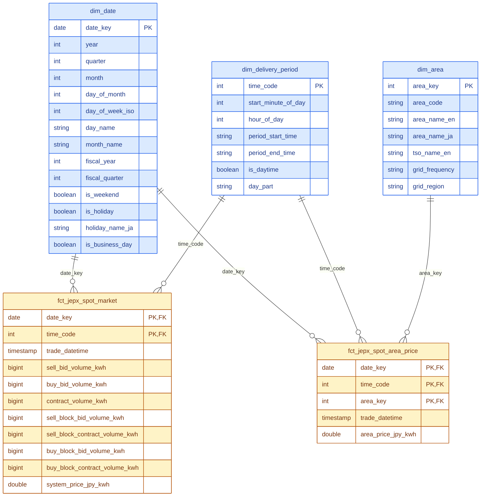

# power-market-analytics

Power market analytics.

## Curated star schema

The curated layer (`dbt/models/curated/`) contains two fact tables sharing
conformed date and delivery-period dimensions:

- `fct_jepx_spot_market` — market-wide JEPX day-ahead auction results, one row
  per delivery period (trade date × 30-minute time code).
- `fct_jepx_spot_area_price` — area clearing prices, one row per delivery
  period per bidding zone.



Notes:

- Prices (`system_price_jpy_kwh`, `area_price_jpy_kwh`) are non-additive —
  average them (volume-weighted if needed), never sum. Volumes are fully
  additive.
- `trade_datetime` is a standalone timestamp for time-series work, not a
  dimension key.
- `dim_area` row 0 is the default "System (Nationwide)" row, so fact tables
  never carry a null area foreign key.

## Development environment

The project runs inside a Docker Compose stack (see `docker-compose.yaml`):

- **devcontainer** — Python 3.13 + uv + Spark client tooling; open the repo in VS Code and reopen in container
- **postgres-metastore** — backing store for the Hive Metastore (host port 5432)
- **postgres-mlflow** — backing store for MLflow (host port 5433)
- **hive-metastore** — standalone Hive Metastore backed by Postgres
- **thriftserver** — Spark Thrift Server (JDBC/ODBC, port 10000; Spark UI on 4040)
- **mlflow** — experiment tracking UI on port 5005
- **docsify** — serves `docs/` on port 3000

### Setup

1. Copy `.env.template` to `.env` and fill in the values (see the comments for per-host memory settings).
2. `docker compose up -d`
3. Open the repo in VS Code and use "Reopen in Container", or `docker compose exec devcontainer bash`.

### Running commands (`just`)

The `justfile` wraps `docker compose exec` so python and dbt commands run
inside the devcontainer from a host terminal (requires
[just](https://github.com/casey/just), e.g. `brew install just`, and the
compose stack to be up):

```bash
just refresh-jepx                        # JEPX refresh: redownload market data + holidays, reload raw, rebuild + test dbt
just refresh-jma --prefecture 44         # JMA weather refresh (scoped; no args = full network, ~60 h cold)
just python scripts/load_jepx_spot.py    # python in the devcontainer
just python -c "import power_market_analytics"
just dbt run                             # dbt, run from /workspace/dbt
just dbt test --select stg_jepx__spot
just exec spark-submit --version         # any command in the devcontainer
just sql                                 # beeline SQL shell on the thriftserver
just shell                               # interactive bash in the devcontainer
```

Run `just --list` to see all recipes. Anything creating a `SparkSession`
must run in the devcontainer (the Hive metastore and `/spark-warehouse`
volume only resolve on the compose network); dbt also works from the host
directly with `cd dbt && DBT_THRIFT_HOST=localhost uv run dbt <command>`.
