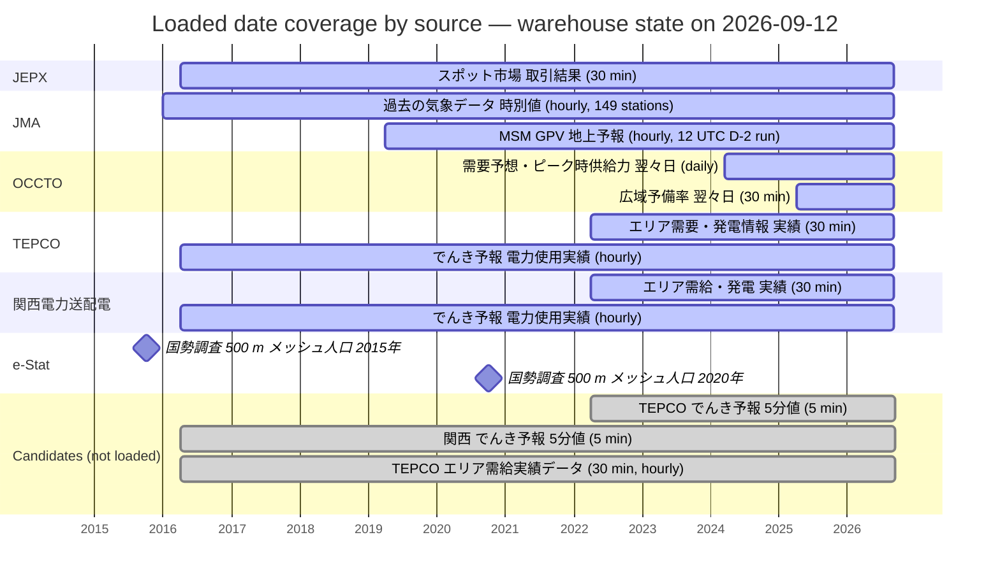

# power-market-analytics

Power market analytics.

## What's here

- **Data sources** — below: every dataset the warehouse loads, its grain, its
  loaded date range and the doc that records how it is retrieved.
- [**Curated star schema**](Curated-Star-Schema.md) — the sixteen fact tables,
  their dimensions and the ER diagram.
- [**Forecast analysis**](Forecast-Analysis.md) — the walk-forward backtest, the
  strategies and feature experiments, and the Superset dashboards.
- [**Development and code review**](Development.md) — the Compose stack, setup,
  the `just` recipes, and how a pull request is reviewed.
- [**Forecasting research**](research/README.md) — the observation log and the
  investigations of each task, and the [papers](research/papers.md) they cite.
- [**Design history**](superpowers/README.md) — every design spec and
  implementation plan, newest first.

## Data sources

Every external dataset the warehouse loads, plus candidates we have evaluated
but not loaded. *Grain* is the source file's grain; *Availability* is the loaded
date range (`current` = up to the last run of `just refresh-all`; for
candidates, the published range). Retrieval protocols and format quirks live in
the linked docs.

### Coverage at a glance

Every loaded source, as the warehouse held it on 2026-09-12. A bar ends at the
last loaded day rather than at today: a source is only as current as the last
`just refresh-all` run, and the feeds settle at different lags.

```mermaid
gantt
    title Loaded date coverage by source — warehouse state on 2026-09-12
    dateFormat YYYY-MM-DD
    axisFormat %Y
    tickInterval 1year
    todayMarker off

    section JEPX
    スポット市場 取引結果 (30 min)                 :active, jepx, 2016-04-01, 2026-09-07

    section JMA
    過去の気象データ 時別値 (hourly, 149 stations) :active, jma, 2016-01-01, 2026-09-05
    MSM GPV 地上予報 (hourly, 12 UTC D-2 run)      :active, msm, 2019-04-01, 2026-09-07

    section OCCTO
    需要予想・ピーク時供給力 翌々日 (daily)        :active, occtod, 2024-03-13, 2026-09-07
    広域予備率 翌々日 (30 min)                     :active, occtor, 2025-04-01, 2026-09-07

    section TEPCO
    エリア需要・発電情報 実績 (30 min)             :active, tepcoa, 2022-04-01, 2026-09-05
    でんき予報 電力使用実績 (hourly)               :active, tepcou, 2016-04-01, 2026-09-05

    section 関西電力送配電
    エリア需給・発電 実績 (30 min)                 :active, kansaia, 2022-04-01, 2026-09-05
    でんき予報 電力使用実績 (hourly)               :active, kansaiu, 2016-04-01, 2026-09-05

    section e-Stat
    国勢調査 500 m メッシュ人口 2015年             :milestone, estat15, 2015-10-01, 0d
    国勢調査 500 m メッシュ人口 2020年             :milestone, estat20, 2020-10-01, 0d

    section Candidates (not loaded)
    TEPCO でんき予報 5分値 (5 min)                 :done, cand1, 2022-04-01, 2026-09-11
    関西 でんき予報 5分値 (5 min)                  :done, cand2, 2016-04-01, 2026-09-11
    TEPCO エリア需給実績データ (30 min, hourly)    :done, cand3, 2016-04-01, 2026-09-11

    %% Invisible anchor. Mermaid derives the axis from the earliest task date, and
    %% has no axis-minimum setting, so without a task at 2015-01-01 the axis starts
    %% at the 2015 census milestone and draws its diamond half outside the plot.
    %% The name is a zero-width space (U+200B): an empty or blank name will not parse,
    %% and the bar itself is 0 px wide.
    ​ :done, axis_anchor_2015, 2015-01-01, 0d
```

Bars are raw coverage: what the loaders put in `pma_raw`, which is what the
table below lists. A curated fact can start later — OCCTO's first 19 days are
試験データ, so `fct_occto_demand_supply_forecast_daily` begins 2024-04-01. The
census is two point-in-time vintages, drawn as milestones. Candidate bars are
the source's *published* range, not a loaded one, and end on the last day
published. Two reference sets are off this scale and left out: the 内閣府
holiday seed (1955-01-01 ~ 2027-11-23) and the JMA station master (a current
snapshot).

### Loaded

| Source | Dataset | Grain | Content | Availability | Loaded into |
|---|---|---|---|---|---|
| JEPX | [スポット市場 取引結果](https://www.jepx.jp/electricpower/market-data/spot/) | <ul><li>受渡日</li><li>時刻コード (48/day)</li><li>one nationwide row, areas as columns</li></ul> | 売り/買い入札量, 約定総量, システムプライス, エリアプライス ×9 areas, スポット・時間前平均価格, α上限/下限/速報/確報 × 平均価格, 回避可能原価 (全国 + 9 areas), 売り/買いブロック入札・約定総量, FIP参照価格 (全国 + 9 areas); block and FIP columns are null before ~FY2022, FY2016 has genuine 0.00 area prices | 2016-04-01 ~ current | `pma_raw.jepx_spot` |
| JMA | [過去の気象データ（官署 時別値）](https://www.data.jma.go.jp/risk/obsdl/index.php) (過去の気象データ・ダウンロード, obsdl) | <ul><li>station (149 staffed stations inside the JEPX areas)</li><li>hour</li></ul> | 27 columns: precipitation, temperature, wind speed/direction, sunshine duration, snow depth, humidity, solar radiation, each with quality / homogeneity flags and 現象なし markers ([doc](JMA-Weather-Data-Retrieval.md)) | 2016-01-01 ~ current | `pma_raw.jma_hourly_staffed` |
| JMA | [Station master](https://www.data.jma.go.jp/risk/obsdl/top/station) (obsdl station list) | <ul><li>station</li></ul> | station id, name, prefecture, latitude / longitude, elevation, station type; JEPX-area mapping from the hand-curated seed `jma_station_areas` | current snapshot | seed `jma_stations` |
| JMA | [MSM GPV 地上予報](https://database.rish.kyoto-u.ac.jp/arch/jmadata/data/gpv/original/) (RISH 京都大学 生存圏研究所 GPV archive) | <ul><li>station (nearest 5 km grid point)</li><li>forecast_reference_at (12 UTC D−2)</li><li>valid hour (leads 28–51 = D 01:00–24:00 JST)</li></ul> | temperature, relative humidity, u/v wind and speed, precipitation, surface / sea-level pressure, shortwave radiation, total / high / middle / low cloud cover ([doc](JMA-MSM-GPV-Retrieval.md)) | 2019-04-01 ~ current | `pma_raw.jma_msm_surface_forecast` |
| OCCTO | [需要予想・ピーク時供給力（翌々日）](https://occtonet3.occto.or.jp/public/dfw/RP11/OCCTO/SD) (広域機関システム 系統情報公表) | <ul><li>対象日 (formulated on D−2)</li><li>area (9 JEPX areas + エリア計 + 沖縄)</li></ul> | 最小需要 時刻 / MW, 最大需要 時刻 / MW, ピーク時供給力 MW, 使用率 %, 予備率 % — hour-ending labels `01:00`–`24:00`; `min_demand_mw` changed meaning on 2025-04-01 ([doc](OCCTO-Demand-Forecast-Retrieval.md)) | 2024-03-13 ~ current (2024-03-13..31 are OCCTO's pre-FY2024 試験データ, kept in `std` but out of the curated fact) | `pma_raw.occto_demand_forecast_dad` |
| OCCTO | [広域予備率 エリア・広域ブロック情報（翌々日）](https://occtonet3.occto.or.jp/public/dfw/RP11/OCCTO/SD) (same portal, `areaDataKnd=31`; identical numbers on the [広域予備率Web公表システム](https://web-kohyo.occto.or.jp/kks-web-public/download)) | <ul><li>対象日</li><li>30-min period (48/day)</li><li>area / 広域ブロック</li></ul> | エリア需要 MW, 供給力 MW, 予備力 MW, 広域予備率 %, 広域使用率 %, block demand / supply capacity / reserve ([doc §9](OCCTO-Demand-Forecast-Retrieval.md)) | 2025-04-01 ~ current | `pma_raw.occto_area_reserve_rate_dad` |
| TEPCO | [エリア需要・発電情報（実績）](https://www.tepco.co.jp/forecast/html/area-download-j.html) (`AREA_YYYYMM.zip`) | <ul><li>date</li><li>30-min period</li><li>Tokyo area</li></ul> | エリア総需要量, エリア総発電量, エリア風力・太陽光発電量 [30分kWh] — the インバランス料金 系統需給情報 items A-1 / B-1 / B-4; 予測 / BG計画 files exist but are not loaded ([doc](TEPCO-Area-Demand-Generation-Retrieval.md)) | 2022-04-01 ~ yesterday | `pma_raw.tepco_area_demand_generation_actual` |
| TEPCO | [過去の電力使用実績データ（でんき予報）](https://www.tepco.co.jp/forecast/html/download-j.html) — yearly `juyo-YYYY.csv` to 2022-03, monthly `YYYYMM_power_usage.zip` of daily files from 2022-04 ([per-year page](https://www.tepco.co.jp/forecast/html/download_year-j.html)) | <ul><li>date</li><li>hour (1時間平均)</li><li>Tokyo area</li></ul> | **Hourly table only.** ≤ 2022-03: `DATE, TIME, 実績(万kW)`; 2022-04 →: `DATE, TIME, 当日実績(万kW), 予測値(万kW), 使用率(%), 供給力(万kW)` (万kW = 10 MW; 予測値 is the day's last intraday revision). **The same daily files also carry a 288-row 5-minute table — `当日実績(５分間隔値)(万kW), 太陽光発電実績(５分間隔値)(万kW), 太陽光発電量(電力使用量に対する割合)(%)` — which is parsed past and not ingested yet** (listed under Candidates). A display product: 万kW resolution, not systematically revised; TEPCO warns 端数処理の関係で1時間値と5分値の平均が一致しない; differs from A-1 by MAE 1.7 万kW (0.05 %) over 2022-04 → 2026-08 ([doc](TEPCO-Power-Usage-Retrieval.md)) | 2016-04-01 ~ yesterday | `pma_raw.tepco_power_usage_hourly` |
| 関西電力送配電 | [エリア需給・発電（実績）](https://www.kansai-td.co.jp/denkiyoho/imbalance/) (インバランス料金関連に関する情報公表; `YYYYMM_jisseki.zip`) | <ul><li>date</li><li>30-min period</li><li>Kansai area</li></ul> | same A-1 / B-1 / B-4 items in 30分kWh; two CSV layouts (switch 2025-12-25), blank cells on the running day ([doc](Kansai-Area-Demand-Generation-Retrieval.md)) | 2022-04-01 ~ last finalized day | `pma_raw.kansai_area_demand_generation_actual` |
| 関西電力送配電 | [過去の電力使用実績データ（でんき予報）](https://www.kansai-td.co.jp/denkiyoho/download/) — monthly `YYYYMM_jisseki.zip` of daily files under `…/yamasou/` | <ul><li>date</li><li>hour (1時間平均)</li><li>Kansai area</li></ul> | **Hourly table only.** `DATE, TIME, 当日実績(万kW), 予想値(万kW), 使用率(%)`, + `供給力想定値(万kW)` from 2019-09-12 (renamed `供給力(万kW)` 2025-12-25); 使用率 redefined 2020-11-16; 60 Excel-padded files and one `修正後` correction (2016-04-24 00:00) handled at load; the same files carry a 5-minute table that is parsed past (Candidates). Differs from A-1 by MAE 0.42 万kW (0.03 %) from FY2023, 4.99 in FY2022 ([doc](Kansai-Power-Usage-Retrieval.md)) | 2016-04-01 ~ yesterday, except 2024-03-31 | `pma_raw.kansai_power_usage_hourly` |
| e-Stat | [国勢調査 500 m メッシュ人口](https://www.e-stat.go.jp/gis/statmap-search) (統計地理情報システム 統計データダウンロード; 4次メッシュ, one file per 第1次地域区画) | <ul><li>census year</li><li>500 m mesh</li></ul> | 人口総数 (+ suppressed detail columns with 秘匿処理 codes); mesh bounding box / centroid decoded from the JIS X 0410 code ([doc](eStat-Census-Population-Mesh-Retrieval.md)) | 2015-10-01 ~ 2020-10-01 | `pma_raw.estat_census_population_mesh` |
| 内閣府 | [国民の祝日](https://www8.cao.go.jp/chosei/shukujitsu/gaiyou.html) (`syukujitsu.csv`) | <ul><li>holiday date</li></ul> | 国民の祝日・休日月日, 名称; `dim_date` adds the customary 年末年始 / ゴールデンウィーク / お盆 days in SQL | 1955-01-01 ~ 2027-11-23 | seed `jpn_national_holidays` |

### Candidates (evaluated, not loaded)

| Source | Dataset | Grain | Content | Availability | Notes |
|---|---|---|---|---|---|
| TEPCO | [過去の電力使用実績データ（でんき予報）— 5-minute table](https://www.tepco.co.jp/forecast/html/download-j.html) — the 288-row block below the hourly table in the same daily `YYYYMMDD_power_usage.csv` files | <ul><li>date</li><li>5 min</li><li>Tokyo area</li></ul> | `当日実績(５分間隔値)(万kW), 太陽光発電実績(５分間隔値)(万kW), 太陽光発電量(電力使用量に対する割合)(%)`; a separate 速報 measurement — over 2022-04 → 2026-08 it runs ≈ 3 万kW below A-1, and the hourly value is not the mean of its twelve values | 2022-04-01 ~ yesterday | Not ingested: the hourly loader skips this block. Would be its own 5-min-grain raw table (a true 30-min shape from 2022-04 plus the only public PV series for the area) |
| 関西電力送配電 | [過去の電力使用実績データ（でんき予報）— 5-minute table](https://www.kansai-td.co.jp/denkiyoho/download/) — the block below the hourly table in the same daily files | <ul><li>date</li><li>5 min</li><li>Kansai area</li></ul> | `当日実績(５分間隔値)(万kW)` from 2016-04, + `太陽光発電実績(５分間隔値)(万kW)` from 2019-09-12 | 2016-04-01 ~ yesterday | Not ingested: the hourly loader skips this block. Would join TEPCO's in a 5-min-grain raw table |
| TEPCO | [エリア需給実績データ](https://www.tepco.co.jp/forecast/html/area_jukyu-j.html) — 30-min `eria_jukyu_YYYYMM_03.csv` (2023年度2月以降); hourly `area-YYYY.csv` on the [2023年度1月迄 page](https://www.tepco.co.jp/forecast/html/area_jukyu_p-j.html) | <ul><li>date</li><li>30-min period (from 2024-02) / hour (FY2016 → 2024-01)</li><li>Tokyo area</li></ul> | 30-min, 単位 MW平均: `エリア需要, 原子力, 火力(LNG), 火力(石炭), 火力(石油), 火力(その他), 水力, 地熱, バイオマス, 太陽光発電実績, 太陽光出力制御量, 風力発電実績, 風力出力制御量, 揚水, 蓄電池, 連系線, その他, 合計`. Hourly, 単位 万kWh: `東京エリア需要, 原子力, 火力, 水力, 地熱, バイオマス, 太陽光発電実績, 太陽光出力制御量, 風力発電実績, 風力出力制御量, 揚水, 連系線, 合計`. 発電実績は推計実績を含む; 端数処理により需要と供給力合計が一致しないことがある | 2016-04-01 ~ current | The 系統情報公表の考え方 需給実績 family (30分値 = kW値の30分平均); the only public per-fuel supply breakdown. 30-min エリア需要 differs from A-1 by ≈ 33 MW MAE (2026-08-16 check) |
