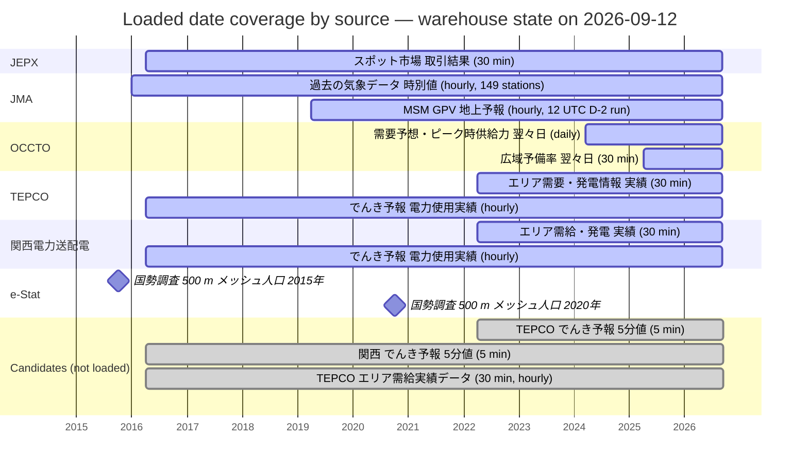
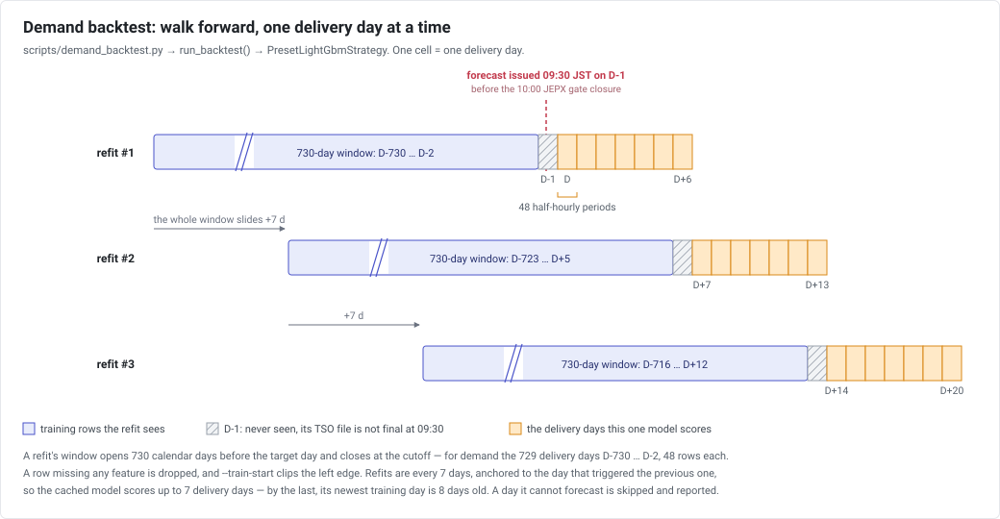
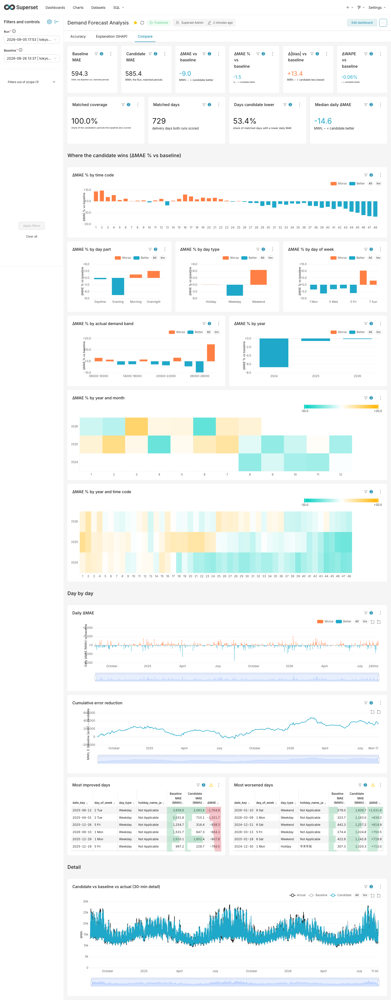
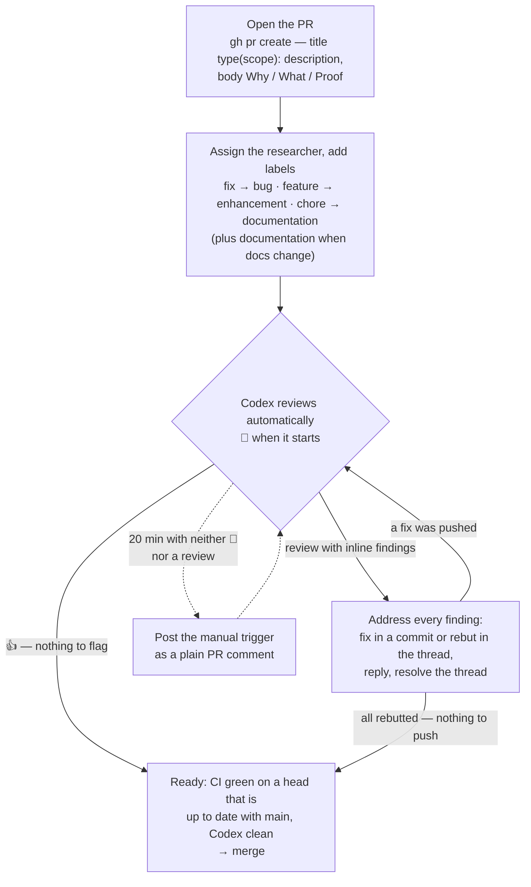

# power-market-analytics

[](https://github.com/hankehly/power-market-analytics/actions/workflows/ci.yml?query=branch%3Amain)

Power market analytics.

## Data sources

Every external dataset the warehouse loads, plus candidates we have evaluated
but not loaded. *Grain* is the source file's grain; *Availability* is the loaded
date range (`current` = up to the last run of `just refresh-all`; for
candidates, the published range). Retrieval protocols and format quirks live in
the linked docs.

### Coverage at a glance

Every loaded source, as the warehouse held it on 2026-09-12. A bar ends at the
last loaded day rather than at today: a source is only as current as the last
`just refresh-all` run, and the feeds settle at different lags.


```mermaid
gantt
    title Loaded date coverage by source — warehouse state on 2026-09-12
    dateFormat YYYY-MM-DD
    axisFormat %Y
    tickInterval 1year
    todayMarker off

    section JEPX
    スポット市場 取引結果 (30 min)                 :active, jepx, 2016-04-01, 2026-09-07

    section JMA
    過去の気象データ 時別値 (hourly, 149 stations) :active, jma, 2016-01-01, 2026-09-05
    MSM GPV 地上予報 (hourly, 12 UTC D-2 run)      :active, msm, 2019-04-01, 2026-09-07

    section OCCTO
    需要予想・ピーク時供給力 翌々日 (daily)        :active, occtod, 2024-03-13, 2026-09-07
    広域予備率 翌々日 (30 min)                     :active, occtor, 2025-04-01, 2026-09-07

    section TEPCO
    エリア需要・発電情報 実績 (30 min)             :active, tepcoa, 2022-04-01, 2026-09-05
    でんき予報 電力使用実績 (hourly)               :active, tepcou, 2016-04-01, 2026-09-05

    section 関西電力送配電
    エリア需給・発電 実績 (30 min)                 :active, kansaia, 2022-04-01, 2026-09-05
    でんき予報 電力使用実績 (hourly)               :active, kansaiu, 2016-04-01, 2026-09-05

    section e-Stat
    国勢調査 500 m メッシュ人口 2015年             :milestone, estat15, 2015-10-01, 0d
    国勢調査 500 m メッシュ人口 2020年             :milestone, estat20, 2020-10-01, 0d

    section Candidates (not loaded)
    TEPCO でんき予報 5分値 (5 min)                 :done, cand1, 2022-04-01, 2026-09-11
    関西 でんき予報 5分値 (5 min)                  :done, cand2, 2016-04-01, 2026-09-11
    TEPCO エリア需給実績データ (30 min, hourly)    :done, cand3, 2016-04-01, 2026-09-11

    %% Invisible anchor. Mermaid derives the axis from the earliest task date, and
    %% has no axis-minimum setting, so without a task at 2015-01-01 the axis starts
    %% at the 2015 census milestone and draws its diamond half outside the plot.
    %% The name is a zero-width space (U+200B): an empty or blank name will not parse,
    %% and the bar itself is 0 px wide.
    ​ :done, axis_anchor_2015, 2015-01-01, 0d
```

Bars are raw coverage: what the loaders put in `pma_raw`, which is what the
table below lists. A curated fact can start later — OCCTO's first 19 days are
試験データ, so `fct_occto_demand_supply_forecast_daily` begins 2024-04-01. The
census is two point-in-time vintages, drawn as milestones. Candidate bars are
the source's *published* range, not a loaded one, and end on the last day
published. Two reference sets are off this scale and left out: the 内閣府
holiday seed (1955-01-01 ~ 2027-11-23) and the JMA station master (a current
snapshot).

### Loaded

| Source | Dataset | Grain | Content | Availability | Loaded into |
|---|---|---|---|---|---|
| JEPX | [スポット市場 取引結果](https://www.jepx.jp/electricpower/market-data/spot/) | <ul><li>受渡日</li><li>時刻コード (48/day)</li><li>one nationwide row, areas as columns</li></ul> | 売り/買い入札量, 約定総量, システムプライス, エリアプライス ×9 areas, スポット・時間前平均価格, α上限/下限/速報/確報 × 平均価格, 回避可能原価 (全国 + 9 areas), 売り/買いブロック入札・約定総量, FIP参照価格 (全国 + 9 areas); block and FIP columns are null before ~FY2022, FY2016 has genuine 0.00 area prices | 2016-04-01 ~ current | `pma_raw.jepx_spot` |
| JMA | [過去の気象データ（官署 時別値）](https://www.data.jma.go.jp/risk/obsdl/index.php) (過去の気象データ・ダウンロード, obsdl) | <ul><li>station (149 staffed stations inside the JEPX areas)</li><li>hour</li></ul> | 27 columns: precipitation, temperature, wind speed/direction, sunshine duration, snow depth, humidity, solar radiation, each with quality / homogeneity flags and 現象なし markers ([doc](JMA-Weather-Data-Retrieval.md)) | 2016-01-01 ~ current | `pma_raw.jma_hourly_staffed` |
| JMA | [Station master](https://www.data.jma.go.jp/risk/obsdl/top/station) (obsdl station list) | <ul><li>station</li></ul> | station id, name, prefecture, latitude / longitude, elevation, station type; JEPX-area mapping from the hand-curated seed `jma_station_areas` | current snapshot | seed `jma_stations` |
| JMA | [MSM GPV 地上予報](https://database.rish.kyoto-u.ac.jp/arch/jmadata/data/gpv/original/) (RISH 京都大学 生存圏研究所 GPV archive) | <ul><li>station (nearest 5 km grid point)</li><li>forecast_reference_at (12 UTC D−2)</li><li>valid hour (leads 28–51 = D 01:00–24:00 JST)</li></ul> | temperature, relative humidity, u/v wind and speed, precipitation, surface / sea-level pressure, shortwave radiation, total / high / middle / low cloud cover ([doc](JMA-MSM-GPV-Retrieval.md)) | 2019-04-01 ~ current | `pma_raw.jma_msm_surface_forecast` |
| OCCTO | [需要予想・ピーク時供給力（翌々日）](https://occtonet3.occto.or.jp/public/dfw/RP11/OCCTO/SD) (広域機関システム 系統情報公表) | <ul><li>対象日 (formulated on D−2)</li><li>area (9 JEPX areas + エリア計 + 沖縄)</li></ul> | 最小需要 時刻 / MW, 最大需要 時刻 / MW, ピーク時供給力 MW, 使用率 %, 予備率 % — hour-ending labels `01:00`–`24:00`; `min_demand_mw` changed meaning on 2025-04-01 ([doc](OCCTO-Demand-Forecast-Retrieval.md)) | 2024-03-13 ~ current (2024-03-13..31 are OCCTO's pre-FY2024 試験データ, kept in `std` but out of the curated fact) | `pma_raw.occto_demand_forecast_dad` |
| OCCTO | [広域予備率 エリア・広域ブロック情報（翌々日）](https://occtonet3.occto.or.jp/public/dfw/RP11/OCCTO/SD) (same portal, `areaDataKnd=31`; identical numbers on the [広域予備率Web公表システム](https://web-kohyo.occto.or.jp/kks-web-public/download)) | <ul><li>対象日</li><li>30-min period (48/day)</li><li>area / 広域ブロック</li></ul> | エリア需要 MW, 供給力 MW, 予備力 MW, 広域予備率 %, 広域使用率 %, block demand / supply capacity / reserve ([doc §9](OCCTO-Demand-Forecast-Retrieval.md)) | 2025-04-01 ~ current | `pma_raw.occto_area_reserve_rate_dad` |
| TEPCO | [エリア需要・発電情報（実績）](https://www.tepco.co.jp/forecast/html/area-download-j.html) (`AREA_YYYYMM.zip`) | <ul><li>date</li><li>30-min period</li><li>Tokyo area</li></ul> | エリア総需要量, エリア総発電量, エリア風力・太陽光発電量 [30分kWh] — the インバランス料金 系統需給情報 items A-1 / B-1 / B-4; 予測 / BG計画 files exist but are not loaded ([doc](TEPCO-Area-Demand-Generation-Retrieval.md)) | 2022-04-01 ~ yesterday | `pma_raw.tepco_area_demand_generation_actual` |
| TEPCO | [過去の電力使用実績データ（でんき予報）](https://www.tepco.co.jp/forecast/html/download-j.html) — yearly `juyo-YYYY.csv` to 2022-03, monthly `YYYYMM_power_usage.zip` of daily files from 2022-04 ([per-year page](https://www.tepco.co.jp/forecast/html/download_year-j.html)) | <ul><li>date</li><li>hour (1時間平均)</li><li>Tokyo area</li></ul> | **Hourly table only.** ≤ 2022-03: `DATE, TIME, 実績(万kW)`; 2022-04 →: `DATE, TIME, 当日実績(万kW), 予測値(万kW), 使用率(%), 供給力(万kW)` (万kW = 10 MW; 予測値 is the day's last intraday revision). **The same daily files also carry a 288-row 5-minute table — `当日実績(５分間隔値)(万kW), 太陽光発電実績(５分間隔値)(万kW), 太陽光発電量(電力使用量に対する割合)(%)` — which is parsed past and not ingested yet** (listed under Candidates). A display product: 万kW resolution, not systematically revised; TEPCO warns 端数処理の関係で1時間値と5分値の平均が一致しない; differs from A-1 by MAE 1.7 万kW (0.05 %) over 2022-04 → 2026-08 ([doc](TEPCO-Power-Usage-Retrieval.md)) | 2016-04-01 ~ yesterday | `pma_raw.tepco_power_usage_hourly` |
| 関西電力送配電 | [エリア需給・発電（実績）](https://www.kansai-td.co.jp/denkiyoho/imbalance/) (インバランス料金関連に関する情報公表; `YYYYMM_jisseki.zip`) | <ul><li>date</li><li>30-min period</li><li>Kansai area</li></ul> | same A-1 / B-1 / B-4 items in 30分kWh; two CSV layouts (switch 2025-12-25), blank cells on the running day ([doc](Kansai-Area-Demand-Generation-Retrieval.md)) | 2022-04-01 ~ last finalized day | `pma_raw.kansai_area_demand_generation_actual` |
| 関西電力送配電 | [過去の電力使用実績データ（でんき予報）](https://www.kansai-td.co.jp/denkiyoho/download/) — monthly `YYYYMM_jisseki.zip` of daily files under `…/yamasou/` | <ul><li>date</li><li>hour (1時間平均)</li><li>Kansai area</li></ul> | **Hourly table only.** `DATE, TIME, 当日実績(万kW), 予想値(万kW), 使用率(%)`, + `供給力想定値(万kW)` from 2019-09-12 (renamed `供給力(万kW)` 2025-12-25); 使用率 redefined 2020-11-16; 60 Excel-padded files and one `修正後` correction (2016-04-24 00:00) handled at load; the same files carry a 5-minute table that is parsed past (Candidates). Differs from A-1 by MAE 0.42 万kW (0.03 %) from FY2023, 4.99 in FY2022 ([doc](Kansai-Power-Usage-Retrieval.md)) | 2016-04-01 ~ yesterday, except 2024-03-31 | `pma_raw.kansai_power_usage_hourly` |
| e-Stat | [国勢調査 500 m メッシュ人口](https://www.e-stat.go.jp/gis/statmap-search) (統計地理情報システム 統計データダウンロード; 4次メッシュ, one file per 第1次地域区画) | <ul><li>census year</li><li>500 m mesh</li></ul> | 人口総数 (+ suppressed detail columns with 秘匿処理 codes); mesh bounding box / centroid decoded from the JIS X 0410 code ([doc](eStat-Census-Population-Mesh-Retrieval.md)) | 2015-10-01 ~ 2020-10-01 | `pma_raw.estat_census_population_mesh` |
| 内閣府 | [国民の祝日](https://www8.cao.go.jp/chosei/shukujitsu/gaiyou.html) (`syukujitsu.csv`) | <ul><li>holiday date</li></ul> | 国民の祝日・休日月日, 名称; `dim_date` adds the customary 年末年始 / ゴールデンウィーク / お盆 days in SQL | 1955-01-01 ~ 2027-11-23 | seed `jpn_national_holidays` |

### Candidates (evaluated, not loaded)

| Source | Dataset | Grain | Content | Availability | Notes |
|---|---|---|---|---|---|
| TEPCO | [過去の電力使用実績データ（でんき予報）— 5-minute table](https://www.tepco.co.jp/forecast/html/download-j.html) — the 288-row block below the hourly table in the same daily `YYYYMMDD_power_usage.csv` files | <ul><li>date</li><li>5 min</li><li>Tokyo area</li></ul> | `当日実績(５分間隔値)(万kW), 太陽光発電実績(５分間隔値)(万kW), 太陽光発電量(電力使用量に対する割合)(%)`; a separate 速報 measurement — over 2022-04 → 2026-08 it runs ≈ 3 万kW below A-1, and the hourly value is not the mean of its twelve values | 2022-04-01 ~ yesterday | Not ingested: the hourly loader skips this block. Would be its own 5-min-grain raw table (a true 30-min shape from 2022-04 plus the only public PV series for the area) |
| 関西電力送配電 | [過去の電力使用実績データ（でんき予報）— 5-minute table](https://www.kansai-td.co.jp/denkiyoho/download/) — the block below the hourly table in the same daily files | <ul><li>date</li><li>5 min</li><li>Kansai area</li></ul> | `当日実績(５分間隔値)(万kW)` from 2016-04, + `太陽光発電実績(５分間隔値)(万kW)` from 2019-09-12 | 2016-04-01 ~ yesterday | Not ingested: the hourly loader skips this block. Would join TEPCO's in a 5-min-grain raw table |
| TEPCO | [エリア需給実績データ](https://www.tepco.co.jp/forecast/html/area_jukyu-j.html) — 30-min `eria_jukyu_YYYYMM_03.csv` (2023年度2月以降); hourly `area-YYYY.csv` on the [2023年度1月迄 page](https://www.tepco.co.jp/forecast/html/area_jukyu_p-j.html) | <ul><li>date</li><li>30-min period (from 2024-02) / hour (FY2016 → 2024-01)</li><li>Tokyo area</li></ul> | 30-min, 単位 MW平均: `エリア需要, 原子力, 火力(LNG), 火力(石炭), 火力(石油), 火力(その他), 水力, 地熱, バイオマス, 太陽光発電実績, 太陽光出力制御量, 風力発電実績, 風力出力制御量, 揚水, 蓄電池, 連系線, その他, 合計`. Hourly, 単位 万kWh: `東京エリア需要, 原子力, 火力, 水力, 地熱, バイオマス, 太陽光発電実績, 太陽光出力制御量, 風力発電実績, 風力出力制御量, 揚水, 連系線, 合計`. 発電実績は推計実績を含む; 端数処理により需要と供給力合計が一致しないことがある | 2016-04-01 ~ current | The 系統情報公表の考え方 需給実績 family (30分値 = kW値の30分平均); the only public per-fuel supply breakdown. 30-min エリア需要 differs from A-1 by ≈ 33 MW MAE (2026-08-16 check) |

## Curated star schema

The curated layer (`dbt/models/curated/`) contains sixteen fact tables across
six subject areas, sharing a conformed `dim_date` (the census fact, a
once-per-census snapshot, joins its own mesh dimension instead):

- `fct_jepx_spot_market` — market-wide JEPX day-ahead auction results, one row
  per delivery period (trade date × 30-minute time code).
- `fct_jepx_spot_area_price` — area clearing prices, one row per delivery
  period per bidding zone.
- `fct_jma_weather_hourly` — JMA hourly weather observations, one row per
  station and observation hour (native hourly grain; not interpolated to the
  30-minute JEPX periods — align by joining each delivery period to the
  weather hour that contains it).
- `fct_spot_price_forecast` — day-ahead price forecasts written back from
  backtest runs (`scripts/spot_price_backtest.py` →
  `pma_ml.spot_price_forecast`), one row per MLflow run per delivery period
  per area; `run_id` is a degenerate dimension linking to the MLflow run.
  Forecasts only — no actuals stored.
- `fct_spot_price_forecast_accuracy` — the forecast fact drilled across to
  `fct_jepx_spot_area_price` actuals, adding signed/absolute/percentage error
  columns. This is the intended BI surface for forecast analysis.
- `fct_demand_forecast` — day-ahead area demand forecasts written back from
  `scripts/demand_backtest.py` (MLflow experiment `demand`); grain run ×
  delivery period × area; forecast values only.
- `fct_demand_forecast_accuracy` — the demand forecast fact drilled across to
  `fct_area_demand_generation_actual` on (date_key, time_code, area_key):
  `actual_demand_kwh`, signed `error_kwh`, `abs_error_kwh`, `pct_error`,
  `abs_pct_error`; the BI surface for demand runs.
- `fct_occto_demand_supply_forecast_daily` — OCCTO day-after-next (翌々日) demand and
  peak supply-capacity forecasts, one row per target date per JEPX area
  (periodic snapshot; formulated on target date − 2, so it is known before
  the day-ahead auction and usable as a spot-price feature). Covers
  2024-04-01 onward: the published エリア計 roll-ups, Okinawa, and OCCTO's
  pre-FY2024 trial rows (試験データ, 2024-03-13..31) stay in
  `std_occto__demand_forecast_dad` only.
- `fct_occto_demand_supply_forecast_30m` — the half-hourly counterpart: OCCTO
  day-after-next area demand and supply-capacity forecasts (MW) from the
  広域予備率 エリア・広域ブロック情報 publication, one row per delivery period
  per JEPX area (same grain as `fct_jepx_spot_area_price`, joins 1:1). Covers
  2025-04-01 onward — the 48-point 翌々日 series began with FY2025; before
  that only the daily peak/min points above exist. Okinawa and the wide-area
  block / reserve columns stay in `std_occto__area_reserve_rate_dad`.
- `fct_area_demand_generation_actual` — TSO-published area actuals, the
  インバランス料金 「系統の需給に関する情報」 items A-1/B-1/B-4. Total demand,
  total generation and wind+solar generation per 30-minute delivery period,
  energy in kWh and additive, one row per delivery period per area. Tokyo
  (TEPCO Power Grid) and Kansai (関西電力送配電) today, one `std_<tso>__…`
  model per TSO unioned underneath, same grain as `fct_jepx_spot_area_price`.
  Covers 2022-04-01 onward through the last finalized day. Measures are null
  where the TSO published no observation (Tokyo 2025-06-14 time codes 11-48,
  Kansai 2025-10-12 × 22 periods).
- `fct_area_power_usage_hourly` — the TSO でんき予報 hourly 電力使用状況
  display series for Tokyo (TEPCO Power Grid) and Kansai (関西電力送配電). Area
  demand per delivery hour, energy in kWh = the published 1時間平均 万kW ×
  10,000 and additive, one row per date × `hour_of_day` × area. Covers
  2016-04-01, the only public area demand before A-1 begins, through
  yesterday, with no gaps except Kansai 2024-03-31. It is this series alone,
  not stitched with A-1: it is a display product at 万kW resolution, revised
  without notice at best, and the two differ by 0.05 % MAE over their overlap.
  `hour_of_day` references `dim_delivery_hour`, the 24-row shrunken rollup of
  `dim_delivery_period`, so the two facts drill across by summing the
  30-minute fact per `dim_delivery_period.hour_of_day`. The daily files'
  予測値 / 使用率 / 供給力 stay in the `std_<tso>__power_usage_hourly` models.
- `fct_census_population_mesh` — Population Census total population per 500 m
  mesh (e-Stat 統計GIS 4次メッシュ). One row per census vintage (2015 and 2020,
  both JGD2000 products) per nine-digit `mesh_code`. It is a periodic snapshot
  at the census date. It is additive across meshes, since the population is as
  published at every mesh with the privacy processing untouched, but not across
  census years. Joins
  `dim_population_mesh_500m` (one row per mesh: primary mesh, datum, bounding
  box and centroid decoded from the code). Intended for population-weighted
  weather aggregation later; no weights or weather-grid crosswalk are stored.


```mermaid
erDiagram
    dim_date ||--o{ fct_jepx_spot_market : "date_key"
    dim_delivery_period ||--o{ fct_jepx_spot_market : "time_code"
    dim_date ||--o{ fct_jepx_spot_area_price : "date_key"
    dim_delivery_period ||--o{ fct_jepx_spot_area_price : "time_code"
    dim_area ||--o{ fct_jepx_spot_area_price : "area_key"
    dim_date ||--o{ fct_jma_weather_hourly : "date_key"
    dim_jma_station ||--o{ fct_jma_weather_hourly : "station_id"
    dim_date ||--o{ fct_spot_price_forecast : "date_key"
    dim_delivery_period ||--o{ fct_spot_price_forecast : "time_code"
    dim_area ||--o{ fct_spot_price_forecast : "area_key"
    dim_date ||--o{ fct_spot_price_forecast_accuracy : "date_key"
    dim_delivery_period ||--o{ fct_spot_price_forecast_accuracy : "time_code"
    dim_area ||--o{ fct_spot_price_forecast_accuracy : "area_key"
    dim_date ||--o{ fct_demand_forecast : "date_key"
    dim_delivery_period ||--o{ fct_demand_forecast : "time_code"
    dim_area ||--o{ fct_demand_forecast : "area_key"
    dim_date ||--o{ fct_demand_forecast_accuracy : "date_key"
    dim_delivery_period ||--o{ fct_demand_forecast_accuracy : "time_code"
    dim_area ||--o{ fct_demand_forecast_accuracy : "area_key"
    dim_date ||--o{ fct_occto_demand_supply_forecast_daily : "date_key"
    dim_area ||--o{ fct_occto_demand_supply_forecast_daily : "area_key"
    dim_date ||--o{ fct_occto_demand_supply_forecast_30m : "date_key"
    dim_delivery_period ||--o{ fct_occto_demand_supply_forecast_30m : "time_code"
    dim_area ||--o{ fct_occto_demand_supply_forecast_30m : "area_key"
    dim_date ||--o{ fct_area_demand_generation_actual : "date_key"
    dim_delivery_period ||--o{ fct_area_demand_generation_actual : "time_code"
    dim_area ||--o{ fct_area_demand_generation_actual : "area_key"
    dim_delivery_hour ||--o{ dim_delivery_period : "hour_of_day"
    dim_date ||--o{ fct_area_power_usage_hourly : "date_key"
    dim_delivery_hour ||--o{ fct_area_power_usage_hourly : "hour_of_day"
    dim_area ||--o{ fct_area_power_usage_hourly : "area_key"
    dim_population_mesh_500m ||--o{ fct_census_population_mesh : "mesh_code"

    dim_date {
        date date_key PK
        int year
        int half
        int quarter
        int month
        int day_of_month
        int day_of_quarter
        int day_of_year
        int day_of_week_iso
        string day_name
        string month_name
        int fiscal_year
        int fiscal_quarter
        boolean is_weekend
        boolean is_holiday
        string holiday_name_ja
        boolean is_business_day
        double holiday_degree
    }

    dim_delivery_period {
        int time_code PK
        int start_minute_of_day
        int hour_of_day FK
        string period_start_time
        string period_end_time
        boolean is_daytime
        string day_part
    }

    dim_delivery_hour {
        int hour_of_day PK
        int hour_ending
        string period_start_time
        string period_end_time
        int first_time_code FK
        int last_time_code FK
        boolean is_daytime
        string day_part
    }

    dim_area {
        int area_key PK
        string area_code
        string area_name_en
        string area_name_ja
        string tso_name_en
        string grid_frequency
        string grid_region
        string representative_jma_station_id
    }

    fct_jepx_spot_market {
        date date_key PK, FK
        int time_code PK, FK
        timestamp trade_datetime
        bigint sell_bid_volume_kwh
        bigint buy_bid_volume_kwh
        bigint contract_volume_kwh
        bigint sell_block_bid_volume_kwh
        bigint sell_block_contract_volume_kwh
        bigint buy_block_bid_volume_kwh
        bigint buy_block_contract_volume_kwh
        double system_price_jpy_kwh
    }

    fct_jepx_spot_area_price {
        date date_key PK, FK
        int time_code PK, FK
        int area_key PK, FK
        timestamp trade_datetime
        double area_price_jpy_kwh
    }

    dim_jma_station {
        string station_id PK
        string station_type
        int prefecture_code
        string station_name
        string station_kana
        double latitude
        double longitude
        double elevation_m
        string kansoku
        int obs_precipitation
        int obs_wind
        int obs_temperature
        int obs_sunshine
        int obs_snow
        int obs_other
        date observation_ended_on
        boolean is_active
    }

    fct_jma_weather_hourly {
        string station_id PK, FK
        timestamp observed_at PK
        timestamp observed_hour_start_at
        date date_key FK
        double precipitation_mm
        int precipitation_phenomenon_absent
        int precipitation_quality_flag
        int precipitation_homogeneity_no
        double temperature_c
        int temperature_quality_flag
        int temperature_homogeneity_no
        double wind_speed_ms
        int wind_speed_quality_flag
        string wind_direction
        int wind_direction_quality_flag
        int wind_homogeneity_no
        double sunshine_duration_h
        int sunshine_phenomenon_absent
        int sunshine_quality_flag
        int sunshine_homogeneity_no
        int snow_depth_cm
        int snow_depth_phenomenon_absent
        int snow_depth_quality_flag
        int snow_depth_homogeneity_no
        int humidity_pct
        int humidity_quality_flag
        int humidity_homogeneity_no
        double solar_radiation_mjm2
        int solar_radiation_quality_flag
        int solar_radiation_homogeneity_no
    }

    fct_spot_price_forecast {
        date date_key PK, FK
        int time_code PK, FK
        int area_key PK, FK
        string run_id PK
        string strategy
        timestamp trade_datetime
        timestamp forecast_issued_ts
        double horizon_hours
        double forecast_price_jpy_kwh
    }

    fct_spot_price_forecast_accuracy {
        date date_key PK, FK
        int time_code PK, FK
        int area_key PK, FK
        string run_id PK
        string strategy
        timestamp trade_datetime
        timestamp forecast_issued_ts
        double horizon_hours
        double forecast_price_jpy_kwh
        double actual_price_jpy_kwh
        double error_jpy_kwh
        double abs_error_jpy_kwh
        double pct_error
        double abs_pct_error
    }

    fct_demand_forecast {
        date date_key PK, FK
        int time_code PK, FK
        int area_key PK, FK
        string run_id PK
        string strategy
        timestamp trade_datetime
        timestamp forecast_issued_ts
        double horizon_hours
        double forecast_demand_kwh
        timestamp published_at
    }

    fct_demand_forecast_accuracy {
        date date_key PK, FK
        int time_code PK, FK
        int area_key PK, FK
        string run_id PK
        string strategy
        timestamp trade_datetime
        timestamp forecast_issued_ts
        double horizon_hours
        double forecast_demand_kwh
        bigint actual_demand_kwh
        double error_kwh
        double abs_error_kwh
        double pct_error
        double abs_pct_error
    }

    fct_occto_demand_supply_forecast_daily {
        date date_key PK, FK
        int area_key PK, FK
        date formulated_date
        int forecast_horizon_days
        int min_demand_hour_ending
        int min_demand_mw
        int max_demand_hour_ending
        int max_demand_mw
        int max_supply_capacity_mw
        double usage_rate
        double reserve_rate
    }

    fct_occto_demand_supply_forecast_30m {
        date date_key PK, FK
        int time_code PK, FK
        int area_key PK, FK
        timestamp delivery_datetime
        double demand_mw
        double supply_capacity_mw
    }

    fct_area_demand_generation_actual {
        date date_key PK, FK
        int time_code PK, FK
        int area_key PK, FK
        timestamp delivery_datetime
        bigint demand_kwh
        bigint generation_kwh
        bigint wind_solar_generation_kwh
    }

    fct_area_power_usage_hourly {
        date date_key PK, FK
        int hour_of_day PK, FK
        int area_key PK, FK
        timestamp delivery_datetime
        bigint demand_kwh
    }

    dim_population_mesh_500m {
        string mesh_code PK
        string primary_mesh_code
        string geodetic_datum
        double south_latitude
        double north_latitude
        double west_longitude
        double east_longitude
        double centroid_latitude
        double centroid_longitude
    }

    fct_census_population_mesh {
        int census_year PK
        date census_date
        string mesh_code PK, FK
        bigint population_total
    }

    classDef dim fill:#DBEAFE,stroke:#2563EB,color:#1E3A8A
    classDef fact fill:#FEF3C7,stroke:#B45309,color:#78350F
    class dim_date,dim_delivery_period,dim_area,dim_jma_station,dim_population_mesh_500m dim
    class fct_jepx_spot_market,fct_jepx_spot_area_price,fct_jma_weather_hourly,fct_spot_price_forecast,fct_spot_price_forecast_accuracy,fct_demand_forecast,fct_demand_forecast_accuracy,fct_occto_demand_supply_forecast_daily,fct_occto_demand_supply_forecast_30m,fct_area_demand_generation_actual,fct_census_population_mesh fact
```

Notes:

- Prices (`system_price_jpy_kwh`, `area_price_jpy_kwh`) are non-additive —
  average them (volume-weighted if needed), never sum. Volumes are fully
  additive.
- `trade_datetime` is a standalone timestamp for time-series work, not a
  dimension key.
- `dim_area` row 0 is the default "System (Nationwide)" row, so fact tables
  never carry a null area foreign key.
- In `fct_spot_price_forecast_accuracy`, error columns are null where the
  actual is missing (Hokkaido suspension) and percentage errors are also null
  where the actual is 0.00 JPY/kWh, so `AVG(abs_error_jpy_kwh)` /
  `AVG(abs_pct_error)` reproduce the MLflow run's MAE /
  `mape_excl_zero_actuals`. Beware that actuals at the post-FY2016 0.01 floor
  still make percentage errors explode — prefer MAE when a window contains
  near-zero prices.
- `dim_date` is conformed across all subject areas: its spine starts 2016-01-01
  to cover JMA weather (JEPX spot begins at fiscal year 2016 = 2016-04-01).
- `fct_jma_weather_hourly.observed_at` marks the end of the observation hour;
  precipitation and sunshine accumulate over `[observed_hour_start_at,
  observed_at]`, temperature and wind are instantaneous at `observed_at`.
  `phenomenon_absent` columns are null only when the quality flag is 2/1/0, and
  for snow depth also when snow is untracked off-season. Value 0 with
  `phenomenon_absent = 0` is a JMA "trace" reading, below measurement
  resolution, which is distinct from a true zero (`phenomenon_absent = 1`).
- `fct_occto_demand_supply_forecast_daily` MW columns are additive across areas; the
  `usage_rate` / `reserve_rate` columns are fractions (0.924 = 92.4%, converted
  from OCCTO's percentages in the standardized layer) and non-additive
  (average, or recompute from the MW columns). `min_demand_mw` for `date_key` ≤ 2025-03-31 is the demand at the
  minimum-reserve-rate hour, not the minimum demand (an OCCTO definition
  change). Hour-ending values run 1–24 (24 = the hour ending at midnight).
- `fct_occto_demand_supply_forecast_30m` measures are power in MW for the
  30-minute period: additive across areas (they sum to OCCTO's wide-area
  block demand), not across periods — × 0.5 h for MWh, × 500 for the kWh
  unit of `fct_area_demand_generation_actual`. `supply_capacity_mw` is available supply
  capacity (供給力), not a generation forecast; minus `demand_mw` it is the
  published area reserve and can be negative.
- `fct_area_demand_generation_actual` measures are energy per 30-minute
  period in kWh (30分kWh, as published) and additive across periods, days
  and areas; divide by 500 for average MW. `wind_solar_generation_kwh` is
  the wind + solar share of `generation_kwh` (always ≤ it). Each TSO
  measures its own area with its own system (TEPCO values are multiples of
  1,000 kWh, Kansai's exact kWh). The fact joins `fct_jepx_spot_area_price`
  1:1 on (`date_key`, `time_code`, `area_key`).
- `fct_census_population_mesh.population_total` is additive across meshes
  (sum for any geography) but not across `census_year` — each vintage is a
  separate snapshot. It is the published headcount at every mesh, privacy
  processing included (the 秘匿処理 folds only the suppressed detail columns
  into neighbouring meshes, never the total), so nothing is reallocated. The
  census date (October 1) predates `dim_date`'s spine and is carried as a
  plain `census_date`; mesh geography lives on `dim_population_mesh_500m`
  (bounding box / centroid decoded from the JIS X 0410 code, JGD2000).

## Forecast analysis

`scripts/spot_price_backtest.py` backtests a forecasting strategy (day-ahead:
at 9:30 JST on D-1, forecast all 48 half-hour prices for delivery day D) and
records the results in two places, linked by the MLflow `run_id`:

- **MLflow** (`just open mlflow`, experiment `spot_price`) — params, metrics,
  SHAP plots, the permutation feature importance as a CSV and a bar plot, and
  CSV artifacts per run. It is the experiment record.
- **Warehouse** — row-level forecasts written to `pma_ml.spot_price_forecast`
  (partitioned by `run_id`; republishing a run replaces its rows), which dbt
  models into `fct_spot_price_forecast` and `fct_spot_price_forecast_accuracy`.

`scripts/demand_backtest.py` follows the same pattern for area demand
(MLflow experiment `demand`), writing to `fct_demand_forecast` and
`fct_demand_forecast_accuracy`.

### Walk-forward backtest

Both tasks run on one engine, `run_backtest`. It steps through the window one
delivery day at a time and hands the strategy only the history published by the
issue time, keeping the 48 forecasts it returns for day D.

Both are issued at 09:30 JST on D-1, but they do not see the same history, so
every statement below names its task:

- **Demand** — history through **D-2** (`history_lead_days = 2`). The TSO 実績
  file for D-1 is not final at 09:30.
- **Spot price** — history through **D-1** (`history_lead_days = 1`). JEPX
  publishes the previous day's auction result before 09:30.

The LightGBM strategies of both tasks do not fit once: they refit every 7
**calendar** days, counted from the day that triggered the previous refit, on a
window that opens 730 calendar days before the target day and closes at that
task's cutoff — at most 729 delivery days for demand (D-730 … D-2), 730 for spot
price (D-730 … D-1). Between refits the cached model scores the delivery days
that fall inside that cadence, up to seven, and its newest training day reaches
`6 + history_lead_days` days old — 8 for demand, 7 for spot price.



The figure is the **demand** task: 48 half-hourly periods per delivery day, the
D-2 cutoff and the unseen D-1. The spot-price loop has the same shape with that
gap closed, since its window runs to D-1.

A day the strategy cannot forecast — a missing feature raises
`ForecastUnavailableError` — is skipped and reported on
`BacktestRun.skipped_days`, and the rest of the window continues. The forecasts
are then joined one-to-one to actuals, and a forecast point with no actual is
dropped.

Read every number above as the complete-data case, which is what the figure
draws. Gaps only move them one way — fewer rows, fewer scored days, an older
model — and they enter at three points: a period with a null actual never enters
the demand history (a TSO hole like Tokyo 2025-06-14, which keeps 10 of its 48
periods), a training row missing any feature is dropped at fit, and a day that
cannot be forecast is skipped. The model's age follows the same rule: the fit
records `_trained_through` as the newest day that kept a complete row, so when
the cutoff day keeps none, the model is older than the figures above.

The numbers come from two places. Each task's `TaskSpec` fixes its cutoff and
issue time (`history_lead_days`, `issue_offset`); the strategy fixes the window
and the cadence, shared by both tasks (`DEFAULT_TRAIN_WINDOW_DAYS = 730` and
`refit_every_days = 7` on `SlidingWindowLightGbmStrategy`). `--train-start`
clips the window's left edge, which is how a baseline is matched to a candidate
whose feature only begins partway through the history. It aligns that boundary,
not the rows themselves: each strategy drops training rows on its own feature
list, so a candidate feature with scattered nulls still leaves the two fitted on
different rows.

### Strategies and feature experiments (spot price)

Three strategies: `previous_day` (naive), `lightgbm` (calendar and 1-day-lag
features) and `lightgbm_occto`. The last adds the OCCTO 翌々日 peak-demand
hour, peak demand and peak supply capacity for the delivery day, published
D-2 evening and so inside the information cutoff.

For a feature experiment, pin `--start-date`/`--end-date` and `--train-start`
identically for candidate and baseline. The OCCTO history starts 2024-04-01, so
`--train-start 2024-04-01` matches a `lightgbm` baseline to it. Then run
`just dbt build --select +fct_spot_price_forecast_accuracy`, and
`scripts/compare_spot_price_runs.py --baseline <run_id> --candidate <run_id>`
prints matched MAE/bias tables by day part, near the OCCTO peak hour, by month
and for high-price days. Experiments are written up under
[`research/spot_price/`](research/spot_price/README.md), with conventions in
[`research/`](research/README.md).

### Superset dashboards

Charting happens in Superset (`just open superset`), with one
forecast-analysis dashboard per task: **Spot Price Forecast Analysis** and
**Demand Forecast Analysis**.

`scripts/create_forecast_dashboard.py` builds both. No arguments rebuilds every
dashboard; `--task spot_price` or `--task demand` rebuilds one. It creates each
task's virtual dataset (`spot_price_forecast_analysis` /
`demand_forecast_analysis`, the accuracy mart joined to `dim_area`,
`dim_delivery_period` and `dim_date`), every chart, the sectioned layout and the
run filter. Rerunning it is safe, so it is how everything is rebuilt after a
`docker compose down -v`.

Each dashboard opens on the newest run with KPI tiles (MAE, bias, RMSE,
RMSE/MAE, WAPE, P90), error-structure heatmaps and day-type slices, calibration
and error-distribution views, a cross-run leaderboard, a worst-days drill list
and a zoomable 30-minute forecast-vs-actual detail. Clicking a row of the drill
list cross-filters the dashboard to that day.

An **Explanation** tab decomposes a day's forecast into per-feature SHAP
contributions. At its foot sits the run's **Feature importance**: the
permutation importance of each feature next to its mean |SHAP|. Permutation
importance is the MAE increase when that feature's column is shuffled across
the run, computed with scikit-learn over the walk-forward models.

A **Compare** tab puts the run against a **Baseline** run chosen in a second
filter, over the periods both runs scored. It holds delta tiles, diverging
ΔMAE % bars by segment, ΔMAE % heatmaps, daily ΔMAE, the cumulative error
reduction, most-improved / most-worsened day tables, the SHAP contribution
deltas per feature against the baseline, and a three-line detail.

The two dashboards are the same layout with the same chart names. Only the
quantity shows through, JPY/kWh against kWh, with demand values SI-formatted as
`1.098M`. "MAE by actual price band" becomes "… actual demand band" (fixed
2-GWh bins), and "Calibration: forecast vs actual price level" becomes "…
actual demand level" (rounded to 1 GWh).




## Development environment

The project runs inside a Docker Compose stack (see `docker-compose.yaml`):

| Service | Port | What it is |
|---|---|---|
| **devcontainer** | — | Python 3.13 + uv + Spark client tooling. Open the repo in VS Code and reopen in container |
| **postgres-metastore** | 5432 | Backing store for the Hive Metastore |
| **postgres-mlflow** | 5433 | Backing store for MLflow |
| **hive-metastore** | — | Standalone Hive Metastore backed by Postgres |
| **thriftserver** | 10000 | Spark Thrift Server (JDBC/ODBC); Spark UI on 4040 |
| **mlflow** | 5005 | Experiment tracking UI |
| **postgres-superset** | 5434 | Backing store for Superset metadata |
| **superset** | 8088 | Apache Superset BI UI. Admin login in `.env`; the Spark Thriftserver connection is registered in the UI |
| **superset-mcp** | 5008 | Superset MCP server, lets Claude Code manage datasets and charts. No-auth dev mode, wired up in `.mcp.json` |
| **docsify** | 3000 | Serves `docs/` |

### Setup

1. Copy `.env.template` to `.env` and fill in the values (see the comments for per-host memory settings).
2. `docker compose up -d`
3. Open the repo in VS Code and use "Reopen in Container", or `docker compose exec devcontainer bash`.

### Running commands (`just`)

The `justfile` wraps `docker compose exec` so python and dbt commands run
inside the devcontainer from a host terminal (requires
[just](https://github.com/casey/just), e.g. `brew install just`, and the
compose stack to be up):

```bash
just refresh-all                         # every source: each download/load script with its defaults, one dbt build at the end
just python scripts/download_jma_hourly_all.py --prefecture 44   # one source = its download + load scripts (pairs in CLAUDE.md) ...
just python scripts/load_jma_hourly.py && just dbt build          # ... then rebuild + test dbt
just python scripts/load_jepx_spot.py    # python in the devcontainer
just python -c "import power_market_analytics"
just python scripts/spot_price_backtest.py --strategy lightgbm --area tokyo  # forecast backtest
just python scripts/compare_spot_price_runs.py --baseline <run_id> --candidate <run_id>  # matched run comparison
just dbt run                             # dbt, run from /workspace/dbt
just dbt test --select stg_jepx__spot
just exec spark-submit --version         # any command in the devcontainer
just sql                                 # beeline SQL shell on the thriftserver
just shell                               # interactive bash in the devcontainer
just open superset                       # open a web UI: docsify | mlflow | spark | spark-dev | superset
```

Run `just --list` to see all recipes. Anything creating a `SparkSession`
must run in the devcontainer (the Hive metastore and `/spark-warehouse`
volume only resolve on the compose network); dbt also works from the host
directly with `cd dbt && DBT_THRIFT_HOST=localhost uv run dbt <command>`.

## Code review process

Every pull request is reviewed by **Codex** before it is merged, documentation-only
ones included. Codex has been the only reviewer since 2026-09-06, when the Copilot
review that used to follow it was dropped. Claude drives the loop and reports the PR
as ready; the researcher merges unless they have explicitly asked Claude to.

The mechanics are in `CLAUDE.md` under *Code review (pull requests)*: the exact
`gh api` polls and their timestamps, why the Codex trigger is never spelled out in a
PR body or reply, resolving review threads, and stacked PRs. This is the shape of the
loop:


```mermaid
flowchart TD
    open["Open the PR<br/>gh pr create — title type(scope): description,<br/>body Why / What / Proof"]
    open --> meta["Assign the researcher, add labels<br/>fix → bug · feature → enhancement · chore → documentation<br/>(plus documentation when docs change)"]
    meta --> codex{"Codex reviews automatically<br/>👀 when it starts"}
    codex -->|"👍 — nothing to flag"| ready["Ready: CI green on a head that is<br/>up to date with main, Codex clean<br/>→ merge"]
    codex -->|"review with inline findings"| fix["Address every finding:<br/>fix in a commit or rebut in the thread,<br/>reply, resolve the thread"]
    fix -->|"a fix was pushed"| codex
    fix -->|"all rebutted — nothing to push"| ready
    codex -.->|"20 min with neither 👀<br/>nor a review"| nudge["Post the manual trigger<br/>as a plain PR comment"]
    nudge -.-> codex
```

One rule the diagram compresses. The repository's required checks must pass on the
PR's *current* head. So a branch that has fallen behind `main` is brought up to date
by merging `main` into it, never by rebasing a reviewed branch. That makes a new head,
which goes through the loop once more before it is merged.
