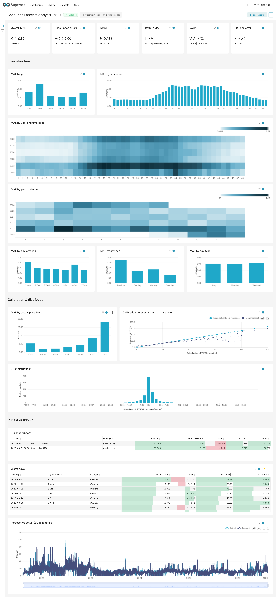
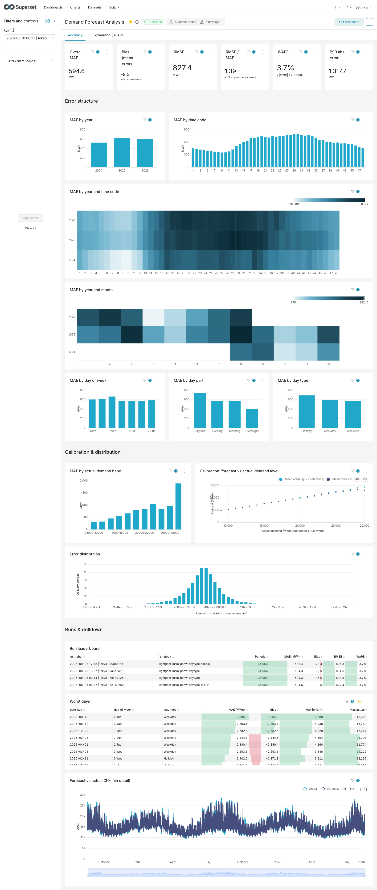

# power-market-analytics

[](https://github.com/hankehly/power-market-analytics/actions/workflows/ci.yml?query=branch%3Amain)

Power market analytics.

## Data sources

Every external dataset the warehouse loads, plus candidates we have evaluated
but not loaded. *Grain* is the source file's grain; *Availability* is what the
publisher offers and what is loaded (`current` = up to the last run of the
matching `just refresh-*` recipe). Retrieval protocols and format quirks live
in the linked docs.

### Loaded

| Source | Page | Grain | Content | Availability | Warehouse |
|---|---|---|---|---|---|
| JEPX スポット市場 取引結果 | [市場データ › スポット市場](https://www.jepx.jp/electricpower/market-data/spot/) (`spot_YYYY.csv` per fiscal year) | 受渡日 × 時刻コード (48/day), nationwide row with per-area columns | 売り/買い入札量, 約定総量, システムプライス, エリアプライス ×9 areas, スポット・時間前平均価格, α上限/下限/速報/確報 × 平均価格, 回避可能原価 (全国 + 9 areas), 売り/買いブロック入札・約定総量, FIP参照価格 (全国 + 9 areas); block and FIP columns are null before ~FY2022, FY2016 has genuine 0.00 area prices | Published per fiscal year; loaded FY2016 (2016-04-01) → current | `pma_raw.jepx_spot` → `fct_jepx_spot_area_price` (contract `conf/schemas/jepx_spot.yaml`) |
| JMA 過去の気象データ（官署 時別値） | [過去の気象データ・ダウンロード](https://www.data.jma.go.jp/risk/obsdl/index.php) | station × hour (149 staffed stations inside the JEPX areas) | 27 columns: precipitation, temperature, wind speed/direction, sunshine duration, snow depth, humidity, solar radiation, each with quality / homogeneity flags and 現象なし markers ([doc](JMA-Weather-Data-Retrieval.md)) | Decades of history on obsdl; loaded 2016-01-01 → current (kept fresh with `just refresh-jma`) | `pma_raw.jma_hourly_staffed` → `fct_jma_weather_hourly` |
| JMA station master | [obsdl station list](https://www.data.jma.go.jp/risk/obsdl/top/station) | station | station id, name, prefecture, latitude / longitude, elevation, station type; JEPX-area mapping from the hand-curated seed `jma_station_areas` | Current snapshot only (no change history on obsdl) — 149 stations | seed `jma_stations` → `dim_jma_station` |
| JMA MSM GPV 地上予報 (RISH archive) | [RISH 京都大学 生存圏研究所 GPV archive](https://database.rish.kyoto-u.ac.jp/arch/jmadata/data/gpv/original/) | station (nearest 5 km grid point) × forecast_reference_at (12 UTC D−2) × valid hour (leads 28–51 = D 01:00–24:00 JST) | temperature, relative humidity, u/v wind and speed, precipitation, surface / sea-level pressure, shortwave radiation, total / high / middle / low cloud cover ([doc](JMA-MSM-GPV-Retrieval.md)) | Archive from 2006-03 (5 km grid); usable from 2019-04-01 (FH51 extension); loaded 2022-04-01 → current | `pma_raw.jma_msm_surface_forecast` → `fct_jma_msm_weather_forecast_hourly` |
| OCCTO 需要予想・ピーク時供給力（翌々日） | [広域機関システム 系統情報公表](https://occtonet3.occto.or.jp/public/dfw/RP11/OCCTO/SD) | 対象日 × area (9 JEPX areas + エリア計 + 沖縄), formulated on D−2 | 最小需要 時刻 / MW, 最大需要 時刻 / MW, ピーク時供給力 MW, 使用率 %, 予備率 % — hour-ending labels `01:00`–`24:00`; `min_demand_mw` changed meaning on 2025-04-01 ([doc](OCCTO-Demand-Forecast-Retrieval.md)) | Portal history from 2024-03-13; loaded 2024-04-01 → current | `pma_raw.occto_demand_forecast_dad` → `fct_occto_demand_supply_forecast_daily` |
| OCCTO 広域予備率 エリア・広域ブロック情報（翌々日） | same portal (`areaDataKnd=31`); identical numbers on the [広域予備率Web公表システム](https://web-kohyo.occto.or.jp/kks-web-public/download) | 対象日 × 30-min period (48/day) × area / 広域ブロック | エリア需要 MW, 供給力 MW, 予備力 MW, 広域予備率 %, 広域使用率 %, block demand / supply capacity / reserve ([doc §9](OCCTO-Demand-Forecast-Retrieval.md)) | 2025-04-01 → current (published and loaded) | `pma_raw.occto_area_reserve_rate_dad` → `fct_occto_demand_supply_forecast_30m` |
| TEPCO エリア需要・発電情報（実績） | [エリア需要・発電情報のダウンロード](https://www.tepco.co.jp/forecast/html/area-download-j.html) (`AREA_YYYYMM.zip`) | date × 30-min period × Tokyo area | エリア総需要量, エリア総発電量, エリア風力・太陽光発電量 [30分kWh] — the インバランス料金 系統需給情報 items A-1 / B-1 / B-4; 予測 / BG計画 files exist but are not loaded ([doc](TEPCO-Area-Demand-Generation-Retrieval.md)) | 2022-04-01 → yesterday (published and loaded; past days are re-issued, hence the always-re-download policy) | `pma_raw.tepco_area_demand_generation_actual` → `fct_area_demand_generation_actual` |
| 関西電力送配電 エリア需給・発電（実績） | [インバランス料金関連に関する情報公表](https://www.kansai-td.co.jp/denkiyoho/imbalance/) (`YYYYMM_jisseki.zip`) | date × 30-min period × Kansai area | same A-1 / B-1 / B-4 items in 30分kWh; two CSV layouts (switch 2025-12-25), blank cells on the running day ([doc](Kansai-Area-Demand-Generation-Retrieval.md)) | Files from 2022-03-16; loaded 2022-04-01 → last finalized day | `pma_raw.kansai_area_demand_generation_actual` → `fct_area_demand_generation_actual` |
| e-Stat 国勢調査 500 m メッシュ人口 | [統計地理情報システム 統計データダウンロード](https://www.e-stat.go.jp/gis/statmap-search) (4次メッシュ, one file per 第1次地域区画) | census year × 500 m mesh | 人口総数 (+ suppressed detail columns with 秘匿処理 codes); mesh bounding box / centroid decoded from the JIS X 0410 code ([doc](eStat-Census-Population-Mesh-Retrieval.md)) | Vintages 2015 (`T000847`) and 2020 (`T001101`) loaded; earlier censuses exist on e-Stat under other table ids | `pma_raw.estat_census_population_mesh` → `fct_census_population_mesh`, `dim_population_mesh_500m`, `fct_census_population_jma_station` |
| 内閣府 国民の祝日 | [国民の祝日について](https://www8.cao.go.jp/chosei/shukujitsu/gaiyou.html) (`syukujitsu.csv`) | holiday date | 国民の祝日・休日月日, 名称; `dim_date` adds the customary 年末年始 / ゴールデンウィーク / お盆 days in SQL | 1955-01-01 → 2027-11-23 (the CSV covers the next calendar year; `dim_date`'s spine ends with the seed's last year) | seed `jpn_national_holidays` → `dim_date` (2016-01-01 → 2027-12-31) |

### Candidates (evaluated, not loaded)

| Source | Page | Grain | Content | Availability | Notes |
|---|---|---|---|---|---|
| TEPCO 過去の電力使用実績データ（でんき予報） | [過去の電力使用実績データ](https://www.tepco.co.jp/forecast/html/download-j.html) — yearly `juyo-YYYY.csv` to 2022-03, monthly `YYYYMM_power_usage.zip` of daily files from 2022-04 ([per-year page](https://www.tepco.co.jp/forecast/html/download_year-j.html)) | date × hour (1時間平均) and, from 2022-04-01, date × 5 min; Tokyo area | ≤ 2022-03: `DATE, TIME, 実績(万kW)`. 2022-04 →: hourly `当日実績(万kW), 予測値(万kW), 使用率(%), 供給力(万kW)`; 5-min `当日実績(５分間隔値)(万kW), 太陽光発電実績(５分間隔値)(万kW), 太陽光発電量(電力使用量に対する割合)(%)`; plus ピーク時供給力 / 予想最大電力 header blocks. A display product: 万kW resolution, not systematically revised, and TEPCO warns 端数処理の関係で1時間値と5分値の平均が一致しない | Hourly 2016-04-01 → yesterday; 5-min 2022-04-01 → yesterday | Only pre-2022-04 area demand history available. Against A-1 over 2022-04 → 2026-08 the hourly value differs by MAE 1.7 万kW (0.05 %); the 5-min series is a separate 速報 measurement (≈ 3 万kW low). Compared 2026-08-29 for the year-ago lag feature |
| TEPCO エリア需給実績データ | 30-min: [2023年度2月以降](https://www.tepco.co.jp/forecast/html/area_jukyu-j.html) (`eria_jukyu_YYYYMM_03.csv`); hourly: [2023年度1月迄](https://www.tepco.co.jp/forecast/html/area_jukyu_p-j.html) (`area-YYYY.csv`) | date × 30-min period (from 2024-02) / date × hour (FY2016 → 2024-01); Tokyo area | 30-min, 単位 MW平均: `エリア需要, 原子力, 火力(LNG), 火力(石炭), 火力(石油), 火力(その他), 水力, 地熱, バイオマス, 太陽光発電実績, 太陽光出力制御量, 風力発電実績, 風力出力制御量, 揚水, 蓄電池, 連系線, その他, 合計`. Hourly, 単位 万kWh: `東京エリア需要, 原子力, 火力, 水力, 地熱, バイオマス, 太陽光発電実績, 太陽光出力制御量, 風力発電実績, 風力出力制御量, 揚水, 連系線, 合計`. 発電実績は推計実績を含む; 端数処理により需要と供給力合計が一致しないことがある | Hourly 2016-04-01 → 2024-01-31; 30-min 2024-02-01 → current (published within ~1 h of the period) | The 系統情報公表の考え方 需給実績 family (30分値 = kW値の30分平均); the only public per-fuel supply breakdown. 30-min エリア需要 differs from A-1 by ≈ 33 MW MAE (2026-08-16 check) |

## Curated star schema

The curated layer (`dbt/models/curated/`) contains eleven fact tables across
six subject areas, sharing a conformed `dim_date` (the census fact, a
once-per-census snapshot, joins its own mesh dimension instead):

- `fct_jepx_spot_market` — market-wide JEPX day-ahead auction results, one row
  per delivery period (trade date × 30-minute time code).
- `fct_jepx_spot_area_price` — area clearing prices, one row per delivery
  period per bidding zone.
- `fct_jma_weather_hourly` — JMA hourly weather observations, one row per
  station and observation hour (native hourly grain; not interpolated to the
  30-minute JEPX periods — align by joining each delivery period to the
  weather hour that contains it).
- `fct_spot_price_forecast` — day-ahead price forecasts written back from
  backtest runs (`scripts/spot_price_backtest.py` →
  `pma_ml.spot_price_forecast`), one row per MLflow run per delivery period
  per area; `run_id` is a degenerate dimension linking to the MLflow run.
  Forecasts only — no actuals stored.
- `fct_spot_price_forecast_accuracy` — the forecast fact drilled across to
  `fct_jepx_spot_area_price` actuals, adding signed/absolute/percentage error
  columns. This is the intended BI surface for forecast analysis.
- `fct_demand_forecast` — day-ahead area demand forecasts written back from
  `scripts/demand_backtest.py` (MLflow experiment `demand`); grain run ×
  delivery period × area; forecast values only.
- `fct_demand_forecast_accuracy` — the demand forecast fact drilled across to
  `fct_area_demand_generation_actual` on (date_key, time_code, area_key):
  `actual_demand_kwh`, signed `error_kwh`, `abs_error_kwh`, `pct_error`,
  `abs_pct_error`; the BI surface for demand runs.
- `fct_occto_demand_supply_forecast_daily` — OCCTO day-after-next (翌々日) demand and
  peak supply-capacity forecasts, one row per target date per JEPX area
  (periodic snapshot; formulated on target date − 2, so it is known before
  the day-ahead auction and usable as a spot-price feature). Covers
  2024-04-01 onward: the published エリア計 roll-ups, Okinawa, and OCCTO's
  pre-FY2024 trial rows (試験データ, 2024-03-13..31) stay in
  `std_occto__demand_forecast_dad` only.
- `fct_occto_demand_supply_forecast_30m` — the half-hourly counterpart: OCCTO
  day-after-next area demand and supply-capacity forecasts (MW) from the
  広域予備率 エリア・広域ブロック情報 publication, one row per delivery period
  per JEPX area (same grain as `fct_jepx_spot_area_price`, joins 1:1). Covers
  2025-04-01 onward — the 48-point 翌々日 series began with FY2025; before
  that only the daily peak/min points above exist. Okinawa and the wide-area
  block / reserve columns stay in `std_occto__area_reserve_rate_dad`.
- `fct_area_demand_generation_actual` — TSO-published area actuals (the
  インバランス料金 「系統の需給に関する情報」 items A-1/B-1/B-4): total demand,
  total generation and wind+solar generation per 30-minute delivery period
  (energy in kWh, additive), one row per delivery period per area — Tokyo
  (TEPCO Power Grid) and Kansai (関西電力送配電) today, one `std_<tso>__…`
  model per TSO unioned underneath (same grain as
  `fct_jepx_spot_area_price`). Covers 2022-04-01 onward through the last
  finalized day; measures are null where the TSO published no observation
  (Tokyo 2025-06-14 time codes 11-48, Kansai 2025-10-12 × 22 periods).
- `fct_census_population_mesh` — Population Census total population per
  500 m mesh (e-Stat 統計GIS 4次メッシュ), one row per census vintage (2015,
  2020 — JGD2000 products) per nine-digit `mesh_code`; a periodic snapshot at
  the census date, additive across meshes (population as published at every
  mesh, privacy processing untouched) but not across census years. Joins
  `dim_population_mesh_500m` (one row per mesh: primary mesh, datum, bounding
  box and centroid decoded from the code). Intended for population-weighted
  weather aggregation later; no weights or weather-grid crosswalk are stored.


```mermaid
erDiagram
    dim_date ||--o{ fct_jepx_spot_market : "date_key"
    dim_delivery_period ||--o{ fct_jepx_spot_market : "time_code"
    dim_date ||--o{ fct_jepx_spot_area_price : "date_key"
    dim_delivery_period ||--o{ fct_jepx_spot_area_price : "time_code"
    dim_area ||--o{ fct_jepx_spot_area_price : "area_key"
    dim_date ||--o{ fct_jma_weather_hourly : "date_key"
    dim_jma_station ||--o{ fct_jma_weather_hourly : "station_id"
    dim_date ||--o{ fct_spot_price_forecast : "date_key"
    dim_delivery_period ||--o{ fct_spot_price_forecast : "time_code"
    dim_area ||--o{ fct_spot_price_forecast : "area_key"
    dim_date ||--o{ fct_spot_price_forecast_accuracy : "date_key"
    dim_delivery_period ||--o{ fct_spot_price_forecast_accuracy : "time_code"
    dim_area ||--o{ fct_spot_price_forecast_accuracy : "area_key"
    dim_date ||--o{ fct_demand_forecast : "date_key"
    dim_delivery_period ||--o{ fct_demand_forecast : "time_code"
    dim_area ||--o{ fct_demand_forecast : "area_key"
    dim_date ||--o{ fct_demand_forecast_accuracy : "date_key"
    dim_delivery_period ||--o{ fct_demand_forecast_accuracy : "time_code"
    dim_area ||--o{ fct_demand_forecast_accuracy : "area_key"
    dim_date ||--o{ fct_occto_demand_supply_forecast_daily : "date_key"
    dim_area ||--o{ fct_occto_demand_supply_forecast_daily : "area_key"
    dim_date ||--o{ fct_occto_demand_supply_forecast_30m : "date_key"
    dim_delivery_period ||--o{ fct_occto_demand_supply_forecast_30m : "time_code"
    dim_area ||--o{ fct_occto_demand_supply_forecast_30m : "area_key"
    dim_date ||--o{ fct_area_demand_generation_actual : "date_key"
    dim_delivery_period ||--o{ fct_area_demand_generation_actual : "time_code"
    dim_area ||--o{ fct_area_demand_generation_actual : "area_key"
    dim_population_mesh_500m ||--o{ fct_census_population_mesh : "mesh_code"

    dim_date {
        date date_key PK
        int year
        int quarter
        int month
        int day_of_month
        int day_of_week_iso
        string day_name
        string month_name
        int fiscal_year
        int fiscal_quarter
        boolean is_weekend
        boolean is_holiday
        string holiday_name_ja
        boolean is_business_day
    }

    dim_delivery_period {
        int time_code PK
        int start_minute_of_day
        int hour_of_day
        string period_start_time
        string period_end_time
        boolean is_daytime
        string day_part
    }

    dim_area {
        int area_key PK
        string area_code
        string area_name_en
        string area_name_ja
        string tso_name_en
        string grid_frequency
        string grid_region
        string representative_jma_station_id
    }

    fct_jepx_spot_market {
        date date_key PK, FK
        int time_code PK, FK
        timestamp trade_datetime
        bigint sell_bid_volume_kwh
        bigint buy_bid_volume_kwh
        bigint contract_volume_kwh
        bigint sell_block_bid_volume_kwh
        bigint sell_block_contract_volume_kwh
        bigint buy_block_bid_volume_kwh
        bigint buy_block_contract_volume_kwh
        double system_price_jpy_kwh
    }

    fct_jepx_spot_area_price {
        date date_key PK, FK
        int time_code PK, FK
        int area_key PK, FK
        timestamp trade_datetime
        double area_price_jpy_kwh
    }

    dim_jma_station {
        string station_id PK
        string station_type
        int prefecture_code
        string station_name
        string station_kana
        double latitude
        double longitude
        double elevation_m
        string kansoku
        int obs_precipitation
        int obs_wind
        int obs_temperature
        int obs_sunshine
        int obs_snow
        int obs_other
        date observation_ended_on
        boolean is_active
    }

    fct_jma_weather_hourly {
        string station_id PK, FK
        timestamp observed_at PK
        timestamp observed_hour_start_at
        date date_key FK
        double precipitation_mm
        int precipitation_phenomenon_absent
        int precipitation_quality_flag
        int precipitation_homogeneity_no
        double temperature_c
        int temperature_quality_flag
        int temperature_homogeneity_no
        double wind_speed_ms
        int wind_speed_quality_flag
        string wind_direction
        int wind_direction_quality_flag
        int wind_homogeneity_no
        double sunshine_duration_h
        int sunshine_phenomenon_absent
        int sunshine_quality_flag
        int sunshine_homogeneity_no
        int snow_depth_cm
        int snow_depth_phenomenon_absent
        int snow_depth_quality_flag
        int snow_depth_homogeneity_no
        int humidity_pct
        int humidity_quality_flag
        int humidity_homogeneity_no
        double solar_radiation_mjm2
        int solar_radiation_quality_flag
        int solar_radiation_homogeneity_no
    }

    fct_spot_price_forecast {
        date date_key PK, FK
        int time_code PK, FK
        int area_key PK, FK
        string run_id PK
        string strategy
        timestamp trade_datetime
        timestamp forecast_issued_ts
        double horizon_hours
        double forecast_price_jpy_kwh
    }

    fct_spot_price_forecast_accuracy {
        date date_key PK, FK
        int time_code PK, FK
        int area_key PK, FK
        string run_id PK
        string strategy
        timestamp trade_datetime
        timestamp forecast_issued_ts
        double horizon_hours
        double forecast_price_jpy_kwh
        double actual_price_jpy_kwh
        double error_jpy_kwh
        double abs_error_jpy_kwh
        double pct_error
        double abs_pct_error
    }

    fct_demand_forecast {
        date date_key PK, FK
        int time_code PK, FK
        int area_key PK, FK
        string run_id PK
        string strategy
        timestamp trade_datetime
        timestamp forecast_issued_ts
        double horizon_hours
        double forecast_demand_kwh
        timestamp published_at
    }

    fct_demand_forecast_accuracy {
        date date_key PK, FK
        int time_code PK, FK
        int area_key PK, FK
        string run_id PK
        string strategy
        timestamp trade_datetime
        timestamp forecast_issued_ts
        double horizon_hours
        double forecast_demand_kwh
        bigint actual_demand_kwh
        double error_kwh
        double abs_error_kwh
        double pct_error
        double abs_pct_error
    }

    fct_occto_demand_supply_forecast_daily {
        date date_key PK, FK
        int area_key PK, FK
        date formulated_date
        int forecast_horizon_days
        int min_demand_hour_ending
        int min_demand_mw
        int max_demand_hour_ending
        int max_demand_mw
        int max_supply_capacity_mw
        double usage_rate
        double reserve_rate
    }

    fct_occto_demand_supply_forecast_30m {
        date date_key PK, FK
        int time_code PK, FK
        int area_key PK, FK
        timestamp delivery_datetime
        double demand_mw
        double supply_capacity_mw
    }

    fct_area_demand_generation_actual {
        date date_key PK, FK
        int time_code PK, FK
        int area_key PK, FK
        timestamp delivery_datetime
        bigint demand_kwh
        bigint generation_kwh
        bigint wind_solar_generation_kwh
    }

    dim_population_mesh_500m {
        string mesh_code PK
        string primary_mesh_code
        string geodetic_datum
        double south_latitude
        double north_latitude
        double west_longitude
        double east_longitude
        double centroid_latitude
        double centroid_longitude
    }

    fct_census_population_mesh {
        int census_year PK
        date census_date
        string mesh_code PK, FK
        bigint population_total
    }

    classDef dim fill:#DBEAFE,stroke:#2563EB,color:#1E3A8A
    classDef fact fill:#FEF3C7,stroke:#B45309,color:#78350F
    class dim_date,dim_delivery_period,dim_area,dim_jma_station,dim_population_mesh_500m dim
    class fct_jepx_spot_market,fct_jepx_spot_area_price,fct_jma_weather_hourly,fct_spot_price_forecast,fct_spot_price_forecast_accuracy,fct_demand_forecast,fct_demand_forecast_accuracy,fct_occto_demand_supply_forecast_daily,fct_occto_demand_supply_forecast_30m,fct_area_demand_generation_actual,fct_census_population_mesh fact
```

Notes:

- Prices (`system_price_jpy_kwh`, `area_price_jpy_kwh`) are non-additive —
  average them (volume-weighted if needed), never sum. Volumes are fully
  additive.
- `trade_datetime` is a standalone timestamp for time-series work, not a
  dimension key.
- `dim_area` row 0 is the default "System (Nationwide)" row, so fact tables
  never carry a null area foreign key.
- In `fct_spot_price_forecast_accuracy`, error columns are null where the
  actual is missing (Hokkaido suspension) and percentage errors are also null
  where the actual is 0.00 JPY/kWh, so `AVG(abs_error_jpy_kwh)` /
  `AVG(abs_pct_error)` reproduce the MLflow run's MAE /
  `mape_excl_zero_actuals`. Beware that actuals at the post-FY2016 0.01 floor
  still make percentage errors explode — prefer MAE when a window contains
  near-zero prices.
- `dim_date` is conformed across all subject areas: its spine starts 2016-01-01
  to cover JMA weather (JEPX spot begins at fiscal year 2016 = 2016-04-01).
- `fct_jma_weather_hourly.observed_at` marks the end of the observation hour;
  precipitation and sunshine accumulate over `[observed_hour_start_at,
  observed_at]`, temperature and wind are instantaneous at `observed_at`.
  `phenomenon_absent` columns are null only when the quality flag is 2/1/0
  (for snow depth, also null when snow is untracked off-season); value 0 with
  `phenomenon_absent = 0` is a JMA "trace" reading (below measurement
  resolution), distinct from a true zero (`phenomenon_absent = 1`).
- `fct_occto_demand_supply_forecast_daily` MW columns are additive across areas; the
  `usage_rate` / `reserve_rate` columns are fractions (0.924 = 92.4%, converted
  from OCCTO's percentages in the standardized layer) and non-additive
  (average, or recompute from the MW columns). `min_demand_mw` for `date_key` ≤ 2025-03-31 is the demand at the
  minimum-reserve-rate hour, not the minimum demand (an OCCTO definition
  change). Hour-ending values run 1–24 (24 = the hour ending at midnight).
- `fct_occto_demand_supply_forecast_30m` measures are power in MW for the
  30-minute period: additive across areas (they sum to OCCTO's wide-area
  block demand), not across periods — × 0.5 h for MWh, × 500 for the kWh
  unit of `fct_area_demand_generation_actual`. `supply_capacity_mw` is available supply
  capacity (供給力), not a generation forecast; minus `demand_mw` it is the
  published area reserve and can be negative.
- `fct_area_demand_generation_actual` measures are energy per 30-minute
  period in kWh (30分kWh, as published) and additive across periods, days
  and areas; divide by 500 for average MW. `wind_solar_generation_kwh` is
  the wind + solar share of `generation_kwh` (always ≤ it). Each TSO
  measures its own area with its own system (TEPCO values are multiples of
  1,000 kWh, Kansai's exact kWh). The fact joins `fct_jepx_spot_area_price`
  1:1 on (`date_key`, `time_code`, `area_key`).
- `fct_census_population_mesh.population_total` is additive across meshes
  (sum for any geography) but not across `census_year` — each vintage is a
  separate snapshot. It is the published headcount at every mesh, privacy
  processing included (the 秘匿処理 folds only the suppressed detail columns
  into neighbouring meshes, never the total), so nothing is reallocated. The
  census date (October 1) predates `dim_date`'s spine and is carried as a
  plain `census_date`; mesh geography lives on `dim_population_mesh_500m`
  (bounding box / centroid decoded from the JIS X 0410 code, JGD2000).

## Forecast analysis

`scripts/spot_price_backtest.py` backtests a forecasting strategy (day-ahead:
at 9:55 JST on D-1, forecast all 48 half-hour prices for delivery day D) and
records the results in two places, linked by the MLflow `run_id`:

- **MLflow** (`just open mlflow`, experiment `spot_price`) — params, metrics,
  SHAP plots and CSV artifacts per run; the experiment record.
- **Warehouse** — row-level forecasts written to `pma_ml.spot_price_forecast`
  (partitioned by `run_id`; republishing a run replaces its rows), which dbt
  models into `fct_spot_price_forecast` and `fct_spot_price_forecast_accuracy`.

`scripts/demand_backtest.py` follows the same pattern for area demand
(MLflow experiment `demand`), writing to `fct_demand_forecast` and
`fct_demand_forecast_accuracy`.

Strategies: `previous_day` (naive), `lightgbm` (calendar + 1-day-lag features)
and `lightgbm_occto` (the same plus the OCCTO 翌々日 peak-demand hour, peak
demand and peak supply capacity for the delivery day — published D-2 evening,
so inside the information cutoff). For a feature experiment, pin
`--start-date`/`--end-date` and `--train-start` identically for candidate and
baseline (the OCCTO history starts 2024-04-01, so `--train-start 2024-04-01`
matches a `lightgbm` baseline to it), then
`scripts/compare_spot_price_runs.py --baseline <run_id> --candidate <run_id>`
prints matched MAE/bias tables by day part, near the OCCTO peak hour, by month
and for high-price days after `just dbt build --select
+fct_spot_price_forecast_accuracy`. Experiments are written up under
[`research/spot_price/`](research/spot_price/README.md) (conventions in
[`research/`](research/README.md)).

Charting happens in Superset (`just open superset`): one forecast-analysis
dashboard per task — **Spot Price Forecast Analysis** and **Demand Forecast
Analysis** — both built by `scripts/create_forecast_dashboard.py` (no
arguments = every dashboard, `--task spot_price` / `--task demand` = one),
which idempotently creates each task's virtual dataset
(`spot_price_forecast_analysis` / `demand_forecast_analysis`: the accuracy
mart joined to `dim_area`, `dim_delivery_period` and `dim_date`), every
chart, the sectioned layout and the run filter — rerun it to rebuild
everything after a `docker compose down -v`. Each dashboard opens on the
newest run with KPI tiles (MAE, bias, RMSE, RMSE/MAE, WAPE, P90),
error-structure heatmaps and day-type slices, calibration and
error-distribution views, a cross-run leaderboard, a worst-days drill list
(click a row to cross-filter the dashboard to that day), and a zoomable
30-minute forecast-vs-actual detail. The two are the same layout with the
same chart names; only the quantity shows through — JPY/kWh vs kWh (demand
values are SI-formatted, `1.098M`), and "MAE by actual price band" /
"Calibration: forecast vs actual price level" become "… actual demand band"
(fixed 2-GWh bins) / "… actual demand level" (rounded to 1 GWh).





## Development environment

The project runs inside a Docker Compose stack (see `docker-compose.yaml`):

- **devcontainer** — Python 3.13 + uv + Spark client tooling; open the repo in VS Code and reopen in container
- **postgres-metastore** — backing store for the Hive Metastore (host port 5432)
- **postgres-mlflow** — backing store for MLflow (host port 5433)
- **hive-metastore** — standalone Hive Metastore backed by Postgres
- **thriftserver** — Spark Thrift Server (JDBC/ODBC, port 10000; Spark UI on 4040)
- **mlflow** — experiment tracking UI on port 5005
- **postgres-superset** — backing store for Superset metadata (host port 5434)
- **superset** — Apache Superset BI UI on port 8088 (admin login, see `.env`;
  the Spark Thriftserver data connection is registered in the Superset UI)
- **superset-mcp** — Superset MCP server on port 5008, lets Claude Code manage
  datasets/charts (no-auth dev mode; wired up in `.mcp.json`)
- **docsify** — serves `docs/` on port 3000

### Setup

1. Copy `.env.template` to `.env` and fill in the values (see the comments for per-host memory settings).
2. `docker compose up -d`
3. Open the repo in VS Code and use "Reopen in Container", or `docker compose exec devcontainer bash`.

### Running commands (`just`)

The `justfile` wraps `docker compose exec` so python and dbt commands run
inside the devcontainer from a host terminal (requires
[just](https://github.com/casey/just), e.g. `brew install just`, and the
compose stack to be up):

```bash
just refresh-jepx                        # JEPX refresh: redownload market data + holidays, reload raw, rebuild + test dbt
just refresh-jma --prefecture 44         # JMA weather refresh (scoped; no args = full network, ~60 h cold)
just refresh-occto                       # OCCTO 翌々日 demand-forecast refresh: redownload full history, reload raw, rebuild + test dbt
just python scripts/load_jepx_spot.py    # python in the devcontainer
just python -c "import power_market_analytics"
just python scripts/spot_price_backtest.py --strategy lightgbm --area tokyo  # forecast backtest
just python scripts/compare_spot_price_runs.py --baseline <run_id> --candidate <run_id>  # matched run comparison
just dbt run                             # dbt, run from /workspace/dbt
just dbt test --select stg_jepx__spot
just exec spark-submit --version         # any command in the devcontainer
just sql                                 # beeline SQL shell on the thriftserver
just shell                               # interactive bash in the devcontainer
just open superset                       # open a web UI: docsify | mlflow | spark | spark-dev | superset
```

Run `just --list` to see all recipes. Anything creating a `SparkSession`
must run in the devcontainer (the Hive metastore and `/spark-warehouse`
volume only resolve on the compose network); dbt also works from the host
directly with `cd dbt && DBT_THRIFT_HOST=localhost uv run dbt <command>`.
