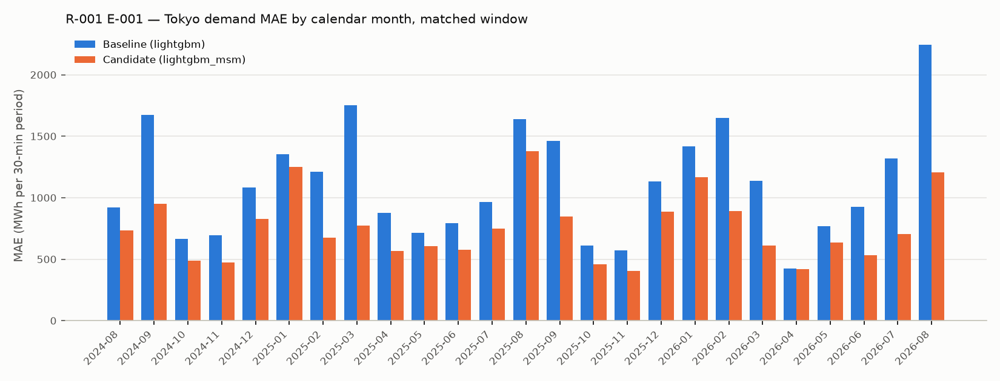

# R-001 — Forecast temperature as a demand feature

- **Status:** In progress
- **Created:** 2026-08-23
- **Last updated:** 2026-08-23 (E-001 executed)
- **Triggering observations:** None — modeling idea
- **Related investigations:** —

## Question

Does the forecast temperature for delivery day D — available at the 09:30 JST
D-1 issue time — improve Tokyo-area day-ahead demand forecasts?

## Motivation

The researcher's reasoning, as stated: forecast temperature contains predictive
value for demand. The current `lightgbm` baseline (MLflow run
[`0c3b709fcdf64577bc1d94ef4dafc781`](http://localhost:5005/#/experiments/2/runs/0c3b709fcdf64577bc1d94ef4dafc781))
relies only on *recent* temperature — `wavg_temperature_c`, the recency-weighted
same-hour observed temperature over D-8..D-2 at the area's representative JMA
station — and contains no forecast temperature at all. The researcher's broader
framing is *forecast weather features*; this investigation starts with the
single temperature feature.

The data for it is already in the warehouse: `fct_jma_msm_weather_forecast_hourly`
holds the JMA MSM GPV point forecast at every staffed station (the 12 UTC run of
D-2, hour-endings 01:00–24:00 of D), gap-free for 東京 s47662 from 2022-04-01 —
the start of the Tokyo demand history — through 2026-08-23. Whether the
forecast carries information beyond the recent observed temperature is the
predictive question; that it is available before the issue time is by
construction (see the MSM retrieval doc's timestamp provenance).

## Current predictive hypothesis

> We believe that adding forecast weather features — starting with a single
> forecast-temperature feature for delivery day D — will reduce the `lightgbm`
> model's overall out-of-sample MAE, because the baseline's only temperature
> signal is the recent observed temperature and it is missing the forecast
> temperature completely.

## Scope and constraints

- **Forecast target:** the 48 half-hourly `demand_kwh` values of
  `fct_area_demand_generation_actual` for day D, Tokyo area (`--area tokyo`)
- **Information cutoff:** D-1 at 09:30 JST; usable demand history = delivery
  days ≤ D-2; observed-weather features use complete observation days ≤ D-2 at
  東京 s47662 (`dim_area.representative_jma_station_id`); the forecast feature
  uses the MSM vintage referenced 21:00 JST D-2 (disseminated a few hours
  later, before the cutoff)
- **Baseline:** `lightgbm` (`scripts/demand_backtest.py`); the researcher's
  reference run `0c3b709fcdf64577bc1d94ef4dafc781`, plus a fresh matched
  `lightgbm` run on today's data (see E-001 Execution for why both)
- **Primary metric:** MAE (kWh per 30-minute period)
- **Important segments:** none pre-specified by the hypothesis, which is about
  overall MAE; day part and calendar month are reported as consistency checks
  (the tooling's standard segments), plus the Superset dashboard's
  actual-demand bands
- **Evaluation method:** rolling out-of-sample backtest over identical delivery
  dates and training rows for baseline and candidate (`--start-date`,
  `--end-date`, `--train-start` pinned identically); accuracy rows in
  `fct_demand_forecast_accuracy` after
  `just dbt build --select +fct_demand_forecast_accuracy`

## E-001 — Add the MSM forecast temperature at the representative station

### Why this experiment

The researcher proposed it as the simplest test of the hypothesis: one added
feature, the forecast temperature at the representative JMA station for the
target area, with everything else held fixed. The MSM point forecast is already
loaded for that station over the whole demand history, so the candidate and the
baseline can be trained and evaluated on identical rows, and a single feature
keeps the SHAP attribution unambiguous.

### Experiment hypothesis

Adding `forecast_temperature_c` — the MSM forecast temperature for delivery day
D at 東京 s47662, at the hour containing each 30-minute period — to the
`lightgbm` feature set will lower overall out-of-sample MAE relative to the
matched baseline.

### Change

Strategy `lightgbm_msm` (`LightGbmMsmStrategy` in
`power_market_analytics/tasks/demand/strategies/lgbm.py`): the `lightgbm`
baseline's five features (`time_code, month, day_of_week, wavg_temperature_c,
lag_7d_demand_kwh`) plus `forecast_temperature_c`, read from
`fct_jma_msm_weather_forecast_hourly` for the area's representative station
(`load_area_temperature_forecast`, `AreaTemperatureForecast` frame keyed
`trade_date × hour_ending`) and joined to each row at
`hour_ending = (time_code + 1) // 2` — the same alignment the observed
temperature uses. Model parameters, refit cadence (weekly, 730-day sliding
window) and the baseline features are unchanged; training rows without a
forecast are dropped (none are, over this history).

### Expected evidence

- Lower overall out-of-sample MAE than the matched baseline
- Improvement that is reasonably consistent across calendar months and day
  parts, rather than confined to a few days or one segment
- No material deterioration in any day part
- No reduction — or a reduction smaller than the month-to-month variation of
  the baseline's own MAE — would make the hypothesis less plausible

### Decision rule

Keep the feature if the candidate lowers overall MAE on the matched window and
the improvement is reasonably consistent across calendar months (the candidate
is better in most months, and the gain does not depend on a handful of days)
without a material deterioration in any day part. Treat the result as
inconclusive if the change is small relative to the month-to-month variation or
depends mainly on a few extreme days. Otherwise reject the change.

### Execution

- **MLflow experiment:** `demand`
- **Baseline run (researcher's reference):** `lightgbm-tokyo`
  [`0c3b709fcdf64577bc1d94ef4dafc781`](http://localhost:5005/#/experiments/2/runs/0c3b709fcdf64577bc1d94ef4dafc781)
  — strategy `lightgbm`, `--start-date 2024-08-18 --end-date 2026-08-17`, no
  `--train-start`; run on 2026-08-18 at commit `ba496e5`, **before** the
  2026-08-20 JMA re-scope backfill: 東京 s47662 observations then ended
  2026-07-19, so 21 of its 22 skipped days are simply 2026-07-28..2026-08-17
  (no temperature window) and it scores 708 days / 33,946 points
- **Baseline run (fresh, matched):** `lightgbm-tokyo`
  [`5e217c7ca286479599de63469bd87624`](http://localhost:5005/#/experiments/2/runs/5e217c7ca286479599de63469bd87624)
  — strategy `lightgbm`, `--start-date 2024-08-18 --end-date 2026-08-17`, no
  `--train-start`; run 2026-08-23 at commit `fc9edf5` on today's data. On the
  708 days it shares with the reference run it is the same model (99.2 % of
  points identical, MAE 1,072,385 vs 1,073,696 kWh — the JMA re-download
  changed a few observed values); it additionally scores the 21 days
  2026-07-28..2026-08-17 (MAE 2,147,595 kWh there), which is why its overall
  MAE (1,103,392) is above the reference run's (1,073,696)
- **Candidate run:** `lightgbm_msm-tokyo`
  [`53dbc56292624f17b7b1167b0e8c1516`](http://localhost:5005/#/experiments/2/runs/53dbc56292624f17b7b1167b0e8c1516)
  — strategy `lightgbm_msm`, same flags, same commit, run immediately after
- **Code or pull request:** branch `demand-forecast-temperature`, commit
  `fc9edf5` (`LightGbmMsmStrategy`, `AreaTemperatureForecast`,
  `load_area_temperature_forecast`, `join_forecast_temperature`); segment
  tables computed from the two runs' `predictions.csv` artifacts (there is no
  demand compare script yet); accuracy rows for both runs are in
  `fct_demand_forecast_accuracy` / the **Demand Forecast Analysis** dashboard
- **Matched window:** MSM rows for s47662 are gap-free 2022-04-01..2026-08-23
  and the Tokyo actuals end 2026-08-17, so both runs train on rows from
  2022-08-19 (the 730-day window behind the first forecast day; no
  `--train-start` needed) and forecast the identical 729 delivery days
  2024-08-18..2026-08-17 (34,954 scored points; 2025-06-21 skipped by both
  because its D-7 lag falls in the 2025-06-14 TSO hole; 38 points on the hole
  day itself have no actual). Both made 105 weekly refits with identical
  training-row counts (34,992 rows on 2022-08-19..2024-08-16 down to 34,916 on
  2024-08-16..2026-08-14). Model parameters, refit cadence and the baseline
  features are unchanged; `forecast_temperature_c` is the only difference
- **Segment definitions:** day parts follow `dim_delivery_period.day_part`
  (Overnight 00–06 = time codes 1–12, Morning 06–08 = 13–16, Daytime 08–18 =
  17–36, Evening 18–24 = 37–48); day type from `dim_date` (holiday = the
  `jpn_national_holidays` seed, weekend = Sat/Sun, else weekday);
  actual-demand bands are the dashboard's 2,000-MWh bands; "top 10 % demand
  days" = the 73 delivery days with the highest daily mean actual (≥ 19,489
  MWh per 30-min period); the daily paired comparison and its bootstrap CI
  treat each delivery day's MAE as one observation (10,000 resamples, seed 0)

### Results

All values in kWh per 30-minute period over the matched window (729 days,
34,954 points per run).

| Metric | Baseline | Candidate | Absolute change | Relative change |
|---|---:|---:|---:|---:|
| Overall MAE | 1,103,392 | 745,695 | −357,697 | −32.4 % |
| Overall MAPE | 6.82 % | 4.62 % | −2.20 pp | −32.3 % |
| RMSE | 1,572,941 | 1,104,408 | −468,533 | −29.8 % |
| R² (MLflow) | 0.803 | 0.903 | +0.100 | — |
| Mean error / bias (forecast − actual), overall | +70,294 | −7,858 | −78,151 | — |
| Mean error / bias, daytime | +135,809 | +8,468 | −127,341 | — |

MAE by day part (candidate lower in all four):

| Day part | n | Baseline | Candidate | Absolute change | Relative change |
|---|---:|---:|---:|---:|---:|
| Overnight (00–06) | 8,746 | 670,438 | 441,344 | −229,095 | −34.2 % |
| Morning (06–08) | 2,912 | 999,146 | 713,910 | −285,237 | −28.5 % |
| Daytime (08–18) | 14,560 | 1,414,351 | 977,156 | −437,194 | −30.9 % |
| Evening (18–24) | 8,736 | 1,053,326 | 675,221 | −378,105 | −35.9 % |

MAE by day type:

| Day type | n | Baseline | Candidate | Absolute change | Relative change |
|---|---:|---:|---:|---:|---:|
| Weekday | 23,568 | 1,110,248 | 747,078 | −363,170 | −32.7 % |
| Weekend | 9,562 | 927,175 | 583,988 | −343,187 | −37.0 % |
| Holiday | 1,824 | 1,938,594 | 1,575,552 | −363,042 | −18.7 % |

MAE by calendar month (candidate lower in **25 of 25** months; 2024-08 covers
the 18th–31st and 2026-08 the 1st–17th):

| Month | Baseline | Candidate | Absolute change | Relative change |
|---|---:|---:|---:|---:|
| 2024-08 (from 18th) | 920,496 | 731,795 | −188,701 | −20.5 % |
| 2024-09 | 1,670,796 | 949,946 | −720,851 | −43.1 % |
| 2024-10 | 664,412 | 487,186 | −177,226 | −26.7 % |
| 2024-11 | 695,719 | 472,023 | −223,696 | −32.2 % |
| 2024-12 | 1,083,272 | 827,699 | −255,573 | −23.6 % |
| 2025-01 | 1,354,476 | 1,249,068 | −105,407 | −7.8 % |
| 2025-02 | 1,208,942 | 673,368 | −535,574 | −44.3 % |
| 2025-03 | 1,752,052 | 772,053 | −979,999 | −55.9 % |
| 2025-04 | 877,499 | 564,682 | −312,817 | −35.6 % |
| 2025-05 | 714,294 | 608,257 | −106,037 | −14.8 % |
| 2025-06 | 792,229 | 577,896 | −214,334 | −27.1 % |
| 2025-07 | 965,013 | 750,535 | −214,478 | −22.2 % |
| 2025-08 | 1,638,640 | 1,376,430 | −262,209 | −16.0 % |
| 2025-09 | 1,462,125 | 848,502 | −613,623 | −42.0 % |
| 2025-10 | 612,522 | 456,732 | −155,789 | −25.4 % |
| 2025-11 | 573,734 | 404,107 | −169,626 | −29.6 % |
| 2025-12 | 1,131,409 | 887,680 | −243,729 | −21.5 % |
| 2026-01 | 1,415,633 | 1,165,362 | −250,271 | −17.7 % |
| 2026-02 | 1,646,627 | 888,931 | −757,695 | −46.0 % |
| 2026-03 | 1,136,205 | 609,879 | −526,325 | −46.3 % |
| 2026-04 | 425,225 | 416,950 | −8,274 | −1.9 % |
| 2026-05 | 770,561 | 636,105 | −134,457 | −17.4 % |
| 2026-06 | 923,554 | 533,001 | −390,552 | −42.3 % |
| 2026-07 | 1,319,340 | 706,630 | −612,710 | −46.4 % |
| 2026-08 (to 17th) | 2,244,520 | 1,206,582 | −1,037,938 | −46.2 % |

MAE by season and by season × day part (relative change):

| Season | n | Baseline | Candidate | Relative change | Overnight | Morning | Daytime | Evening |
|---|---:|---:|---:|---:|---:|---:|---:|---:|
| Winter (Dec–Feb) | 8,640 | 1,302,691 | 954,269 | −26.7 % | −34.8 % | −24.4 % | −21.3 % | −32.5 % |
| Spring (Mar–May) | 8,832 | 949,175 | 602,522 | −36.5 % | −40.9 % | −33.0 % | −34.0 % | −40.1 % |
| Summer (Jun–Aug) | 8,746 | 1,222,286 | 828,118 | −32.2 % | −23.6 % | −26.8 % | −34.6 % | −32.7 % |
| Autumn (Sep–Nov) | 8,736 | 943,166 | 601,642 | −36.2 % | −37.7 % | −32.9 % | −34.4 % | −40.5 % |

MAE by actual-demand band (MWh per 30-min period; candidate lower in every
band):

| Band | n | Baseline | Candidate | Absolute change | Relative change |
|---|---:|---:|---:|---:|---:|
| 8,000–10,000 | 148 | 941,550 | 929,124 | −12,426 | −1.3 % |
| 10,000–12,000 | 4,421 | 581,294 | 424,699 | −156,595 | −26.9 % |
| 12,000–14,000 | 7,277 | 863,513 | 581,631 | −281,882 | −32.6 % |
| 14,000–16,000 | 8,387 | 1,066,884 | 690,628 | −376,256 | −35.3 % |
| 16,000–18,000 | 5,810 | 1,197,562 | 766,255 | −431,307 | −36.0 % |
| 18,000–20,000 | 4,135 | 1,247,994 | 947,784 | −300,210 | −24.1 % |
| 20,000–22,000 | 2,602 | 1,654,315 | 1,061,129 | −593,187 | −35.9 % |
| 22,000–24,000 | 1,210 | 1,898,996 | 1,281,807 | −617,189 | −32.5 % |
| 24,000–26,000 | 616 | 1,769,196 | 1,234,434 | −534,762 | −30.2 % |
| 26,000–28,000 | 323 | 2,218,742 | 1,538,838 | −679,903 | −30.6 % |
| 28,000–30,000 | 25 | 3,995,641 | 3,382,509 | −613,132 | −15.3 % |

MAE on high-demand days:

| Days | n | Baseline | Candidate | Absolute change | Relative change |
|---|---:|---:|---:|---:|---:|
| Top 10 % demand days (daily mean ≥ 19,489 MWh, 73 days) | 3,504 | 1,585,318 | 1,065,082 | −520,235 | −32.8 % |
| Other 90 % of days | 31,450 | 1,049,698 | 710,111 | −339,588 | −32.4 % |

Daily paired comparison (daily MAE, candidate − baseline, 729 days):

- candidate lower on 75.2 % of days (548 of 729); median difference −212,704 kWh
- mean difference −357,122 kWh; 95 % bootstrap CI over days
  [−401,292, −314,392] kWh
- the 10 most-improved days account for 10 % of the total absolute-error
  reduction

SHAP (mean |SHAP| over the pooled per-day TreeSHAP records, plots in MLflow):
in the baseline the order is `lag_7d_demand_kwh` (≈1.39 M) > `time_code`
(≈1.03 M) > `wavg_temperature_c` (≈0.89 M) > `day_of_week` (≈0.54 M) > `month`
(≈0.43 M); in the candidate it is `lag_7d_demand_kwh` (≈1.34 M) > `time_code`
(≈1.09 M) > `forecast_temperature_c` (≈1.07 M) > `day_of_week` (≈0.57 M) >
`wavg_temperature_c` (≈0.36 M) > `month` (≈0.18 M) — the new feature ranks
third, and the attribution of `wavg_temperature_c` and `month` falls.

### Interpretation

Read against the pre-registered expected evidence:

- **Lower overall MAE than the matched baseline:** yes, −357,697 kWh (−32.4 %);
  MAPE 6.82 % → 4.62 %, RMSE −29.8 %, R² 0.80 → 0.90.
- **Consistent across months and day parts:** yes. The candidate is lower in
  every one of the 25 calendar months (−1.9 % in 2026-04 to −55.9 % in
  2025-03), in all four day parts (−28.5 % to −35.9 %), in all four seasons
  (−26.7 % to −36.5 %), on weekdays, weekends and holidays, in every
  actual-demand band, and about equally on the top-10 % demand days (−32.8 %)
  and the other 90 % (−32.4 %). The gain is not carried by a few days: the
  candidate wins on 75 % of days, the bootstrap CI over days is well away from
  zero, and the ten most-improved days contribute only a tenth of the total
  reduction. The smallest monthly relative gains are 2026-04 (−1.9 %), 2025-01
  (−7.8 %), 2025-05 (−14.8 %) and 2025-08 (−16.0 %); the largest are 2025-03
  (−55.9 %), 2026-07 (−46.4 %), 2026-03 (−46.3 %), 2026-08 (−46.2 %) and
  2026-02 (−46.0 %).
- **No material deterioration in any day part:** none; the overall bias also
  shrinks from +70,294 to −7,858 kWh, and the daytime bias from +135,809 to
  +8,468 kWh.

Limitations. One area (Tokyo), one station (東京 s47662), one MSM vintage (the
D-2 12 UTC run, nearest grid point rather than a station forecast), and the
baseline's fixed hyperparameters were kept unchanged. The experiment measures
the feature's incremental value over the *current* baseline, whose only
temperature signal is a lagged proxy (`wavg_temperature_c`); it does not
separate how much of the gain is "forecast information" versus "same-day
temperature information" (no perfect-foresight observed-temperature bound was
run), and the bootstrap CI treats days as exchangeable (no block structure).
Improved forecasting supports incremental predictive value; it does not by
itself establish causality.

### Decision

**Decision:** Keep (provisional — applied mechanically from the decision rule;
researcher to confirm)

Applying the rule as written: overall MAE is lower on the matched window
(−32.4 %), the candidate is better in 25 of 25 months and the gain does not
depend on a handful of days, and no day part deteriorates — every condition
of the "keep" branch is met and neither "inconclusive" condition applies.

### Follow-up ideas

- The researcher's broader framing — forecast *weather* features beyond
  temperature — is the natural continuation if the single feature helps; no
  specific next feature has been recorded yet.

## Current conclusion

E-001 executed on 2026-08-23. On the matched window (training rows from
2022-08-19, evaluation 2024-08-18..2026-08-17, 729 days, Tokyo), adding the
MSM forecast temperature for delivery day D at 東京 s47662 to the `lightgbm`
baseline lowers overall MAE by 32.4 % (1,103,392 → 745,695 kWh; MAPE 6.82 % →
4.62 %), lower in every calendar month, day part, season, day type and demand
band, with the overall bias shrinking from +70 k to −8 k kWh. Provisionally
**Keep** per the E-001 decision rule; the hypothesis that forecast temperature
adds predictive value beyond the recent observed temperature is supported by
this single-area experiment.

## Open questions

- Does the result hold for Kansai (`--area kansai`, 大阪 s47772), the other
  area with a TSO feed?

## Final disposition

**Investigation status:** In progress (E-001 supports the hypothesis; awaiting
the researcher's confirmation of the provisional decision)

**Recommended action:** Researcher to review the E-001 result and confirm or
revise the provisional Keep; if confirmed, `lightgbm_msm` becomes the demand
baseline that later feature experiments are matched against.

**Superseded by:** —
