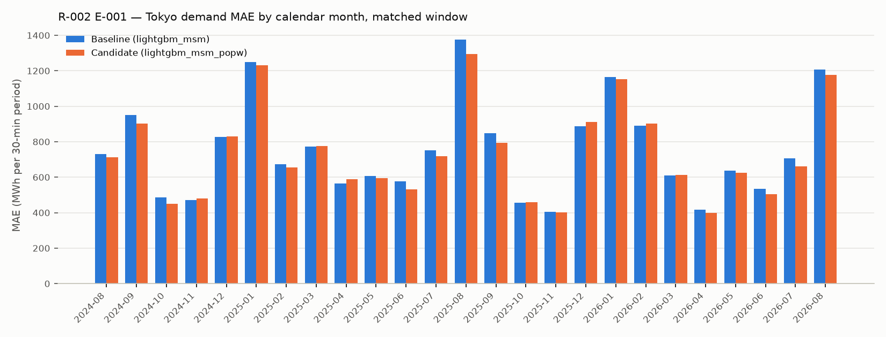

# R-002 — Population-weighted area temperature

- **Status:** In progress
- **Created:** 2026-08-23
- **Last updated:** 2026-08-23 (E-001 executed)
- **Triggering observations:** None — modeling idea
- **Related investigations:**
  [R-001 — Forecast temperature as a demand feature](research/demand/R-001-forecast-temperature.md)
  (this investigation starts from its `lightgbm_msm` candidate)

## Question

Does representing an area's weather by a population-weighted average over the
area's staffed JMA stations — rather than by the single representative station
— improve Tokyo-area day-ahead demand forecasts?

## Motivation

The researcher's reasoning, as stated: the model currently looks at a single
reference location per area (`dim_area.representative_jma_station_id`, 東京
s47662 for Tokyo), so its weather input is too coarse — it does not take into
account how the population is distributed across the area, nor how temperature
differs slightly from place to place. The hypothesis is that performance gains
are being missed because one reference location per area is not enough, and
that temperature weighted by population will give higher accuracy.

The inputs are all in the warehouse: the staffed-station master
(`dim_jma_station`, 23 stations in the Tokyo area, each with a JEPX area), the
MSM point forecast at every staffed station
(`fct_jma_msm_weather_forecast_hourly`), and the 500 m census population mesh
(`fct_census_population_mesh` / `dim_population_mesh_500m`, 2015 and 2020).

## Current predictive hypothesis

> We believe that replacing the single-station forecast temperature
> (`forecast_temperature_c`, R-001 E-001) with a population-weighted average of
> the forecast temperature over the area's staffed stations will reduce
> out-of-sample MAE, because one reference location per area is too coarse:
> it ignores how the population is distributed across the area and how
> temperature differs by location.

## Scope and constraints

- **Forecast target:** the 48 half-hourly `demand_kwh` values of
  `fct_area_demand_generation_actual` for day D, Tokyo area (`--area tokyo`)
- **Information cutoff:** D-1 at 09:30 JST; usable demand history = delivery
  days ≤ D-2; observed-weather features use complete observation days ≤ D-2 at
  東京 s47662; forecast features use the MSM vintage referenced 21:00 JST D-2
  (published ~23:30 JST D-2), at whichever stations the feature draws on
- **Baseline:** `lightgbm_msm` — the R-001 E-001 candidate (baseline features +
  `forecast_temperature_c` at the representative station), re-run on the same
  code version as the candidate
- **Primary metric:** MAE (kWh per 30-minute period)
- **Important segments:** none pre-specified by the hypothesis, which is about
  overall MAE; day part and calendar month are reported as consistency checks
- **Evaluation method:** rolling out-of-sample backtest over identical delivery
  dates and training rows for baseline and candidate (`--start-date`,
  `--end-date`, `--train-start` pinned identically; the R-001 window); accuracy
  rows in `fct_demand_forecast_accuracy` after
  `just dbt build --select +fct_demand_forecast_accuracy`

## E-001 — Replace the single-station forecast temperature with the population-weighted one

### Why this experiment

It is the most direct test of the hypothesis: the same feature slot, the same
forecast vintage and the same model — only the spatial representation of the
forecast temperature changes, from one station to a population-weighted average
over the area's stations. The station weights come from the census population
nearest to each station, so no new data had to be fetched, and the candidate
and baseline can be trained and evaluated on identical rows.

### Experiment hypothesis

Replacing `forecast_temperature_c` with `popw_forecast_temperature_c` — the MSM
forecast temperature for delivery day D averaged over the Tokyo area's staffed
stations with census population weights — in the `lightgbm_msm` feature set
will lower overall out-of-sample MAE relative to the matched `lightgbm_msm`
baseline.

### Change

- **Station weights** — new curated fact `fct_census_population_jma_station`
  (grain `census_year × station_id`): every populated 500 m census mesh is
  assigned to the staffed station nearest its centroid (great-circle distance)
  among the stations that are mapped to a JEPX area and sit at or below
  1,000 m elevation; a station's weight is its share of its area's population
  (weights sum to 1 per area). The five stations above 1,000 m — 富士山
  (3,775 m) and 奥日光 (1,292 m) in the Tokyo area, plus 伊吹山, 阿蘇山 and 剣山 —
  are excluded because the MSM forecast at their grid points is documented as
  unrepresentative of the lowland towns that would otherwise be nearest to them
  (MSM retrieval doc §9.4); their meshes fall to the next-nearest station. A
  mesh belongs to the area of its nearest station, an approximation of the TSO
  supply-area boundary that is exact away from area borders; the resulting
  Tokyo-area population is 45.3 M (2020), with 東京 41.7 %, 横浜 21.0 %, 千葉
  7.6 %, 熊谷 7.1 %, つくば 4.6 %, … over 21 weighted stations.
- **Feature** — `popw_forecast_temperature_c` =
  Σ weight × station forecast temperature per delivery day and hour-ending,
  renormalised over the stations that have a value for the hour
  (`load_area_temperature_forecast_population_weighted`), using the latest
  census vintage (2020) for the whole history; mapped onto the 30-minute
  periods at `hour_ending = (time_code + 1) // 2` like the single-station
  feature.
- **Strategy** — `lightgbm_msm_popw` (`LightGbmMsmPopWeightedStrategy`): the
  `lightgbm` baseline's five features plus `popw_forecast_temperature_c`
  (replacing `forecast_temperature_c`); model parameters, refit cadence and the
  observed single-station `wavg_temperature_c` are unchanged, so the spatial
  representation of the *forecast* temperature is the only difference.

### Expected evidence

- Lower overall out-of-sample MAE than the matched `lightgbm_msm` baseline
- Improvement that is reasonably consistent across calendar months and day
  parts, rather than confined to a few days or one segment
- No material deterioration in any day part
- No reduction — or a change whose sign flips from month to month and whose
  paired-difference interval over days includes zero — would make the
  hypothesis less plausible

### Decision rule

Keep the weighted feature if the candidate lowers overall MAE on the matched
window, is better in most calendar months and the 95 % bootstrap interval of
the daily paired MAE difference excludes zero, without a material deterioration
in any day part. Treat the result as inconclusive if the interval includes zero
or the monthly sign is mixed, and reject the change if overall MAE is higher
with an interval that excludes zero.

### Execution

- **MLflow experiment:** `demand` (run parameters, metrics, code versions and
  artifacts live on the runs)
- **Baseline run:** `lightgbm_msm-tokyo`
  [`4bdb6087b6ed4d22948b8faf1d3e9202`](http://localhost:5005/#/experiments/2/runs/4bdb6087b6ed4d22948b8faf1d3e9202)
  — the R-001 E-001 candidate strategy re-run on the candidate's code version;
  it reproduces R-001's run `53dbc562…` to floating-point precision (max
  forecast difference 2 × 10⁻⁹ kWh)
- **Candidate run:** `lightgbm_msm_popw-tokyo`
  [`2556e3f2b94c4cf59efc6b2fff1bddef`](http://localhost:5005/#/experiments/2/runs/2556e3f2b94c4cf59efc6b2fff1bddef)
  — same flags, run immediately after; 2020 census weights over 21 stations
  (`population_weight_census_year` on the run)
- **Code or pull request:** branch `demand-forecast-temperature`
  (`fct_census_population_jma_station`, `LightGbmMsmPopWeightedStrategy`,
  `load_area_temperature_forecast_population_weighted`); the segment tables
  below were computed from the two runs' `predictions.csv` artifacts (no
  demand compare script yet); accuracy rows for both runs are in
  `fct_demand_forecast_accuracy` / the **Demand Forecast Analysis** dashboard
- **Matched window:** the R-001 window — 729 delivery days
  2024-08-18..2026-08-17, identical training rows and refit schedule (one day,
  2025-06-21, skipped by both for its D-7 lag in the 2025-06-14 TSO hole)
- **Segment definitions:** as in R-001 (day parts per
  `dim_delivery_period.day_part`; daily paired comparison with a 95 % bootstrap
  CI over days, 10,000 resamples, seed 0)

### Results

All values in kWh per 30-minute period over the matched window (729 days;
MLflow holds the full metric sets).

| Metric | Baseline | Candidate | Absolute change | Relative change |
|---|---:|---:|---:|---:|
| Overall MAE | 745,695 | 728,573 | −17,122 | −2.3 % |
| Overall MAPE | 4.62 % | 4.52 % | −0.09 pp | −2.0 % |
| Mean error / bias (forecast − actual), overall | −7,858 | −9,018 | −1,160 | — |
| Mean error / bias, daytime | +8,468 | +3,748 | −4,720 | — |

MAE by day part (candidate lower in all four):

| Day part | n | Baseline | Candidate | Absolute change | Relative change |
|---|---:|---:|---:|---:|---:|
| Overnight (00–06) | 8,746 | 441,344 | 434,999 | −6,345 | −1.4 % |
| Morning (06–08) | 2,912 | 713,910 | 706,093 | −7,816 | −1.1 % |
| Daytime (08–18) | 14,560 | 977,156 | 950,888 | −26,268 | −2.7 % |
| Evening (18–24) | 8,736 | 675,221 | 659,452 | −15,769 | −2.3 % |

MAE by calendar month (candidate lower in **17 of 25** months; 2024-08 covers
the 18th–31st and 2026-08 the 1st–17th):

| Month | Baseline | Candidate | Relative change |
|---|---:|---:|---:|
| 2024-08 (from 18th) | 731,795 | 712,085 | −2.7 % |
| 2024-09 | 949,946 | 901,929 | −5.1 % |
| 2024-10 | 487,186 | 451,128 | −7.4 % |
| 2024-11 | 472,023 | 480,115 | +1.7 % |
| 2024-12 | 827,699 | 829,697 | +0.2 % |
| 2025-01 | 1,249,068 | 1,231,356 | −1.4 % |
| 2025-02 | 673,368 | 655,171 | −2.7 % |
| 2025-03 | 772,053 | 774,966 | +0.4 % |
| 2025-04 | 564,682 | 589,470 | +4.4 % |
| 2025-05 | 608,257 | 593,648 | −2.4 % |
| 2025-06 | 577,896 | 532,799 | −7.8 % |
| 2025-07 | 750,535 | 719,864 | −4.1 % |
| 2025-08 | 1,376,430 | 1,295,663 | −5.9 % |
| 2025-09 | 848,502 | 793,480 | −6.5 % |
| 2025-10 | 456,732 | 457,756 | +0.2 % |
| 2025-11 | 404,107 | 400,960 | −0.8 % |
| 2025-12 | 887,680 | 912,506 | +2.8 % |
| 2026-01 | 1,165,362 | 1,153,501 | −1.0 % |
| 2026-02 | 888,931 | 903,376 | +1.6 % |
| 2026-03 | 609,879 | 611,828 | +0.3 % |
| 2026-04 | 416,950 | 398,931 | −4.3 % |
| 2026-05 | 636,105 | 623,851 | −1.9 % |
| 2026-06 | 533,001 | 504,930 | −5.3 % |
| 2026-07 | 706,630 | 661,050 | −6.5 % |
| 2026-08 (to 17th) | 1,206,582 | 1,176,447 | −2.5 % |

MAE by season (relative change, with its day parts):

| Season | Baseline | Candidate | Overall | Overnight | Morning | Daytime | Evening |
|---|---:|---:|---:|---:|---:|---:|---:|
| Winter (Dec–Feb) | 954,269 | 953,212 | −0.1 % | +0.7 % | −2.7 % | −0.1 % | +0.5 % |
| Spring (Mar–May) | 602,522 | 599,919 | −0.4 % | +1.0 % | +1.2 % | −0.9 % | −0.8 % |
| Summer (Jun–Aug) | 828,118 | 785,474 | −5.1 % | −4.8 % | −2.2 % | −5.2 % | −6.0 % |
| Autumn (Sep–Nov) | 601,642 | 579,505 | −3.7 % | −3.2 % | +0.8 % | −4.6 % | −3.1 % |

Daily paired comparison (daily MAE, candidate − baseline, 729 days): the
candidate is lower on 58.6 % of days (427 of 729); mean difference −17,200 kWh
with a 95 % bootstrap CI over days of [−24,089, −10,185] kWh; median difference
−11,434 kWh; the ten most-improved days account for 31 % of the total
absolute-error reduction.

Other cuts of the same two runs (not tabulated here): weekdays −3.0 %, weekends
−1.1 %, holidays −0.5 %; the top-10 % demand days (daily mean ≥ 19,489 MWh,
73 days) −5.2 % against −1.8 % on the other 90 %; every 2,000-MWh actual-demand
band from 10,000 MWh upward is lower, increasingly so at high demand (−5 % to
−11 % above 22,000 MWh), while the lowest band (8,000–10,000 MWh, 148 points)
is +0.7 %. In the candidate's SHAP importance plot (MLflow)
`popw_forecast_temperature_c` ranks second, just above `time_code`, where the
single-station `forecast_temperature_c` ranked third in the baseline's plot.

### Interpretation

Read against the pre-registered expected evidence:

- **Lower overall MAE than the matched `lightgbm_msm` baseline:** yes, but
  small — −17,122 kWh (−2.3 %); MAPE 4.62 % → 4.52 %. For scale, R-001's
  single-station forecast temperature removed 357,697 kWh (−32.4 %) from the
  `lightgbm` baseline; the population weighting removes a further 5 % of the
  remaining error.
- **Consistent across months and day parts:** partly. All four day parts are
  lower (−1.1 % to −2.7 %), and the candidate is better in 17 of 25 months,
  but the monthly change ranges from −7.8 % (2025-06) to +4.4 % (2025-04), and
  the gain is seasonal: summer −5.1 % and autumn −3.7 %, winter −0.1 % and
  spring −0.4 % (essentially flat, with Overnight/Morning slightly worse in
  those seasons). It is also larger on high-demand days and in the high
  actual-demand bands. The paired-difference interval over days excludes zero,
  the candidate wins on 59 % of days, and the ten most-improved days carry 31 %
  of the total reduction — a more concentrated gain than R-001's (10 %).
- **No material deterioration in any day part:** none overall; the worst
  season × day-part cell is Spring Morning at +1.2 %.

Limitations. One area (Tokyo) and one census vintage (2020 weights applied to
2022–2026); the station weights rest on a nearest-station assignment of
meshes (Voronoi on 21 stations, ≤ 1,000 m rule) rather than on TSO
supply-area polygons, and on the MSM grid-point forecast at each station.
The observed-temperature feature is still the single representative station's,
so the candidate mixes two spatial representations. No hyperparameters were
retuned, and the bootstrap CI treats days as exchangeable. Improved forecasting
supports incremental predictive value; it does not by itself establish
causality.

### Decision

**Decision:** Keep (provisional — applied mechanically from the decision rule;
researcher to confirm)

Applying the rule as written: overall MAE is lower, the candidate is better in
most months (17 of 25), the bootstrap interval of the daily paired difference
excludes zero, and no day part deteriorates — the "keep" conditions are met.
The researcher should weigh two things the rule does not capture: the gain is
small (−2.3 %) and seasonal (summer/autumn; winter/spring flat), and a third of
it comes from ten days. If the monthly pattern (8 months worse, by up to 4.4 %)
is read as a "mixed sign", the rule's inconclusive branch applies instead.

### Follow-up ideas

- None recorded yet.

## Current conclusion

E-001 executed on 2026-08-23. On the matched window (Tokyo, 729 delivery days
2024-08-18..2026-08-17), replacing the single-station forecast temperature with
the population-weighted average over the area's 21 weighted stations lowers
overall MAE by 2.3 % (745,695 → 728,573 kWh; MAPE 4.62 % → 4.52 %). The
improvement is statistically clear (paired CI over days excludes zero; all day
parts lower; 17 of 25 months lower) but small and uneven: summer −5.1 % and
autumn −3.7 %, winter and spring flat, and larger on high-demand days.
Provisionally **Keep** per the decision rule; the hypothesis that one reference
location per area is too coarse is supported modestly by this single-area
experiment.

## Open questions

- The observed-temperature feature (`wavg_temperature_c`) is still the single
  representative station's; whether population-weighting it too changes the
  result has not been tested.

## Final disposition

**Investigation status:** In progress (E-001 supports the hypothesis modestly;
awaiting the researcher's confirmation of the provisional decision)

**Recommended action:** Researcher to review the E-001 result and confirm or
revise the provisional Keep, weighing the small, seasonal size of the gain; if
confirmed, `lightgbm_msm_popw` becomes the demand baseline for later matched
experiments.

**Superseded by:** —
