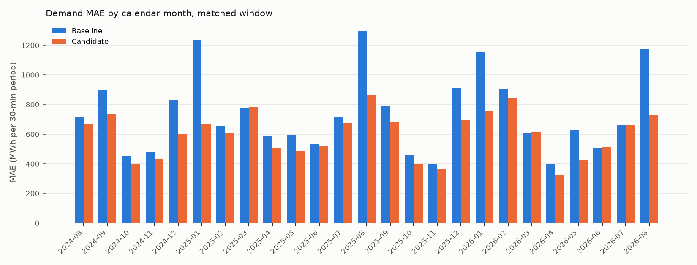

# R-003 — Day type as a categorical feature

- **Status:** Supported
- **Last updated:** 2026-08-26 (E-001 decision confirmed by the researcher)
- **Created:** 2026-08-25
- **Triggering observation:** [O-001 — Holidays dominate the worst days and are over-forecast](research/demand/observations.md#o-001-holidays-dominate-the-worst-days-and-are-over-forecast)
- **Related investigations:**
  [R-002 — Population-weighted area temperature](research/demand/R-002-population-weighted-temperature.md)
  (this investigation starts from its `lightgbm_msm_popw` candidate, the
  demand baseline)

## Question

Does giving the model the delivery day's type — working day, weekend or
holiday — as a categorical feature improve Tokyo-area day-ahead demand
forecasts, in particular on holidays and on the worst days, most of which are
holidays?

## Motivation

[O-001](research/demand/observations.md#o-001-holidays-dominate-the-worst-days-and-are-over-forecast):
on the baseline run `2556e3f2…` (`lightgbm_msm_popw`, Tokyo, 729 days
2024-08-18..2026-08-17) 15 of the 20 worst days by daily MAE are holidays,
although holidays are 60 of the 729 days; holiday MAE is 1,760,466 kWh against
665,046 on weekdays, and 96 % of it is positive bias (+1,688,435 kWh) — the
model over-forecasts 59 of the 60 holidays. Holidays are 8 % of the scored
points but carry 20 % of the run's total absolute error.

The researcher's reasoning, as stated: the day category is not passed to the
model during training, so it has no guidance that these days represent the
special human behaviour of not working, which changes electricity usage. As a
result the model often over-estimates the amount of electricity needed — less
electricity is used than forecast — which the researcher attributes to there
being less commercial activity on holidays. The proposed change is therefore
to add a day-type categorical to the model.

The inputs already exist: `dim_date` flags every day as a weekend and/or a
holiday, where `is_holiday` covers the Cabinet Office 国民の祝日 and, since
2026-08-25 (PR #14), the customary non-working days 年末年始 12/30–1/3,
ゴールデンウィーク 4/30–5/2 and お盆 8/13–16 — the 年末年始 and お盆 days that
top O-001's worst-days table. The baseline's calendar features are
`time_code`, `month` and `day_of_week`, so a holiday on a Monday–Friday has the
same calendar input as a working day of that weekday.

## Current predictive hypothesis

> We believe that adding the delivery day's type (Weekday / Weekend / Holiday
> per `dim_date`) to `lightgbm_msm_popw` as a LightGBM categorical feature will
> reduce out-of-sample MAE — on holidays first, and therefore on the worst
> days, which are mostly holidays — because the model currently receives no
> input that distinguishes a holiday from a working day of the same weekday
> and over-forecasts holidays systematically (O-001).

## Scope and constraints

- **Forecast target:** the 48 half-hourly `demand_kwh` values of
  `fct_area_demand_generation_actual` for day D, Tokyo area (`--area tokyo`)
- **Information cutoff:** D-1 at 09:30 JST; usable demand history = delivery
  days ≤ D-2; observed-weather features use complete observation days ≤ D-2 at
  東京 s47662; forecast features use the MSM vintage referenced 21:00 JST D-2
  population-weighted over the area's 21 weighted stations; the day type of D
  is known from the calendar
- **Baseline:** `lightgbm_msm_popw` — the R-002 E-001 candidate run
  [`2556e3f2b94c4cf59efc6b2fff1bddef`](http://localhost:5005/#/experiments/2/runs/2556e3f2b94c4cf59efc6b2fff1bddef),
  the demand baseline since 2026-08-24, compared as run (not re-run)
- **Primary metric:** MAE (kWh per 30-minute period)
- **Important segments:** the *Holiday* day type (MAE and bias) and the
  worst days (the 20 delivery days with the highest daily MAE) — the
  researcher's stated expectations; *Weekday* and *Weekend* as no-harm checks;
  day part and calendar month as consistency checks
- **Evaluation method:** rolling out-of-sample backtest over identical delivery
  dates and training rows for baseline and candidate (`--start-date 2024-08-18
  --end-date 2026-08-17`, no `--train-start`, exactly the baseline run's
  flags); accuracy rows in `fct_demand_forecast_accuracy` after
  `just dbt build --select +fct_demand_forecast_accuracy`

## E-001 — Add the day type as a categorical feature

### Why this experiment

It is the most direct and the cheapest test of the hypothesis: the same model,
the same rows, the same refit schedule and one additional column whose values
already exist in the warehouse (`dim_date`). If the day type carries the
information the researcher expects, this is where it shows first.

### Experiment hypothesis

Adding `day_type` — 0 = Weekday, 1 = Weekend, 2 = Holiday — to the
`lightgbm_msm_popw` feature set, declared to LightGBM as a categorical column,
will lower holiday MAE and shrink the positive holiday bias on the matched
window, improve the worst days that are holidays, and lower overall MAE,
without a material deterioration on weekdays or weekends.

### Change

- **Feature** — `day_type`, the delivery day's category per `dim_date`:
  *Holiday* (`is_holiday`: a national holiday or a customary non-working day,
  whatever weekday it falls on) takes precedence over *Weekend*
  (`is_weekend`), else *Weekday* — the same labels and precedence as the
  compare script's day-type segment, so the model's categories are the
  research tables' segments. Loaded once for the whole `dim_date` spine
  (`load_day_types` → `DayTypeCalendar`, grain = day) and joined to every
  training and prediction row on the delivery day (`join_day_type`); a
  delivery day outside the calendar is unforecastable, like a missing
  temperature.
- **Categorical** — the shared LightGBM base gained a
  `categorical_feature_cols` class attribute that is passed to
  `LGBMRegressor.fit(categorical_feature=…)` and logged as
  `lgbm_categorical_feature_cols`; the fitted booster records the column
  (`booster.params["categorical_column"]`) and splits on category sets
  (`==` decisions) rather than on an ordinal threshold. With an empty list the
  fit is LightGBM's default, verified bitwise identical, so the existing
  strategies are unchanged.
- **Strategy** — `lightgbm_msm_popw_daytype`
  (`LightGbmMsmPopWeightedDayTypeStrategy`): the `lightgbm_msm_popw` features
  plus `day_type`; model parameters, refit cadence, the population weights
  (2020 census) and the temperature features are unchanged, so the day type is
  the only difference from the baseline. The level coding is logged as
  `day_type_levels`.

### Expected evidence

Pre-registered from the researcher's stated expectations:

- Lower holiday MAE and a holiday bias closer to zero than the baseline's
  +1,688,435 kWh
- The holidays among the baseline's 20 worst days have a lower daily MAE, and
  fewer of the candidate's 20 worst days are holidays
- Lower overall MAE, coming mostly through the holiday segment (holidays are
  8 % of the points and 20 % of the baseline's absolute error)
- No material deterioration of weekday or weekend MAE (92 % of the days)
- Holiday MAE and bias unchanged, or a holiday gain offset by a deterioration
  on weekdays/weekends, would make the hypothesis less plausible

### Decision rule

Keep the day-type feature if holiday MAE falls materially and the holiday bias
shrinks, overall MAE is lower with the 95 % bootstrap interval of the daily
paired MAE difference excluding zero, and neither weekdays nor weekends
deteriorate materially. Refine if holidays improve but another day type
deteriorates, or if only some holiday kinds improve (a different or finer
categorisation would then be the next experiment). Treat the result as
inconclusive if the interval includes zero, and reject the change if holiday
MAE is not lower or overall MAE is higher with an interval that excludes zero.

### Execution

- **MLflow experiment:** `demand` (run parameters, metrics, code versions and
  artifacts live on the runs)
- **Baseline run:** `lightgbm_msm_popw-tokyo`
  [`2556e3f2b94c4cf59efc6b2fff1bddef`](http://localhost:5005/#/experiments/2/runs/2556e3f2b94c4cf59efc6b2fff1bddef)
  — the R-002 E-001 candidate on the PR #13 code version, compared as run.
  The candidate runs on this investigation's code version; the only shared
  code that changed is the base class's `categorical_feature` pass-through,
  verified a no-op for strategies without categorical columns, and the
  `dim_date` customary holidays (PR #14) enter only the new feature and the
  day-type segment tables, not the baseline's forecasts.
- **Candidate run:** `lightgbm_msm_popw_daytype-tokyo`
  [`7ce891253f584ed39f179f76a7a8c7c9`](http://localhost:5005/#/experiments/2/runs/7ce891253f584ed39f179f76a7a8c7c9)
  — run 2026-08-25 with the baseline's flags; `lgbm_categorical_feature_cols
  = day_type`, `day_type_levels = 0=Weekday,1=Weekend,2=Holiday`, 2020 census
  weights, 105 refits
- **Code or pull request:** branch `demand-day-type-feature`
  (`DayTypeCalendar`, `load_day_types`, `day_type_code`, `join_day_type`,
  `SlidingWindowLightGbmStrategy.categorical_feature_cols`,
  `LightGbmMsmPopWeightedDayTypeStrategy`); pull request pending. The segment
  tables, the daily paired comparison and the figure below are the output of
  `scripts/compare_demand_runs.py --baseline 2556e3f2b94c4cf59efc6b2fff1bddef
  --candidate 7ce891253f584ed39f179f76a7a8c7c9 --mae-by-month-png …`; the
  worst-days, holiday-by-holiday and holiday-kind tables were queried from
  `fct_demand_forecast_accuracy` × `dim_date` the same way as O-001's.
- **Matched window:** the R-001/R-002 window — 729 delivery days
  2024-08-18..2026-08-17, 34,954 scored points per run, identical training
  rows and refit schedule (both training sets start at the first demand day,
  2022-04-01, and both skip 2025-06-21 for its D-7 lag in the 2025-06-14 TSO
  hole)
- **Segment definitions:** as in R-002 (`tasks/demand/compare.py`: day parts
  per `dim_delivery_period.day_part`, day types from `dim_date`, 2,000-MWh
  bands, top-10 % demand days; daily paired comparison = percentile bootstrap
  of the mean daily-MAE difference over days, 10,000 resamples, seed 0), plus
  the worst-days table (the 20 delivery days with the highest daily MAE, per
  run) and the holiday kinds (元日 / 年末年始; お盆; ゴールデンウィーク 4/30–5/2;
  a national holiday on a weekday; a national holiday on a Saturday/Sunday)

### Results

All values in kWh per 30-minute period over the matched window (729 days;
MLflow holds the full metric sets).

| Metric | Baseline | Candidate | Absolute change | Relative change |
|---|---:|---:|---:|---:|
| Overall MAE | 728,573 | 594,325 | −134,249 | −18.4 % |
| Holiday MAE (important segment) | 1,760,466 | 765,403 | −995,063 | −56.5 % |
| Holiday mean error / bias | +1,688,435 | +83,172 | −1,605,263 | — |
| Overall MAPE | 4.52 % | 3.66 % | −0.86 pp | −19.1 % |
| Mean error / bias, overall | −9,018 | −14,967 | −5,949 | — |
| Mean error / bias, daytime | +3,748 | +4,729 | +981 | — |

MAE and bias by day type (candidate lower in all three):

| Day type | n | Baseline MAE | Candidate MAE | Relative change | Baseline bias | Candidate bias | Points over-forecast |
|---|---:|---:|---:|---:|---:|---:|---|
| Weekday | 22,752 | 665,046 | 590,209 | −11.3 % | −209,608 | −36,732 | 41.9 % → 49.7 % |
| Weekend | 9,322 | 564,823 | 551,514 | −2.4 % | −43,863 | +7,837 | 49.1 % → 52.1 % |
| Holiday | 2,880 | 1,760,466 | 765,403 | −56.5 % | +1,688,435 | +83,172 | 93.1 % → 57.4 % |

Holiday MAPE falls from 12.58 % to 5.27 %. Of the total absolute-error
reduction, 61 % comes from the 60 holidays, 36 % from the weekdays and 3 %
from the weekends.

Holidays by kind (point-level MAE and bias over the kind's days):

| Kind | Days | Baseline MAE | Candidate MAE | Relative change | Baseline bias | Candidate bias |
|---|---:|---:|---:|---:|---:|---:|
| 元日 / 年末年始 | 10 | 3,408,562 | 881,279 | −74 % | +3,407,959 | +656,627 |
| お盆 (8/13–16) | 8 | 2,064,418 | 755,520 | −63 % | +2,052,627 | +570,732 |
| National holiday on a weekday | 28 | 1,559,832 | 833,513 | −47 % | +1,444,323 | −176,848 |
| National holiday on a Saturday/Sunday | 8 | 844,106 | 530,599 | −37 % | +781,469 | +188,543 |
| ゴールデンウィーク (4/30–5/2) | 6 | 766,473 | 580,682 | −24 % | +685,445 | −449,736 |

The baseline's 20 worst days (daily MAE), with the candidate on the same days
— the researcher's second expectation:

| # | Delivery day | Weekday | Day type | Holiday | Baseline MAE | Candidate MAE | Change | Baseline bias | Candidate bias |
|---:|---|---|---|---|---:|---:|---:|---:|---:|
| 1 | 2026-01-01 | Thu | Holiday | 元日 | 4,874,440 | 1,550,996 | −68 % | +4,874,440 | +1,539,671 |
| 2 | 2025-01-01 | Wed | Holiday | 元日 | 4,245,892 | 1,211,019 | −71 % | +4,245,892 | +1,196,401 |
| 3 | 2026-01-02 | Fri | Holiday | 年末年始 | 4,089,108 | 1,206,569 | −70 % | +4,089,108 | +1,206,569 |
| 4 | 2025-12-31 | Wed | Holiday | 年末年始 | 3,826,590 | 966,350 | −75 % | +3,826,590 | +966,350 |
| 5 | 2025-08-13 | Wed | Holiday | お盆 | 3,691,456 | 1,378,069 | −63 % | +3,691,456 | +1,378,069 |
| 6 | 2024-12-31 | Tue | Holiday | 年末年始 | 3,538,519 | 743,883 | −79 % | +3,538,519 | +651,277 |
| 7 | 2025-01-03 | Fri | Holiday | 年末年始 | 3,487,994 | 748,137 | −79 % | +3,487,994 | +483,461 |
| 8 | 2025-08-12 | Tue | Weekday | — | 3,345,966 | 3,858,649 | +15 % | +3,345,966 | +3,858,649 |
| 9 | 2024-12-20 | Fri | Weekday | — | 3,140,294 | 2,088,766 | −33 % | −3,140,294 | −2,081,102 |
| 10 | 2025-01-02 | Thu | Holiday | 年末年始 | 3,131,748 | 805,761 | −74 % | +3,131,748 | +789,373 |
| 11 | 2024-12-30 | Mon | Holiday | 年末年始 | 3,126,408 | 307,339 | −90 % | +3,126,408 | −182,649 |
| 12 | 2025-08-14 | Thu | Holiday | お盆 | 3,069,397 | 1,058,911 | −66 % | +3,069,397 | +1,058,911 |
| 13 | 2026-02-08 | Sun | Weekend | — | 2,862,238 | 2,449,929 | −14 % | −2,862,238 | −2,449,929 |
| 14 | 2025-08-15 | Fri | Holiday | お盆 | 2,821,602 | 934,991 | −67 % | +2,821,602 | +934,991 |
| 15 | 2025-08-06 | Wed | Weekday | — | 2,559,708 | 1,341,885 | −48 % | −2,559,708 | −1,341,885 |
| 16 | 2026-08-12 | Wed | Weekday | — | 2,555,156 | 2,837,390 | +11 % | +2,555,156 | +2,837,390 |
| 17 | 2026-08-13 | Thu | Holiday | お盆 | 2,552,324 | 604,150 | −76 % | +2,552,324 | +603,643 |
| 18 | 2024-09-23 | Mon | Holiday | 休日 (振替休日) | 2,509,672 | 810,162 | −68 % | +2,509,672 | +808,380 |
| 19 | 2026-05-05 | Tue | Holiday | こどもの日 | 2,445,803 | 1,097,991 | −55 % | +2,445,803 | +1,097,991 |
| 20 | 2025-05-05 | Mon | Holiday | こどもの日 | 2,298,120 | 929,604 | −60 % | +2,298,120 | +929,604 |

The candidate is lower on 18 of these 20 days; their mean daily MAE falls
from 3,208,622 to 1,346,528 (−58 %), and every one of the 15 holidays among
them improves, by 55 % to 90 %. The two that get worse are the working days
before お盆 (2025-08-12 +15 %, 2026-08-12 +11 %, both over-forecast more than
before). The candidate's own 20 worst days contain 4 holidays (the baseline's
contained 15); its three worst are 2025-08-12 (+3,858,649), 2026-02-11
建国記念の日 (−3,071,435; −1,147,127 in the baseline) and 2026-08-12
(+2,837,390), followed by 2025-12-29, the Monday before 年末年始 (+2,610,079;
+2,218,287 in the baseline).

Holiday by holiday, the candidate is lower on 53 of the 60; 35 holidays keep a
positive daily bias (59 in the baseline). The seven holidays that get worse are
all under-forecast by the candidate: 2025-01-13 成人の日 (1,213,771 →
2,592,018; bias +1,165,823 → −2,592,018), 2025-02-11 建国記念の日 (1,196,317 →
1,534,427), 2025-05-02 ゴールデンウィーク Friday (522,385 → 901,064),
2025-07-21 海の日 (1,202,479 → 1,509,700), 2025-11-23 勤労感謝の日, a Sunday
(233,536 → 632,155), 2026-02-11 建国記念の日 (1,147,127 → 3,071,435; the one
holiday the baseline already under-forecast) and 2026-05-01 ゴールデンウィーク
Friday (580,482 → 1,076,621).

Weekdays adjacent to a holiday (daily MAE): the 12 weekdays immediately before
a holiday go from 1,185,735 to 1,388,594 (+17 %; bias +592,436 → +900,156),
the 23 weekdays immediately after from 904,548 to 911,609 (+1 %), the other
441 weekdays from 648,752 to 564,229 (−13 %; bias −241,110 → −69,184).

MAE by day part (candidate lower in all four):

| Day part | n | Baseline | Candidate | Absolute change | Relative change |
|---|---:|---:|---:|---:|---:|
| Overnight (00–06) | 8,746 | 434,999 | 374,014 | −60,986 | −14.0 % |
| Morning (06–08) | 2,912 | 706,093 | 551,840 | −154,253 | −21.8 % |
| Daytime (08–18) | 14,560 | 950,888 | 754,144 | −196,744 | −20.7 % |
| Evening (18–24) | 8,736 | 659,452 | 562,684 | −96,769 | −14.7 % |

MAE by calendar month (candidate lower in **21 of 25** months; 2024-08 covers
the 18th–31st and 2026-08 the 1st–17th):

| Month | Baseline | Candidate | Relative change |
|---|---:|---:|---:|
| 2024-08 (from 18th) | 712,085 | 671,564 | −5.7 % |
| 2024-09 | 901,929 | 733,187 | −18.7 % |
| 2024-10 | 451,128 | 397,079 | −12.0 % |
| 2024-11 | 480,115 | 433,344 | −9.7 % |
| 2024-12 | 829,697 | 599,482 | −27.7 % |
| 2025-01 | 1,231,356 | 667,398 | −45.8 % |
| 2025-02 | 655,171 | 608,690 | −7.1 % |
| 2025-03 | 774,966 | 781,107 | +0.8 % |
| 2025-04 | 589,470 | 506,628 | −14.1 % |
| 2025-05 | 593,648 | 490,256 | −17.4 % |
| 2025-06 | 532,799 | 517,076 | −3.0 % |
| 2025-07 | 719,864 | 674,844 | −6.3 % |
| 2025-08 | 1,295,663 | 864,353 | −33.3 % |
| 2025-09 | 793,480 | 682,651 | −14.0 % |
| 2025-10 | 457,756 | 396,315 | −13.4 % |
| 2025-11 | 400,960 | 367,753 | −8.3 % |
| 2025-12 | 912,506 | 693,260 | −24.0 % |
| 2026-01 | 1,153,501 | 759,672 | −34.1 % |
| 2026-02 | 903,376 | 842,688 | −6.7 % |
| 2026-03 | 611,828 | 614,197 | +0.4 % |
| 2026-04 | 398,931 | 325,763 | −18.3 % |
| 2026-05 | 623,851 | 425,271 | −31.8 % |
| 2026-06 | 504,930 | 515,539 | +2.1 % |
| 2026-07 | 661,050 | 664,226 | +0.5 % |
| 2026-08 (to 17th) | 1,176,447 | 727,562 | −38.2 % |

MAE by season: Winter (Dec–Feb) −27.2 %, Spring (Mar–May) −12.5 %, Summer
(Jun–Aug) −16.1 %, Autumn (Sep–Nov) −13.6 %.

Daily paired comparison (daily MAE, candidate − baseline, 729 days): the
candidate is lower on 61.6 % of days (449 of 729); mean difference
−134,134 kWh with a 95 % bootstrap CI over days of [−167,972, −102,160] kWh;
median difference −24,070 kWh; the ten most-improved days account for 28 % of
the total absolute-error reduction.

Other cuts of the same two runs (not tabulated here): every 2,000-MWh
actual-demand band is lower (−12.0 % to −25.2 % between 10,000 and
24,000 MWh, −58.6 % in the lowest 8,000–10,000 MWh band, where holidays sit);
the top-10 % demand days (daily mean ≥ 19,489 MWh, 73 days) −21.7 % against
−17.9 % on the other 90 %.

### Interpretation

Read against the pre-registered expected evidence:

- **Lower holiday MAE and a bias closer to zero:** yes, and large — holiday
  MAE −56.5 % (1,760,466 → 765,403 kWh), the holiday bias +1,688,435 →
  +83,172 kWh, the share of over-forecast holiday points 93 % → 57 %, holiday
  MAPE 12.6 % → 5.3 %. Every holiday kind improves, most where the baseline
  was worst (元日 / 年末年始 −74 %, お盆 −63 %, national holidays on weekdays
  −47 %) and least on the customary ゴールデンウィーク days 4/30–5/2 (−24 %),
  which the candidate now under-forecasts on average (bias −449,736).
- **The worst days:** yes — the 15 holidays among the baseline's 20 worst days
  improve by 55–90 %, the candidate is lower on 18 of those 20 days (mean
  daily MAE −58 %), and only 4 holidays remain among the candidate's 20 worst.
- **Lower overall MAE, mostly through holidays:** yes — −18.4 % (728,573 →
  594,325 kWh; MAPE 4.52 % → 3.66 %), of which 61 % comes from the holidays.
  The weekdays contribute another 36 % (−11.3 %, concentrated on the weekdays
  not adjacent to a holiday: −13 %, with their bias moving from −241,110 to
  −69,184); weekends −2.4 %.
- **No material deterioration on weekdays or weekends:** none — both are
  lower, all four day parts are lower (−14 % to −22 %), all four seasons and
  21 of 25 months are lower (the four higher months are within +2.1 %), and
  the paired-difference interval over days excludes zero. The gain is less
  concentrated than R-002's (28 % of it from the ten most-improved days).

What got worse, which the expected evidence did not anticipate: 7 of the 60
holidays, all of which the candidate under-forecasts — 2026-02-11 建国記念の日
is now the run's second-worst day (−3,071,435) and 2025-01-13 成人の日 its
fifth (−2,592,018) — and the 12 weekdays immediately before a holiday
(+17 %), where the over-forecast grows: the candidate's worst day is
2025-08-12, the Tuesday before お盆, and 2026-08-12 and 2025-12-29 (the
working days before お盆 and 年末年始) are its third and fourth.

Limitations. One area (Tokyo), one window, and a small number of holidays
(60; 6–28 per kind), so the per-kind and per-holiday numbers are noisy. The
baseline is the R-002 run rather than a re-run on the candidate's code
version (the pass-through is a verified no-op, so the rows and the model are
matched). `day_type` overlaps `day_of_week` on Saturdays and Sundays. No
hyperparameters were retuned, and the bootstrap CI treats days as
exchangeable. Improved forecasting supports incremental predictive value; it
does not by itself establish causality — in particular it does not establish
the researcher's commercial-activity explanation.

### Decision

**Decision:** Keep (confirmed by the researcher on 2026-08-26)

Applying the rule as written: holiday MAE falls materially (−56.5 %) and the
holiday bias shrinks (+1.69 M → +0.08 M kWh); overall MAE is lower with the
bootstrap interval of the daily paired difference excluding zero; neither
weekdays (−11.3 %) nor weekends (−2.4 %) deteriorate — every "keep" condition
is met. Three things the rule does not capture were put to the researcher:
seven holidays get worse and are now under-forecast (two of them are among the
candidate's five worst days), the customary ゴールデンウィーク days are
under-forecast on average, and the weekday before a holiday deteriorates
(+17 %). The researcher confirmed the decision on 2026-08-26, judging the MAE
improvement and the reduction of the holiday bias significant; the three
points stay recorded under *Open questions*. Resulting change:
`lightgbm_msm_popw_daytype` is the demand baseline for later matched
experiments and the default of `scripts/demand_backtest.py`; `lightgbm`,
`lightgbm_msm` and `lightgbm_msm_popw` stay registered as reference
strategies.

### Follow-up ideas

- None recorded yet.

---

## Current conclusion

E-001 executed on 2026-08-25. On the matched window (Tokyo, 729 delivery days
2024-08-18..2026-08-17), adding the `dim_date` day type (Weekday / Weekend /
Holiday) to `lightgbm_msm_popw` as a LightGBM categorical lowers overall MAE
by 18.4 % (728,573 → 594,325 kWh; MAPE 4.52 % → 3.66 %). The effect is where
the hypothesis placed it: holiday MAE −56.5 % with the holiday over-forecast
essentially removed (bias +1,688,435 → +83,172 kWh), the 15 holidays among
the baseline's 20 worst days improved by 55–90 %, and no day type, day part
or season deteriorated (21 of 25 months lower; CI over days excludes zero).
The residual holiday error is two-sided — seven holidays are now
under-forecast — and the weekday before a holiday gets worse (+17 %).
**Keep**, confirmed by the researcher on 2026-08-26: the hypothesis that the
model lacked the day category is supported by this single-area experiment,
and `lightgbm_msm_popw_daytype` is now the demand baseline.

## Open questions

- Whether one *Holiday* level is the right granularity: the candidate's
  residual holiday error is two-sided (35 of 60 holidays over-forecast, 25
  under-forecast), the customary ゴールデンウィーク days 4/30–5/2 are
  under-forecast on average, and the weekday before a holiday is over-forecast
  more than in the baseline.
- Whether the gain on weekdays not adjacent to a holiday (−13 %) persists on
  another area or window.

## Final disposition

**Investigation status:** Supported (E-001; decision confirmed 2026-08-26)

**Recommended action:** Done — `lightgbm_msm_popw_daytype` is the demand
baseline for later matched experiments (demand README scope defaults) and the
default of `scripts/demand_backtest.py`. Later experiments compare against a
matched `lightgbm_msm_popw_daytype` run.

**Superseded by:** —
