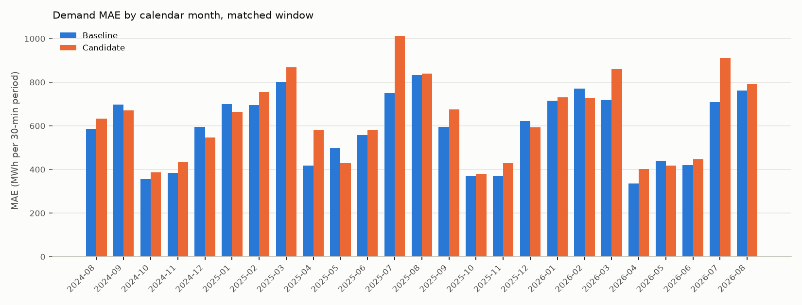

# R-005 — Calendar features from dim_date

- **Status:** Not supported
- **Last updated:** 2026-09-06 (E-001 rejected by the researcher)
- **Created:** 2026-09-06
- **Triggering observation:** None — modeling idea
- **Related investigations:**
  [R-003 — Day type as a categorical feature](research/demand/R-003-day-type-feature.md)
  (the day type is the only `dim_date` attribute the model has had so far);
  [R-004 — Year-ago load from a prior-year reference day](research/demand/R-004-prior-year-load-lag.md)
  (its E-002 strategy `lightgbm_msm_popw_daytype_simday` is the baseline here; its
  similar-day selector reads three of these attributes, but the model never sees them)

## Question

Do the calendar attributes `dim_date` holds — where the day sits in the year,
half, quarter and month, how much of a holiday it is, whether it is a working
day, and how far it is from the nearest holiday — carry information about
Tokyo-area demand that the model's current calendar inputs (`time_code`,
`month`, `day_of_week`, `day_type`) do not, and does adding them lower overall
out-of-sample MAE?

## Motivation

The researcher's reasoning, as stated on 2026-09-06: these additional calendar
features carry predictive value our model does not yet have, so including this
information should reduce overall MAE.

What the model has today: `time_code`, `month` and `day_of_week` from the
shared LightGBM base (pandas-derived) plus `day_type` (R-003). `dim_date`
carries more: `half`, `quarter`, `day_of_month`, `day_of_quarter` and
`day_of_year` (the Azure AutoML standard calendar set, PR #48, 2026-09-06),
`fiscal_quarter`, `is_business_day`, `holiday_degree` (the graded 休日度合い,
2026-09-05) and — computed by `load_day_calendar` over the spine — the days
since and until the nearest named holiday. The baseline's similar-day selector
uses `holiday_degree` and the two holiday distances to pick a reference day,
so they shape one feature indirectly; the model has no direct input from any
of the ten.

## Current predictive hypothesis

> We believe that adding ten calendar features from `dim_date` — `half`,
> `quarter`, `day_of_month`, `day_of_quarter`, `day_of_year`,
> `holiday_degree`, `is_business_day`, `fiscal_quarter`, `days_since_holiday`
> and `days_until_holiday` — to `lightgbm_msm_popw_daytype_simday` will reduce
> overall out-of-sample MAE, because these features carry predictive value
> the model does not yet have.

## Scope and constraints

- **Forecast target:** the 48 half-hourly `demand_kwh` values of
  `fct_area_demand_generation_actual` for day D, Tokyo area (`--area tokyo`)
- **Information cutoff:** D-1 at 09:30 JST; usable demand history = delivery
  days ≤ D-2; observed-weather features use complete observation days ≤ D-2;
  forecast features use the MSM vintage referenced 21:00 JST D-2; every
  calendar attribute of D is known from the calendar
- **Baseline:** `lightgbm_msm_popw_daytype_simday` — the R-004 E-002 run
  [`008868fe59274abfb49f128e29aa28fe`](http://localhost:5005/#/experiments/2/runs/008868fe59274abfb49f128e29aa28fe),
  the Tokyo demand baseline since 2026-09-06, compared as run (not re-run)
- **Primary metric:** MAE (kWh per 30-minute period)
- **Important segments:** overall MAE (the researcher's stated expectation);
  day type, day part, calendar month and the top-10 % demand days as
  consistency checks; the daily paired comparison's bootstrap interval
- **Evaluation method:** rolling out-of-sample backtest over identical delivery
  dates and training rows for baseline and candidate (`--start-date 2024-08-18
  --end-date 2026-08-17`, no `--train-start`, exactly the baseline run's
  flags); accuracy rows in `fct_demand_forecast_accuracy` after
  `just dbt build --select +fct_demand_forecast_accuracy`

## E-001 — Add the ten dim_date calendar features

### Why this experiment

The most direct and the cheapest test of the hypothesis: the same model, the
same rows, the same refit schedule and the same similar-day selector, plus
one join of columns that already exist in the `DayCalendar` frame the
baseline loads.

### Experiment hypothesis

Adding the ten `dim_date` calendar attributes to the baseline's feature set,
as plain numeric columns, lowers overall MAE on the matched window.

### Change

- **Features** — `DAY_CALENDAR_FEATURE_COLS` (`tasks/demand/features.py`):
  `half` (1 before July 1, else 2), `quarter`, `day_of_month`,
  `day_of_quarter`, `day_of_year`, `holiday_degree` (0 / 0.3 / 0.5 / 0.8 /
  1.0), `is_business_day` (1 / 0), `fiscal_quarter` (April = Q1),
  `days_since_holiday` and `days_until_holiday` (calendar days to the nearest
  `dim_date.is_holiday` day; 0 on a holiday). Joined to every training and
  prediction row on the delivery day (`join_day_calendar`); a day outside the
  calendar is unforecastable, as for the day type. None is declared
  categorical — `day_type` stays the only one.
- **Frame** — `DayCalendar` gained the seven `dim_date` columns
  (`half`, `quarter`, `day_of_month`, `day_of_quarter`, `day_of_year`,
  `is_business_day`, `fiscal_quarter`); `load_day_calendar` selects them. The
  selector and the parent strategies read the same columns as before.
- **Strategy** — `lightgbm_msm_popw_daytype_simday_calendar`
  (`LightGbmMsmPopWeightedDayTypeSimilarDayCalendarStrategy`): the baseline's
  inputs and features plus the ten; model parameters, refit cadence,
  population weights (2020 census) and the similar-day selector unchanged, so
  the calendar features are the only difference from the baseline.

### Expected evidence

Pre-registered from the researcher's stated expectation:

- Lower overall MAE than the baseline's 585,362 kWh on the matched window
- Overall MAE unchanged or higher, or a gain in one segment offset by a loss
  elsewhere, would make the hypothesis less plausible

### Decision rule

The standing rule of R-004 E-002: keep if overall MAE is lower and the 95 %
bootstrap interval of the daily paired MAE difference excludes zero, with no
day type materially worse; inconclusive if the interval includes zero; reject
if MAE is higher and the interval excludes zero. The decision is the
researcher's.

### Execution

- **MLflow experiment:** `demand`
- **Baseline run:**
  [`008868fe59274abfb49f128e29aa28fe`](http://localhost:5005/#/experiments/2/runs/008868fe59274abfb49f128e29aa28fe),
  compared as run
- **Candidate runs:**
  [`e3e3bd619f894eed9958bdd29ad99c58`](http://localhost:5005/#/experiments/2/runs/e3e3bd619f894eed9958bdd29ad99c58)
  (2026-09-06, `lightgbm_msm_popw_daytype_simday_calendar --start-date
  2024-08-18 --end-date 2026-08-17 --area tokyo`, no `--train-start`; 729
  delivery days, 34,954 predictions, one skipped day — 2025-06-21, as in
  every run; 105 refits; 9.1 min; the selector fitted to the same weights
  as the baseline run, so the ten features are the only difference)
- **Code or pull request:** branch `feature/demand-calendar-features`

### Results

Matched window 2024-08-18 to 2026-08-17, 729 days, `compare_demand_runs.py`
(kWh per 30-minute period).

| Metric | Baseline | Candidate | Absolute change | Relative change |
|---|---:|---:|---:|---:|
| Overall MAE | 585,362 | 627,877 | +42,515 | +7.3 % |
| MAPE | 3.61 % | 3.86 % | +0.26 pt | +7.1 % |
| Mean error / bias | −28,365 | −40,392 | −12,027 | — |
| Weekday MAE | 561,769 | 623,062 | +61,293 | +10.9 % |
| Weekend MAE | 587,210 | 620,739 | +33,529 | +5.7 % |
| Holiday MAE | 765,760 | 689,019 | −76,742 | −10.0 % |
| Overnight MAE | 385,373 | 428,799 | +43,426 | +11.3 % |
| Morning MAE | 559,934 | 606,187 | +46,253 | +8.3 % |
| Daytime MAE | 749,628 | 784,373 | +34,745 | +4.6 % |
| Evening MAE | 520,278 | 573,586 | +53,308 | +10.2 % |
| Winter MAE (Dec–Feb) | 681,699 | 667,166 | −14,533 | −2.1 % |
| Spring MAE (Mar–May) | 537,595 | 593,907 | +56,313 | +10.5 % |
| Summer MAE (Jun–Aug) | 661,742 | 756,358 | +94,616 | +14.3 % |
| Autumn MAE (Sep–Nov) | 461,906 | 494,733 | +32,827 | +7.1 % |
| Top-10 % demand days MAE | 734,621 | 798,776 | +64,155 | +8.7 % |

Daily paired comparison over the 729 days: the candidate is lower on 43.5 %
of days (317); mean daily-MAE difference +42,436 kWh, 95 % bootstrap
interval over days [+23,233, +61,413] (10,000 resamples, seed 0); median
+17,828 kWh. By calendar month the candidate is lower in 7 of 25 months
(2024-09, 2024-12, 2025-01, 2025-05, 2025-12, 2026-02, 2026-05) and higher
in 18; the largest increases are 2025-04 (+38.8 %), 2025-07 (+35.0 %),
2026-07 (+28.5 %), 2026-04 (+20.0 %) and 2026-03 (+19.2 %).

Share of the mean absolute SHAP contribution per feature
(`fct_demand_forecast_contribution`, both runs):

| Feature | Baseline | Candidate |
|---|---:|---:|
| `similar_day_demand_kwh` | 50.0 % | 50.3 % |
| `time_code` | 13.3 % | 10.9 % |
| `popw_forecast_temperature_c` | 12.7 % | 11.3 % |
| `wavg_temperature_c` | 6.6 % | 4.2 % |
| `day_type` | 6.4 % | 1.8 % |
| `lag_7d_demand_kwh` | 4.3 % | 6.5 % |
| `day_of_week` | 3.9 % | 3.2 % |
| `month` | 2.8 % | 0.2 % |
| `day_of_year` | — | 3.2 % |
| `holiday_degree` | — | 2.2 % |
| `days_since_holiday` | — | 1.8 % |
| `days_until_holiday` | — | 1.5 % |
| `day_of_quarter` | — | 1.4 % |
| `day_of_month` | — | 1.4 % |
| `fiscal_quarter` | — | 0.2 % |
| `is_business_day` | — | 0.0 % |
| `half`, `quarter` | — | 0 (never split on) |

### Interpretation

The overall error rises, and the rise is broad: every day part, weekdays and
weekends, three of four seasons, 18 of 25 months, the top-10 % demand days
and the other 90 % alike. The segments that improve are holidays (−10.0 %,
with the holiday MAE still the highest of the three day types), winter
(−2.1 %) and the two lowest actual-demand bands (below 12,000 MWh). The
largest deteriorations sit in April, July and March.

The ten features take 11.7 % of the attribution mass between them. Most of
it is taken from `day_type` (6.4 % → 1.8 %), `month` (2.8 % → 0.2 %), the
observed temperature (6.6 % → 4.2 %) and `time_code` (13.3 % → 10.9 %); the
similar-day load keeps its half. `day_of_year` is the largest of the ten,
`half` and `quarter` are never used by a split and `is_business_day` almost
never.

Limitations: one area and one 729-day window; the selector's inputs and
weights are unchanged, so nothing here says how the ten would behave without
the similar-day feature or with a different training window.

### Reading against the decision rule

Overall MAE is higher and the bootstrap interval over days excludes zero on
the positive side, so the standing rule reads *Reject*. Holidays improved,
which the rule does not weigh against a broad loss elsewhere.

### Decision

**Decision:** Reject — decided by the researcher on 2026-09-06. Overall MAE
is higher and the interval over days excludes zero; the holiday gain is the
one result in the hypothesis's direction. The baseline stays
`lightgbm_msm_popw_daytype_simday`; the strategy remains registered as a
reference strategy.

### Follow-up ideas

—

---

## Current conclusion

E-001 (2026-09-06): adding the ten `dim_date` calendar features to the
Tokyo baseline raises overall MAE 7.3 % on the matched 729-day window
(585,362 → 627,877 kWh; interval over days [+23,233, +61,413]), with a
broad deterioration across day parts, weekdays, weekends and seasons and a
10 % improvement on holidays. Rejected by the researcher on 2026-09-06: the
hypothesis that the ten features carry predictive value the model lacks is
not supported on this window.

## Open questions

- Whether the holiday gain survives without the nine other features, and
  which of the ten carries it (the per-day SHAP waterfall of the Explanation
  tab shows the candidate run's decomposition on any holiday)

## Final disposition

**Investigation status:** Not supported
**Recommended action:** keep the baseline `lightgbm_msm_popw_daytype_simday`;
no production change. The strategy stays registered as a reference.
**Superseded by:** —
