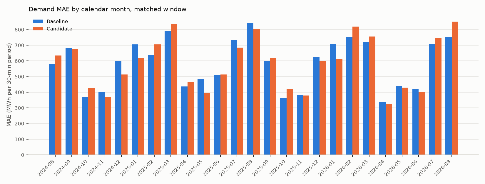

# R-006 — Recent load features

- **Status:** In progress
- **Last updated:** 2026-09-12 (E-001 run; the researcher's decision pending)
- **Created:** 2026-09-12
- **Triggering observation:** None — modeling idea
- **Related investigations:**
  [R-004 — Year-ago load from a prior-year reference day](research/demand/R-004-prior-year-load-lag.md)
  (its E-002 preset `lightgbm_msm_popw_daytype_simday` is the baseline here);
  [R-005 — Calendar features from dim_date](research/demand/R-005-calendar-features.md)
  (the last feature-set experiment on the same baseline and window)

## Question

The model reads one value of the area's own demand history: the same period
seven days earlier, plus the similar day's load one year earlier. Does the
demand of the last four weeks — the newest complete days, more weekly lags,
their means, the week-on-week change, the last four days of D's day type and
D−2's daily summaries — carry information the model does not have, and does
adding it lower out-of-sample MAE?

## Motivation

The researcher's reasoning, as stated on 2026-09-12: the model is missing
information on recent demand; giving it more information about recent
behavior is going to improve prediction accuracy.

What the model has today of its own history: `lag_7d_demand_kwh` and the
similar day's load one year earlier. The newest public actuals, D−2's
(public about 00:05 on D−1, before the 09:30 issue time), are not read at
all.

## Current predictive hypothesis

> The model is missing information on recent demand. Giving it more
> information about recent behavior is going to improve prediction accuracy.

(The researcher's words, 2026-09-12.)

## Scope and constraints

- **Forecast target:** the 48 half-hourly `demand_kwh` values of
  `fct_area_demand_generation_actual` for day D, Tokyo area (`--area tokyo`)
- **Information cutoff:** the [task defaults](research/demand/README.md).
  Every feature is retrieved through Feast as of 09:30 on D−1; the D−2
  actuals are public by then (the daily files land about 00:05 on D−1)
  except on re-issued days, below
- **Baseline:** `lightgbm_msm_popw_daytype_simday`, re-run on the changed
  `ftr_period_actuals` (run
  [`a3fde7eb3af446968cbfea96407d5429`](http://localhost:5005/#/experiments/2/runs/a3fde7eb3af446968cbfea96407d5429)),
  because the mart's `available_at` now takes the newest of every lag it
  carries: the re-issued 2022-12-01 and 12-02 files hide ten Tokyo delivery
  days of December 2022 (12-03 to 12-11 and 12-15) from the whole row, where
  before they hid two. Against the newest baseline run on the old mart,
  [`429eca36…`](http://localhost:5005/#/experiments/2/runs/429eca360efe4c3b9e89e1258b932cc7)
  (MAE 583,561), the fresh baseline's MAE is 583,132 (−429, −0.07 %):
  identical to the kWh from 2025-01 onward, where the training windows no
  longer reach December 2022, lower on 60 of 729 days, CI over days
  [−1,709, +809]
- **Primary metric:** MAE (kWh per 30-minute period)
- **Important segments:** overall MAE (the researcher's stated expectation);
  day type, day part, calendar month, season and the top-10 % demand days as
  consistency checks; the daily paired comparison's bootstrap interval
- **Evaluation method:** rolling out-of-sample backtest over identical
  delivery dates and training rows (`--start-date 2024-08-18 --end-date
  2026-08-17`, no `--train-start`); the compare script counts the periods
  both runs scored

## E-001 — Add the thirteen recent-load features

### Why this experiment

The direct test of the hypothesis: the same model, window and baseline, with
every feature of the researcher's list added at once.

### Experiment hypothesis

The researcher's, above: more information on recent demand improves
accuracy.

### Change

The preset `lightgbm_msm_popw_daytype_simday_lags` = the baseline plus, from
`ftr_period_actuals`: y(D−2, p), y(D−3, p), y(D−14, p), y(D−21, p),
y(D−28, p); the mean and the 8:4:2:1 exponentially weighted mean of the
D−7, D−14, D−21 and D−28 lags; y(D−2, p) − y(D−9, p); the mean and the
8:4:2:1 weighted mean at p over the last four complete days of D's day type
at or before D−2 — and, from `ftr_day_actuals`: D−2's mean, maximum and
maximum-minus-minimum demand. Both weighted means halve per step and are
renormalised over the inputs present. Design:
`docs/superpowers/specs/2026-09-12-demand-recent-load-features-design.md`.

### Expected evidence

- Lower overall MAE than the fresh baseline
- Consistent across months and day parts
- The result that would weaken the hypothesis: no change or a rise in overall
  MAE with the CI over days including zero

### Decision rule

The researcher decides: practical magnitude, consistency across months and
day types, the bootstrap interval over days, and the worst days.

### Execution

- **MLflow experiment:** `demand`
- **Baseline run:**
  [`a3fde7eb3af446968cbfea96407d5429`](http://localhost:5005/#/experiments/2/runs/a3fde7eb3af446968cbfea96407d5429)
  (2026-09-12, `lightgbm_msm_popw_daytype_simday --area tokyo --start-date
  2024-08-18 --end-date 2026-08-17`, no `--train-start`; 729 days, 34,954
  predictions, one skipped day (2025-06-21), 105 refits, 3.6 min)
- **Candidate runs:**
  [`34707ed624f14b30ae21e60435a4775c`](http://localhost:5005/#/experiments/2/runs/34707ed624f14b30ae21e60435a4775c)
  (2026-09-12, `lightgbm_msm_popw_daytype_simday_lags`, the same flags; 723
  days, 34,666 predictions, 105 refits, 4.0 min; seven skipped days —
  2025-06-16, 06-17, 06-21, 06-23, 06-28, 07-05 and 07-12 — because the
  2025-06-14 hole reaches every lag the preset reads and a target day with
  one missing feature is skipped, where the baseline loses 06-21 alone)
- **Code or pull request:** branch `feature/demand-recent-load-features`

### Results

Matched on the 723 delivery days both runs scored (`compare_demand_runs.py
--common-days`, added for this comparison: the six days only the baseline
scored are dropped and listed), kWh per 30-minute period.

| Metric | Baseline | Candidate | Absolute change | Relative change |
|---|---:|---:|---:|---:|
| Overall MAE | 580,862 | 577,355 | −3,507 | −0.6 % |
| MAPE | 3.59 % | 3.55 % | −0.04 pt | −1.1 % |
| Mean error / bias | −24,429 | −23,607 | +822 | — |
| Weekday MAE | 561,376 | 564,209 | +2,833 | +0.5 % |
| Weekend MAE | 574,608 | 575,550 | +942 | +0.2 % |
| Holiday MAE | 753,753 | 686,299 | −67,454 | −8.9 % |
| Overnight MAE | 391,308 | 357,893 | −33,415 | −8.5 % |
| Morning MAE | 560,141 | 539,341 | −20,800 | −3.7 % |
| Daytime MAE | 738,219 | 748,128 | +9,909 | +1.3 % |
| Evening MAE | 515,279 | 525,119 | +9,841 | +1.9 % |
| Winter MAE (Dec–Feb) | 670,766 | 639,717 | −31,049 | −4.6 % |
| Spring MAE (Mar–May) | 537,150 | 535,617 | −1,533 | −0.3 % |
| Summer MAE (Jun–Aug) | 654,251 | 656,948 | +2,697 | +0.4 % |
| Autumn MAE (Sep–Nov) | 465,083 | 480,814 | +15,730 | +3.4 % |
| Top-10 % demand days MAE | 728,560 | 749,951 | +21,391 | +2.9 % |
| Other 90 % of days MAE | 564,254 | 557,947 | −6,307 | −1.1 % |

Daily paired comparison over the 723 days: the candidate is lower on 52.4 %
of days (379); mean daily-MAE difference −3,409 kWh, 95 % bootstrap interval
over days [−21,386, +14,328] (10,000 resamples, seed 0); median −7,506 kWh;
the ten most-improved days account for 341 % of the total absolute-error
reduction, so the net gain is a few large days offset by many small losses.
By calendar month the candidate is lower in 13 of 25 months; the largest
falls are 2025-05 (−18.1 %), 2024-12 (−14.4 %), 2026-01 (−14.0 %) and
2025-01 (−12.6 %), the largest rises 2025-10 (+16.3 %), 2024-10 (+15.1 %),
2026-08 (+13.3 %) and 2025-02 (+10.6 %). By actual-demand band the
10,000–12,000 MWh band falls 10.2 % and the bands above 22,000 MWh rise
(+2.6 %, +6.2 %, +11.0 % on 25 points), except 26,000–28,000 MWh (−6.8 %).

Permutation importance of the candidate (ΔMAE when the column is shuffled
across the 723 scored days, mean of 5 repeats; `permutation_importance.csv`
on the run), the thirteen new features first, then the baseline's with the
baseline run's own ΔMAE for comparison:

| Feature | ΔMAE (kWh) | Importance % | Baseline run's ΔMAE |
|---|---:|---:|---:|
| `ewm_daytype_4d_demand_kwh` | 131,146 | 22.7 % | — |
| `lag_2d_demand_kwh` | 72,770 | 12.6 % | — |
| `lag_2d_mean_demand_kwh` | 59,666 | 10.3 % | — |
| `lag_2d_range_demand_kwh` | 37,572 | 6.5 % | — |
| `change_2d_9d_demand_kwh` | 28,280 | 4.9 % | — |
| `lag_2d_max_demand_kwh` | 13,166 | 2.3 % | — |
| `ewm_weekly_lags_demand_kwh` | 10,295 | 1.8 % | — |
| `lag_3d_demand_kwh` | 9,308 | 1.6 % | — |
| `mean_daytype_4d_demand_kwh` | 7,052 | 1.2 % | — |
| `mean_weekly_lags_demand_kwh` | 4,933 | 0.9 % | — |
| `lag_21d_demand_kwh` | 4,613 | 0.8 % | — |
| `lag_14d_demand_kwh` | 3,805 | 0.7 % | — |
| `lag_28d_demand_kwh` | 1,596 | 0.3 % | — |
| `similar_day_demand_kwh` | 1,599,304 | 277.0 % | 1,585,938 |
| `popw_forecast_temperature_c` | 366,529 | 63.5 % | 545,287 |
| `time_code` | 168,137 | 29.1 % | 645,234 |
| `day_of_week` | 66,153 | 11.5 % | 69,617 |
| `day_type` | 23,458 | 4.1 % | 142,945 |
| `month` | 19,687 | 3.4 % | 59,172 |
| `lag_7d_demand_kwh` | 13,579 | 2.4 % | 67,150 |
| `wavg_temperature_c` | 12,427 | 2.2 % | 254,835 |

Correlated features share importance (the two day-type means, the weekly
lags and their means, the D−2 lag and D−2's summaries), so a small ΔMAE does
not mean a column is unused.

### Interpretation

What the tables show, no more. The overall change is small (−0.6 %) and the
interval over days includes zero. The change is not uniform: holidays
(−8.9 %), the overnight and morning day parts (−8.5 %, −3.7 %) and winter
(−4.6 %) improve; daytime, evening, autumn and the top-10 % demand days get
worse (+1.3 %, +1.9 %, +3.4 %, +2.9 %), and the sign alternates month by
month with swings of 10 to 18 %. Among the new features the day-type
weighted mean, the D−2 lag and D−2's mean and range carry most of the
permutation importance; the weekly lags beyond D−7 and their means carry
little. The model leans on the new columns in place of `time_code`,
`wavg_temperature_c`, `day_type`, `month` and `lag_7d_demand_kwh`, whose
ΔMAE all fall by 60 to 95 % against the baseline run's.

### Decision

**Decision:** Pending — the researcher's.

### Follow-up ideas

- (the researcher's)

## Current conclusion

One experiment. All thirteen features together lower Tokyo MAE by 0.6 % on
the 723 days both runs scored, with the CI over days including zero, holidays
and overnight periods improving and daytime, autumn and the highest-demand
days getting worse. The features are in the catalogue and the preset is
registered; the decision is the researcher's.

## Open questions

- The researcher's verdict.

## Final disposition

**Investigation status:** In progress  
**Recommended action:** —  
**Superseded by:** —
