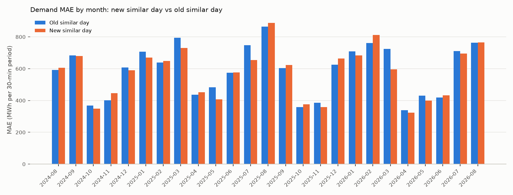
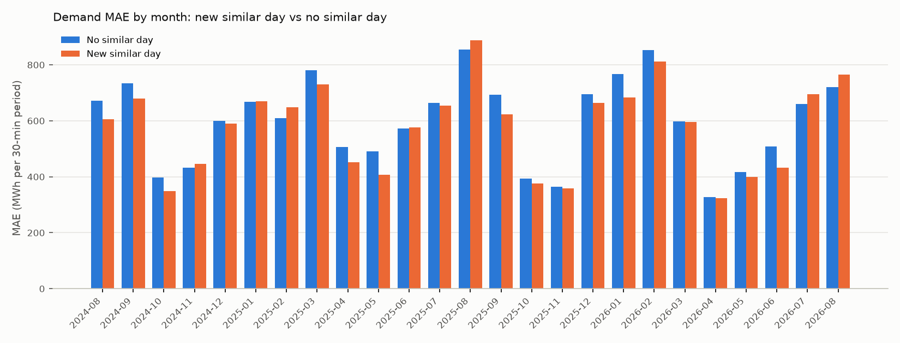
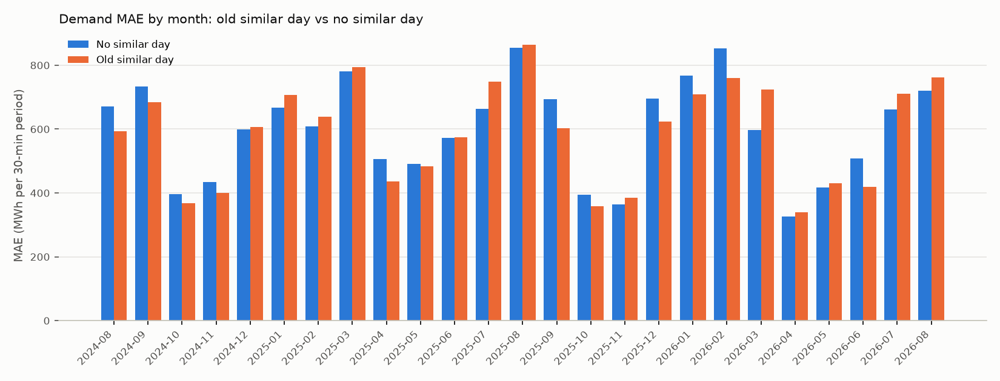

# R-008 — Similar days from the paper's blended pool

- **Status:** In progress
- **Last updated:** 2026-09-15 (E-001 run; the researcher's decision pending)
- **Created:** 2026-09-15
- **Triggering observation:** None — modeling idea
- **Related investigations:**
  [R-004 — Year-ago load from a prior-year reference day](research/demand/R-004-prior-year-load-lag.md)
  (its E-002 feature, the nearest day in D − 364 ± 30, is this investigation's
  old arm)

## Question

Does the similar day taken from the paper's blended pool forecast Tokyo demand
better than the single similar day from D − 364 ± 30, on a matched window?

The researcher's question, 2026-09-15: "How did the run of
`lightgbm_msm_popw_daytype_simday` with the newly updated feature compare to
that of the old feature?"

## Motivation

The researcher's reasoning, as stated on 2026-09-14: "I'd like our similar day
features to mimic their implementation. Use the same windows (blend of recent
and past year) and use same date last year for special days." "Their" is Park,
Song and Kwon (2020), the paper the selector comes from
([papers](research/papers.md)).

What changed in the feature: the design spec
`docs/superpowers/specs/2026-09-14-similar-day-top-k-design.md` (§1 goal, §2
decisions, §3 the paper against this design), implemented in PR #124.

- **Old:** the nearest day in D − 364 ± 30.
- **New:** rank 1 of one ranking over D − 2 … D − 31 and D − 335 … D − 394.
  - Holidays are never candidates.
  - A candidate's load must be public by the issue time.
  - A holiday takes last year's same-named holiday when that day lies 335 …
    394 days back and its load was public by the issue time.

On 2026-09-15 the researcher chose a rigorous matched test, with the old
feature rebuilt on today's code, over reading the existing runs. The last runs
of `lightgbm_msm_popw_daytype_simday` with the old feature (`a3fde7eb…`,
`47d65146…`) predate PRs #110 (null features) and #117 (the TSO actuals'
`available_at` rule), so they are not matched with a run of the new feature.

## Current predictive hypothesis

The researcher has not stated one.

## Scope and constraints

- **Forecast target:** the 48 half-hourly `demand_kwh` values of
  `fct_area_demand_generation_actual` for day D, Tokyo area (`--area tokyo`)
- **Information cutoff:** the [task defaults](research/demand/README.md).
  Every feature is retrieved through Feast as of 09:30 on D−1. Both similar-day
  features are dated by their `available_at`; neither table has a row public
  after its issue time
- **Baseline:** three fresh runs on the same window, code and marts; no earlier
  run is reused.
- **Primary metric:** MAE (kWh per 30-minute period)
- **Important segments:** none stated by the researcher; the tables report the
  comparison tool's standard set
- **Evaluation method:** rolling out-of-sample backtest,
  `--start-date 2024-08-18 --end-date 2026-08-17`, no `--train-start`, the
  730-day training window, every arm with the same flags. Each pair is compared
  on the delivery days both runs scored (`compare_demand_runs.py --common-days`),
  which drops nothing: every arm scored all 730 days

## E-001 — The paper's pool against the single year-ago similar day

### Why this experiment

It is the direct matched test of the two features. A third arm with no similar
day is part of the matched design chosen on 2026-09-15: it sizes each feature
on the same window.

### Experiment hypothesis

Not stated by the researcher.

### Change

Three arms, the same window and flags, all on branch `feature/similar-day-top-k`
at `157caba`:

- **Control:** preset `lightgbm_msm_popw_daytype` (7 features), no similar day.
- **Old:** the control + `similar_day_demand_kwh`, the nearest day in
  D − 364 ± 30 (R-004 E-002's selector). It was rebuilt for this experiment by
  main's own job (`scripts/fit_similar_day.py` at `1df4d22`), redirected to the
  scratch table `pma_scratch.similar_day_old`, and served by a scratch Feast
  view over the scratch mart `pma_scratch.ftr_period_similar_day_old`. The run
  used `--strategy lightgbm_msm_popw_daytype --add
  ftr_period_similar_day_old:similar_day_demand_kwh --name
  lightgbm_msm_popw_daytype_simday_old`.
- **New:** preset `lightgbm_msm_popw_daytype_simday` = the control +
  `ftr_period_similar_day:similar_day_rank1_demand_kwh`, rank 1 of the pool
  (spec §4–§6).

In both similar-day arms the similar day is the eighth and last feature. It is
float64 and not categorical; `day_type` is the only categorical feature.
Nothing in `pma_ml.similar_day` or `pma_features.ftr_period_similar_day` was
touched. The two runner scripts sit outside the repo and are logged as MLflow
artifacts (`runner/`) on the rebuild run and on every arm.

### Checks that the arms are matched

- **Old feature rebuild.** Job run `73ecfbeb…` reproduces the last old-feature
  job run `30ab12e9…`:
  - the same 2,714 days (2019-04-04 … 2026-09-07);
  - the same reference day on all 2,714 days;
  - the same fit cutoffs;
  - distances that differ by at most 0.000224 (library versions changed
    since, scipy 1.18.1 and pyspark 4.2.0 among them; the cause was not
    isolated);
  - the same four retrieval metrics.

  The scratch mart holds one run and 130,272 rows, with no nulls and no row
  public after its issue time.
- **Runner.** Before the arms, the runner re-ran the new preset on the window
  of run `3aeec968…` (2025-09-06 … 2026-09-05). Run `67242a74…` reproduced it
  bit for bit: the same MAE and RMSE and a byte-identical `predictions.csv`. So
  the scratch view, the scratch registry and the runner change nothing.
- **Arms.** All three logged the same values for:
  - the hash of the seven shared feature columns over the 70,128 retrieved rows;
  - the null share of each of the six preset features (0 everywhere, except
    `lag_7d_demand_kwh` at 0.054 %; `time_code` is not logged);
  - the model parameters, window, day count (730), predictions (35,002),
    skipped days (0) and code commit.

  Neither similar-day column has a null.

### Expected evidence

- (the researcher's)

### Decision rule

- (the researcher's)

### Execution

- **MLflow experiment:** `demand`
- **Control run:**
  [`3dc586c422c74d0dab0ad123adc740b4`](http://localhost:5005/#/experiments/2/runs/3dc586c422c74d0dab0ad123adc740b4)
  (2026-09-15, `lightgbm_msm_popw_daytype --area tokyo --start-date 2024-08-18
  --end-date 2026-08-17`; 730 days, 35,002 predictions, no skipped day)
- **Old run:**
  [`9f02c38523ae4908ab914685d475e6c0`](http://localhost:5005/#/experiments/2/runs/9f02c38523ae4908ab914685d475e6c0)
  (the same flags plus `--add ftr_period_similar_day_old:similar_day_demand_kwh
  --name lightgbm_msm_popw_daytype_simday_old`; the same counts)
- **New run:**
  [`d019a37072334a42a23f4d9552cd668e`](http://localhost:5005/#/experiments/2/runs/d019a37072334a42a23f4d9552cd668e)
  (`lightgbm_msm_popw_daytype_simday`, the same flags; the same counts)
- **Similar-day job runs:**
  - Old:
    [`73ecfbeb61a84d5d9891066378934fe6`](http://localhost:5005/#/experiments/4/runs/73ecfbeb61a84d5d9891066378934fe6)
    (MLflow experiment `similar_day_old`; main at `1df4d22`; 388 fits,
    2,714 days).
  - New:
    [`4f598bcfb5c7451da470b995b9831fe8`](http://localhost:5005/#/experiments/3/runs/4f598bcfb5c7451da470b995b9831fe8)
    (experiment `similar_day`; the branch; 2,521 ranked days, 25 of them
    special days, and 193 same-holiday days).
- **Runner check run:**
  [`67242a740e9a407ab320027d85f2b4a5`](http://localhost:5005/#/experiments/2/runs/67242a740e9a407ab320027d85f2b4a5)
- **Code or pull request:** branch `feature/similar-day-top-k` at `157caba`,
  PR #124; the old feature from main at `1df4d22`

### Results

All 730 delivery days and all 35,002 periods in every pair. kWh per 30-minute
period.

| Metric | Control | Old | New | Old vs control | New vs control | New vs old |
|---|---:|---:|---:|---:|---:|---:|
| Overall MAE | 594,900 | 585,788 | 572,428 | −1.5 % | −3.8 % | −2.3 % |
| MAPE | 3.66 % | 3.61 % | 3.52 % | −1.3 % | −3.9 % | −2.6 % |
| Mean error / bias | −16,498 | −23,634 | −40,034 | — | — | — |
| RMSE | 836,762 | 804,871 | 789,312 | −3.8 % | −5.7 % | −1.9 % |
| R² | 0.9442 | 0.9484 | 0.9504 | — | — | — |
| Weekday MAE | 588,891 | 563,709 | 551,350 | −4.3 % | −6.4 % | −2.2 % |
| Weekend MAE | 557,908 | 582,985 | 566,561 | +4.5 % | +1.6 % | −2.8 % |
| Holiday MAE | 762,729 | 769,330 | 758,038 | +0.9 % | −0.6 % | −1.5 % |
| Overnight MAE | 375,527 | 393,189 | 381,879 | +4.7 % | +1.7 % | −2.9 % |
| Morning MAE | 554,439 | 561,902 | 538,760 | +1.3 % | −2.8 % | −4.1 % |
| Daytime MAE | 752,152 | 747,294 | 729,615 | −0.6 % | −3.0 % | −2.4 % |
| Evening MAE | 565,925 | 517,392 | 512,441 | −8.6 % | −9.5 % | −1.0 % |
| Winter (Dec–Feb) MAE | 697,427 | 673,265 | 676,293 | −3.5 % | −3.0 % | +0.4 % |
| Spring (Mar–May) MAE | 521,088 | 536,001 | 485,648 | +2.9 % | −6.8 % | −9.4 % |
| Summer (Jun–Aug) MAE | 661,271 | 669,489 | 658,389 | +1.2 % | −0.4 % | −1.7 % |
| Autumn (Sep–Nov) MAE | 501,312 | 465,349 | 470,908 | −7.2 % | −6.1 % | +1.2 % |
| Top-10 % demand days MAE | 790,311 | 733,422 | 736,146 | −7.2 % | −6.9 % | +0.4 % |
| Other 90 % of days MAE | 573,162 | 569,364 | 554,216 | −0.7 % | −3.3 % | −2.7 % |

The daytime bias is +1,839 kWh (control), −29,084 (old) and −44,025 (new).

**Daily paired comparison** (10,000 bootstrap resamples over days, seed 0):

| Comparison | Candidate lower on | Mean daily-MAE difference | 95 % CI over days | Median | Ten most-improved days' share of the reduction | Months lower |
|---|---:|---:|---|---:|---:|---:|
| Old vs control | 51.6 % (377 of 730) | −9,156 | [−27,468, +8,934] | −7,052 | 144 % | 12 of 25 |
| New vs control | 55.5 % (405 of 730) | −22,490 | [−40,523, −4,705] | −21,947 | 60 % | 18 of 25 |
| New vs old | 51.9 % (379 of 730) | −13,334 | [−30,316, +3,579] | −8,208 | 91 % | 13 of 25 |

**By month, new vs old.**
- Largest falls: 2026-03 (−17.8 %), 2025-05 (−15.7 %), 2025-07 (−12.6 %),
  2025-03 (−7.9 %).
- Largest rises: 2024-11 (+11.3 %), 2026-02 (+6.7 %), 2025-12 (+6.4 %),
  2025-10 (+5.1 %).

**Walk-forward permutation importance** of the similar-day column (ΔMAE, mean
over 5 repeats; `permutation_importance.csv` on each run). It has the largest
ΔMAE of the eight features in both arms:

| Arm | Feature | ΔMAE (kWh) | Std | Rank |
|---|---|---:|---:|---:|
| Old | `similar_day_demand_kwh` | 1,589,863 | 2,957 | 1 |
| New | `similar_day_rank1_demand_kwh` | 1,582,359 | 4,389 | 1 |

The next two in both arms are `time_code` (649,322 old; 621,112 new) and
`popw_forecast_temperature_c` (539,293 old; 520,991 new). `lag_7d_demand_kwh`
falls from 531,289 in the control to 68,006 (old) and 56,267 (new).

**Similar-day job diagnostics** (MLflow metrics of the two job runs):

| Job | Reference | Selected load difference | Reference's | Oracle | Share of days better than the reference |
|---|---|---:|---:|---:|---:|
| Old `73ecfbeb…` | D − 364 | 0.0522 | 0.0766 | 0.0213 | 56.8 % |
| New `4f598bcf…` | D − 7 | 0.0489 | 0.0714 | 0.0186 | 59.0 % |

These are not comparable one to one:
- the reference day differs (D − 364 against D − 7);
- the oracle is the best day of a different pool;
- the new job's metrics cover ranked days with a known load (2,519 of 2,521),
  the old job's every day with a known load (2,712 of 2,714).

### What E-001 does not separate

- **Several changes in one arm.** The new arm changes these at once, and E-001
  measures them together:
  - the candidate pool (adding D − 2 … D − 31);
  - the year-ago window, narrowed from 334 … 394 to 335 … 394 days back;
  - the calendar part of the distance;
  - the exclusion of holidays from the pool and the fit;
  - the load-availability rule on candidates and training pairs;
  - the same-holiday rule.
- **Earlier run on part of the window.** Run `3aeec968…`, the rollout proof
  backtest of PR #124 (2025-09-06 … 2026-09-05), overlaps this window on
  2025-09-06 … 2026-08-17.

### Interpretation

What the tables show, no more.
- **Against no similar day.** The new feature lowers MAE by 3.8 %, with an
  interval over days that excludes zero. The old one lowers it by 1.5 %, with
  an interval that includes zero.
- **New against old.** MAE is 2.3 % lower. The interval over days includes zero,
  13 of 25 months are lower, and the ten most-improved days carry 91 % of the
  total reduction.
- **New against old, by segment:**
  - day parts: overnight −2.9 %, morning −4.1 %, daytime −2.4 %, evening −1.0 %;
  - day types: weekday −2.2 %, weekend −2.8 %, holiday −1.5 %;
  - seasons: winter +0.4 %, spring −9.4 %, summer −1.7 %, autumn +1.2 %;
  - the top-10 % demand days +0.4 %, the other 90 % −2.7 %.
- **Bias.** It is more negative in the new arm (−40,034 kWh) than in the old
  (−23,634) and the control (−16,498).

### Decision

**Decision:** Pending — the researcher's.

### Follow-up ideas

- (the researcher's)

### Scratch objects

The rebuilt old feature exists only in `pma_scratch.similar_day_old` and
`pma_scratch.ftr_period_similar_day_old`. They are kept until the researcher
decides, then dropped with `DROP DATABASE pma_scratch CASCADE`.

---

## Current conclusion

One experiment, on 730 matched days:
- **MAE:** control 594,900, old 585,788, new 572,428.
- **Against the control:** the new feature's interval over days excludes zero;
  the old feature's does not.
- **New against old:** −2.3 %, with an interval over days that includes zero.

The decision is the researcher's.

## Open questions

- The researcher's verdict.

## Final disposition

**Investigation status:** In progress  
**Recommended action:** —  
**Superseded by:** —
