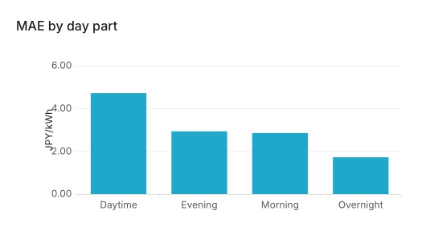

# Observation Log — spot price

Record notable spot-price-forecast behavior here before trying to explain it.
Record only observations and ideas supplied by the researcher or directly
established from the cited evidence; do not generate possible explanations or
hypotheses on the researcher's behalf unless explicitly asked. Conventions,
IDs and statuses: [research README](research/README.md); scope defaults:
[spot price README](research/spot_price/README.md).

---

## O-001 — Daytime MAE is higher than other day parts

- **Recorded:** 2026-08-16
- **Data period:** 2021-08-14 through 2026-08-12
- **Strategy:** `lightgbm`
- **Market area:** Tokyo
- **MLflow run:** [`0273327f73c04803afd12b6bc0a60799`](http://localhost:5005/#/experiments/1/runs/0273327f73c04803afd12b6bc0a60799)
- **Status:** Investigating
- **Related investigations:** [R-001 — Supply and demand tightness signals](research/spot_price/R-001-supply-demand-tightness.md)

### Observation

In the Superset **MAE by day part** chart, the LightGBM strategy's daytime MAE
is visibly higher than its MAE during every other predefined day part.

The chart shows approximate MAE values of:

| Day part | Time range | MAE (JPY/kWh) |
|---|---|---:|
| Daytime | 08:00-18:00 | 4.7 |
| Evening | 18:00-24:00 | 2.9 |
| Morning | 06:00-08:00 | 2.8 |
| Overnight | 00:00-06:00 | 1.7 |

These values were read visually from the chart and should be replaced with
queried values before making a quantitative claim about the size of the
difference.

### References

- MLflow run: [`0273327f73c04803afd12b6bc0a60799`](http://localhost:5005/#/experiments/1/runs/0273327f73c04803afd12b6bc0a60799)
- Superset dashboard: **Spot Price Forecast Analysis** → **MAE by day part**
- Plot:

  

---

<!--
Copy the structure above for each new observation. Use the next stable O-XXX
identifier within this task. Add possible causes only when the researcher supplies them.
-->
